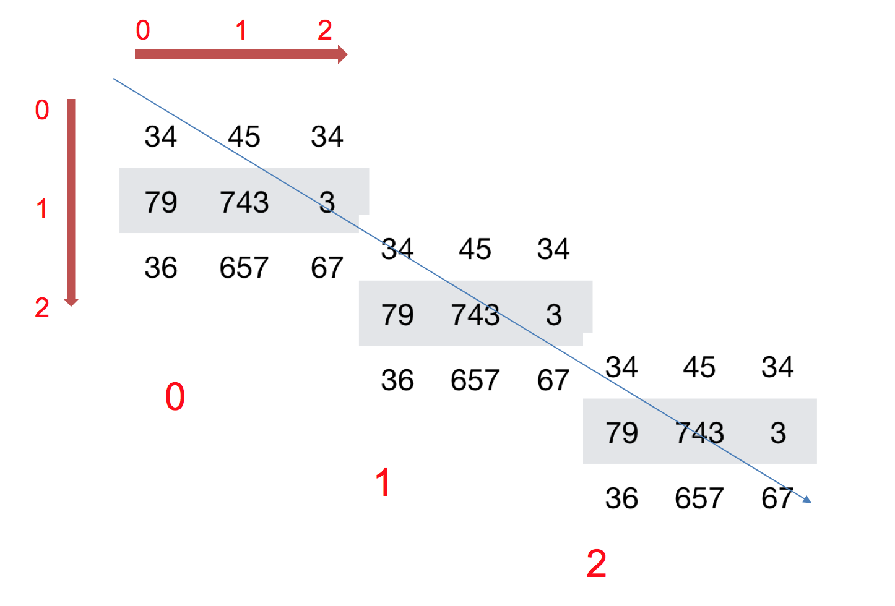
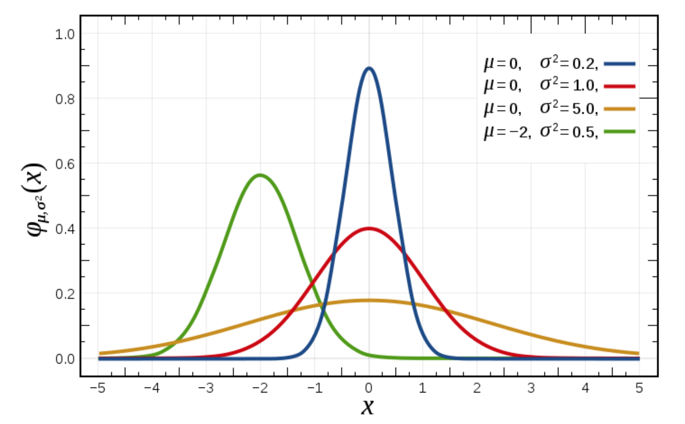

# Numpy优势
## numpy介绍
- 一个开源的Python科学计算库
- 计算起来要比python简洁高效
- Numpy使用ndarray对象来处理多维数组

## ndarray介绍
- NumPy提供了一个N维数组类型ndarray，它描述了相同类型的“items”的集合。
- 生成numpy对象:np.array()
## ndarray的优势
- 内存块风格
```
- list -- 分离式存储,存储内容多样化
- ndarray -- 一体式存储,存储类型必须一样
```
- ndarray支持并行化运算（向量化运算）
- ndarray底层是用C语言写的,效率更高,释放了GIL

# N维数组-ndarray
## ndarray的属性
| 属性 | 描述 |
| --- | --- |
| `ndarray.shape` | 返回一个元组，表示数组的维度。例如，对于形状为`(3, 4)`的数组，`shape`属性将返回`(3, 4)`。 |
| `ndarray.ndim` | 返回数组的维度数。对于二维数组，`ndim`为2。 |
| `ndarray.size` | 返回数组中元素的总数。对于形状为`(3, 4)`的数组，`size`为12。 |
| `ndarray.dtype` | 返回数组中元素的数据类型。例如，`int64`表示64位整数，`float32`表示32位浮点数。 |
| `ndarray.itemsize` | 返回数组中每个元素的字节大小。例如，`int64`的`itemsize`为8字节。 |
| `ndarray.data` | 返回数组的实际数据的缓冲区。通常情况下，我们不直接使用这个属性，而是通过索引和切片操作访问数组中的元素。 |
| `ndarray.flags` | 返回一个描述数组内存布局的标志的对象，例如C连续或Fortran连续。 |
| `ndarray.strides` | 返回一个元组，表示在不同维度上访问相邻元素所需的字节数。对于二维数组，`strides`将返回一个包含两个值的元组，分别表示在行和列方向上的字节数。 |
| `ndarray.T` | 返回数组的转置。对于二维数组，`T`将交换行和列。 |
| `ndarray.real` | 返回数组的实部，适用于复数数组。对于实数数组，返回自身。 |
| `ndarray.imag` | 返回数组的虚部，适用于复数数组。对于实数数组，返回全零数组。 |
| `ndarray.flat` | 返回一个迭代器，用于按照数组的元素顺序访问数组中的每个元素。 |
| `ndarray.size` | 返回数组中的元素数目。与`ndarray.size`相同。 |

## ndarray的形状
- 二维数组：
    
- 三维数组：
    


```python
import numpy as np

a = np.array([[1,2,3],[4,5,6]])
b = np.array([1,2,3,4])
c = np.array([[[1,2,3],[4,5,6]],[[1,2,3],[4,5,6]]])
print("-----------")
print("a:\n", a)
print("a.shape:\n", a.shape)
print("-----------")
print("b:\n", b)
print("b.shape:\n", b.shape)
print("-----------")
print("c:\n", c)
print("c.shape:\n", c.shape)
print("-----------")
```

    -----------
    a:
     [[1 2 3]
     [4 5 6]]
    a.shape:
     (2, 3)
    -----------
    b:
     [1 2 3 4]
    b.shape:
     (4,)
    -----------
    c:
     [[[1 2 3]
      [4 5 6]]
    
     [[1 2 3]
      [4 5 6]]]
    c.shape:
     (2, 2, 3)
    -----------
    

## ndarray的类型
注意：**若不指定，整数默认int64，小数默认float64**
| 名称 | 描述 | 简写 |
| --- | --- | --- |
| `bool` | 存储布尔值的类型 | `b` |
| `int` | 默认整数类型，通常为`int64`或`int32` | `i` |
| `int8` | 8位有符号整数 | `i1` |
| `int16` | 16位有符号整数 | `i2` |
| `int32` | 32位有符号整数 | `i4` |
| `int64` | 64位有符号整数 | `i8` |
| `uint8` | 8位无符号整数 | `u1` |
| `uint16` | 16位无符号整数 | `u2` |
| `uint32` | 32位无符号整数 | `u4` |
| `uint64` | 64位无符号整数 | `u8` |
| `float` | 默认浮点数类型，通常为`float64` | `f` |
| `float16` | 16位半精度浮点数 | `f2` |
| `float32` | 32位单精度浮点数 | `f4` |
| `float64` | 64位双精度浮点数 | `f8` |
| `complex` | 默认复数类型，表示为`float64`的实部和虚部 | `c` |
| `complex64` | 由两个32位单精度浮点数组成的复数 | `c8` |
| `complex128` | 由两个64位双精度浮点数组成的复数 | `c16` |
| `object` | Python对象类型 | `O` |
| `str` | 字符串类型 | `S` |
| `unicode` | Unicode类型 | `U` |


```python
a = np.array([[1, 2, 3],[4, 5, 6]], dtype=np.float32)
a.dtype
```


    dtype('float32')


```python
arr = np.array(['python', 'tensorflow', 'scikit-learn', 'numpy'], dtype = np.string_)
arr
```


    array([b'python', b'tensorflow', b'scikit-learn', b'numpy'], dtype='|S12')


# 基本操作
## 生成数组的方法
### 生成0和1的数组

- np.ones(shape, dtype)
- np.ones_like(a, dtype)
- np.zeros(shape, dtype)
- np.zeros_like(a, dtype)


```python
ones = np.ones([4,8])
ones
```


    array([[1., 1., 1., 1., 1., 1., 1., 1.],
           [1., 1., 1., 1., 1., 1., 1., 1.],
           [1., 1., 1., 1., 1., 1., 1., 1.],
           [1., 1., 1., 1., 1., 1., 1., 1.]])


```python
np.zeros_like(ones)
```


    array([[0., 0., 0., 0., 0., 0., 0., 0.],
           [0., 0., 0., 0., 0., 0., 0., 0.],
           [0., 0., 0., 0., 0., 0., 0., 0.],
           [0., 0., 0., 0., 0., 0., 0., 0.]])


## 从现有数组生成
### 生成方式
- np.array(object, dtype)
- np.asarray(a, dtype)


```python
a = np.array([[1,2,3],[4,5,6]])
# 从现有的数组当中创建
a1 = np.array(a)
# 相当于索引的形式，并没有真正的创建一个新的
a2 = np.asarray(a)
print("a:\n", a)
print("a1:\n", a1)
print("a2:\n", a2)
```

    a:
     [[1 2 3]
     [4 5 6]]
    a1:
     [[1 2 3]
     [4 5 6]]
    a2:
     [[1 2 3]
     [4 5 6]]
    

### array和asarray的对比


```python
a[0][0] = 5
```


```python
print("a:\n", a)
print("a1:\n", a1)
print("a2:\n", a2)
print("a?a1:\n", a==a1)
print("a?a2:\n", a==a2)
```

    a:
     [[5 2 3]
     [4 5 6]]
    a1:
     [[1 2 3]
     [4 5 6]]
    a2:
     [[5 2 3]
     [4 5 6]]
    a?a1:
     [[False  True  True]
     [ True  True  True]]
    a?a2:
     [[ True  True  True]
     [ True  True  True]]
    

## 生成固定范围的数组
### numpy.linspace()

```python
numpy.linspace(start, stop, num=50, endpoint=True, retstep=False, dtype=None, axis=0)
```

`numpy.linspace()`函数<font color=blue>返回指定间隔内的等间隔数字(**创建等差数组 — 指定数量**)。</font>

- 参数说明：

    - `start` : float型参数，表示区间的起始值。
    - `stop` : float型参数，表示区间的结束值。
    - `num` : int型参数，可选参数，默认为50，表示要生成的等间隔样例数量，包括起始值和结束值。
    - `endpoint` : bool型参数，可选参数，默认为True，表示区间的结束值是否包含在序列中。
    - `retstep` : bool型参数，可选参数，默认为False，表示是否返回样例之间的步长。
    - `dtype` : 可选参数，表示输出数组的数据类型。
    - `axis` : 可选参数，表示在哪个轴上生成等间隔样例。
    
- 返回值：

    返回一个numpy数组，其中包含指定间隔内的等间隔样例，其形状由参数start，stop和num确定。

- 参考链接：

    官方文档：[numpy.linspace](https://numpy.org/doc/stable/reference/generated/numpy.linspace.html)


```python
import numpy as np

print(np.linspace(0, 1, 5))
```

    [0.   0.25 0.5  0.75 1.  ]
    

### numpy.arange()

```python
numpy.arange([start, ]stop, [step, ]dtype=None)
```

`numpy.arange()`函数<font color=blue>返回一个数组，其中包含在半开区间[start, stop)内以step为步长的等间隔样例(**创建等差数组 — 指定步长**)。</font>

- 参数说明：

    - `start` : int型参数，可选参数，默认为0，表示区间的起始值。
    - `stop` : int型参数，表示区间的结束值。
    - `step` : int型参数，可选参数，默认为1，表示区间内样例之间的间隔。
    - `dtype` : 可选参数，表示输出数组的数据类型。
    
- 返回值：

    返回一个numpy数组，其中包含在半开区间[start, stop)内以step为步长的等间隔样例。

- 参考链接：

    官方文档：[numpy.arange](https://numpy.org/doc/stable/reference/generated/numpy.arange.html)


```python
import numpy as np

print(np.arange(3))
```

    [0 1 2]
    

### numpy.logspace()

```python
numpy.logspace(start, stop, num=50, endpoint=True, base=10.0, dtype=None, axis=0)
```

`numpy.logspace()`函数<font color=blue>返回一个数组，其中包含在对数刻度上均匀分布的数字(**创建等比数列**)。</font>

- 参数说明：

    - `start` : float型参数，表示区间的起始值。
    - `stop` : float型参数，表示区间的结束值。
    - `num` : int型参数，可选参数，默认为50，表示要生成的等间隔样例数量，包括起始值和结束值。
    - `endpoint` : bool型参数，可选参数，默认为True，表示区间的结束值是否包含在序列中。
    - `base` : float型参数，可选参数，默认为10.0，表示对数空间的底数。
    - `dtype` : 可选参数，表示输出数组的数据类型。
    - `axis` : 可选参数，表示在哪个轴上生成等间隔样例。
    
- 返回值：

    返回一个numpy数组，其中包含在对数刻度上均匀分布的数字。

- 参考链接：

    官方文档：[numpy.logspace](https://numpy.org/doc/stable/reference/generated/numpy.logspace.html)


```python
import numpy as np

print(np.logspace(0, 1, num=5))
```

    [ 1.          1.77827941  3.16227766  5.62341325 10.        ]
    

## 生成随机数组
### numpy.random

`numpy.random`模块<font color=blue>提供了伪随机数生成器。</font>它包括各种分布的随机样本生成器，替换样本生成器，随机数种子函数等。使用此模块需要先导入`numpy`库。

主要函数和用法如下：

- `numpy.random.rand(d0, d1, ..., dn)`：根据给定的维度生成[0,1)之间的随机数。

- `numpy.random.randn(d0, d1, ..., dn)`：返回指定形状的标准正态分布样本，即均值为0，标准偏差为1的正态分布随机样本。

- `numpy.random.randint(low, high=None, size=None, dtype=int)`：返回随机整数，范围从低（包括）到高（不包括），即[low, high)。

- `numpy.random.random_sample(size=None)`：返回[0.0, 1.0)之间的随机浮点数。

- `numpy.random.choice(a, size=None, replace=True, p=None)`：从给定的一维数组中生成随机样本。

- `numpy.random.shuffle(x)`：修改序列x使其随机排列。

更多函数和用法，详见官方文档。

- 参考链接：

    官方文档：[numpy.random](https://numpy.org/doc/stable/reference/random/index.html)


```python
import numpy as np

# 生成5个[0,1)之间的随机数
print(np.random.rand(5))

# 返回指定形状的标准正态分布样本
print(np.random.randn(2, 3))

# 从0到9（不包括10）中随机选择3个整数
print(np.random.randint(10, size=3))

# 返回[0.0, 1.0)之间的随机浮点数
print(np.random.random_sample())

# 从给定的一维数组中生成随机样本
print(np.random.choice([0, 1, 2, 3, 4, 5], size=3))

# 随机排列序列
x = np.array([1, 2, 3, 4, 5])
np.random.shuffle(x)
print(x)
```

    [0.58092784 0.74540058 0.5712938  0.38105009 0.93885573]
    [[ 0.02190669  0.81466485 -1.29852305]
     [-2.52695819 -0.97014307 -0.80256029]]
    [4 3 2]
    0.4278280334657695
    [1 5 4]
    [2 3 5 4 1]
    

## 正态分布
### 什么是正态分布
正态分布是一种概率分布。

正态分布是具有两个参数μ和σ的连续型随机变量的分布，第一参数μ是服从正态分布的随机变量的均值，第二个参数σ是此随机变量的标准差，所以正态分布记作$N(μ，σ )$。
\

### 正态分布的应用

生活、生产与科学实验中很多随机变量的概率分布都可以近似地用正态分布来描述。

### 正态分布特点

**μ决定了其位置，其标准差σ决定了分布的幅度**。当$μ = 0,σ = 1$时的正态分布是标准正态分布。

**方差**是在概率论和统计方差衡量一组数据时离散程度的度量,一般用$σ ^2$来表示：

$$\sigma^2=\frac{(x_1-M)^2+(x_2-M)^2+(x_3-M)^2+\dots\dots(x_n-M)^2}{n}$$
    
    其中M为平均值，n为数据总个数
    
σ 为标准差:
$$\sigma=\sqrt{\frac{1}{N}\sum_{i=1}^N\left(x_i-\mu\right)^2}$$

#### 标准差与方差的意义
可以理解成数据的一个离散程度的衡量


### 正态分布创建方式
##### numpy.random.randn()
```python
numpy.random.randn(*d0, d1, …, dn*)
```

`numpy.random.randn()`函数<font color=blue>返回一个或多个形状为(d0, d1, …, dn)的样本，其中每个样本都是来自标准正态分布的浮点数。</font>如果没有参数，那么返回单个浮点数。

- 参数说明：

    - *d0, d1, …, dn* : int型参数，表示输出数组的形状。
    
- 返回值：

    返回一个或多个形状为(d0, d1, …, dn)的样本，其中每个样本都是来自标准正态分布的浮点数。

- 参考链接：

    官方文档：[numpy.random.randn](https://numpy.org/doc/stable/reference/random/generated/numpy.random.randn.html)


```python
import numpy as np

# 返回单个样本
print(np.random.randn())

# 返回形状为(2, 3)的样本
print(np.random.randn(2, 3))
```

    -0.12024379867695324
    [[ 1.00229485 -0.04404083  0.52036541]
     [-1.67993708 -2.06943128  0.50267612]]
    

##### numpy.random.standard_normal()
```python
numpy.random.standard_normal(*size=None*)
```
`numpy.random.standard_normal()`函数<font color=blue>返回形状为size的标准正态分布样本。</font>

- 参数说明：

    - `size` : int型参数或int型元组，可选参数，表示输出数组的形状。
    
- 返回值：

    返回形状为size的标准正态分布样本。

- 参考链接：

    官方文档：[numpy.random.standard_normal](https://numpy.org/doc/stable/reference/random/generated/numpy.random.standard_normal.html)


```python
import numpy as np

# 返回单个样本
print(np.random.standard_normal())

# 返回形状为(2, 3)的样本
print(np.random.standard_normal((2, 3)))
```

    0.48888082449135667
    [[-1.063671    0.89782796 -0.46255264]
     [-0.05493017  1.36724107  1.58763301]]
    

## 均匀分布
均匀分布是关于定义在区间$[a,b], (a<b)$上连续变量的简单概率分布，其概率密度函数如下图所示：


### 均匀分布创建方式
#### numpy.random.rand()
```python
numpy.random.rand(*d0*, *d1*, *...*, *dn*)
```
`numpy.random.rand()`函数<font color=blue>返回一个或多个形状为(d0, d1, …, dn)的样本，其中每个样本都是在[0,1)区间内均匀分布的随机浮点数。</font>如果没有参数，那么返回单个浮点数。

- 参数说明：

    - `d0, d1, …, dn` : int型参数，表示输出数组的形状。
    
- 返回值：

    返回一个或多个形状为(d0, d1, …, dn)的样本，其中每个样本都是在[0,1)区间内均匀分布的随机浮点数。

- 参考链接：

    官方文档：[numpy.random.rand](https://numpy.org/doc/stable/reference/random/generated/numpy.random.rand.html)


```python
import numpy as np

# 返回单个样本
print(np.random.rand())

# 返回形状为(2, 3)的样本
print(np.random.rand(2, 3))
```

    0.9210000783663215
    [[0.16488304 0.32896453 0.69695352]
     [0.58506941 0.28724354 0.26637676]]
    

#### numpy.random.uniform()
```python
numpy.random.uniform(*low=0.0*, *high=1.0*, *size=None*)
```
`numpy.random.uniform()`函数<font color=blue>返回从[low, high)中随机采样的浮点数。</font>

- 参数说明：

    - `low` : float型参数，可选参数，默认为0.0，表示采样范围的最小值。
    - `high` : float型参数，可选参数，默认为1.0，表示采样范围的最大值。
    - `size` : int型参数或int型元组，可选参数，表示输出数组的形状。
    
- 返回值：

    返回从[low, high)中随机采样的浮点数。

- 参考链接：

    官方文档：[numpy.random.uniform](https://numpy.org/doc/stable/reference/random/generated/numpy.random.uniform.html)


```python
import numpy as np

# 从[0, 1)中随机采样一个浮点数
print(np.random.uniform())

# 从[0, 10)中随机采样形状为(2, 3)的浮点数
print(np.random.uniform(0, 10, size=(2, 3)))
```

    0.8195039819601586
    [[5.53771405 7.59620853 7.66278146]
     [7.9895242  7.71790873 6.75722235]]
    

#### numpy.random.randint()
```python
numpy.random.randint(*low*, *high=None*, *size=None*, *dtype='l'*)
```
`numpy.random.randint()`函数<font color=blue>返回指定范围内的随机整数。</font>

- 参数说明：

    - `low` : int型参数，表示随机数的最小值（包括）。
    - `high` : int型参数，可选参数，默认为None，表示随机数的最大值（不包括）。如果不指定则返回[0,low)之间的随机整数。
    - `size` : int型参数或int型元组，可选参数，表示输出数组的形状。
    - `dtype` : 可选参数，输出的数据类型。默认为'l'，即int64。
    
- 返回值：

    返回指定范围内的随机整数。

- 参考链接：

    官方文档：[numpy.random.randint](https://numpy.org/doc/stable/reference/random/generated/numpy.random.randint.html)


```python
import numpy as np

# 从[0, 10)中随机选择一个整数
print(np.random.randint(10))

# 从[0, 10)中随机选择形状为(2, 3)的整数
print(np.random.randint(0, 10, size=(2, 3)))

# 从[0, 10)中随机选择5个整数
print(np.random.randint(10, size=5))
```

    7
    [[1 2 4]
     [0 6 0]]
    [0 3 8 7 7]
    

## 形状修改

#### numpy.reshape()

```python
numpy.reshape(a, newshape, order='C')
```

`numpy.reshape()`函数<font color=blue>返回一个新的数组，该数组与所给定的形状兼容，并包含相同的数据，但具有新的形状。</font>

- 参数说明：

    - `a` : 要操作的数组。
    - `newshape` : 返回的数组的新形状，以整数或整数元组的形式给出。
    - `order` : 可选参数，表示要返回的数组的内存布局。如果是'C'（默认值），则返回的数组以行为主；如果是'F'，则返回的数组以列为主；如果是'A'，则返回的数组与原数组的内存布局一致。

- 返回值：

    返回一个由原始数组数据组成的新数组，该数组的形状由 `newshape` 参数指定。

- 参考链接：

    官方文档：[numpy.reshape](https://numpy.org/doc/stable/reference/generated/numpy.reshape.html)


```python
import numpy as np

a = np.array([[1, 2], [3, 4], [5, 6]])
b = a.reshape(2, 3)
print(b)
```

    [[1 2 3]
     [4 5 6]]
    

#### numpy.resize()

```python
numpy.resize(a, new_shape)
```

`numpy.resize()`函数<font color=blue>返回指定形状的新数组，如果新数组的尺寸大于原数组，则包含原始数组中的元素的重复副本，如果新数组的尺寸小于原数组，则原始数组中的一些元素将被丢弃。</font>

- 参数说明：

    - `a` : 要操作的数组。
    - `new_shape` : 返回的数组的新形状，以整数或整数元组的形式给出。

- 返回值：

    返回一个由原始数组数据组成的新数组，该数组的形状由 `new_shape` 参数指定。

- 参考链接：

    官方文档：[numpy.resize](https://numpy.org/doc/stable/reference/generated/numpy.resize.html)


```python
import numpy as np

a = np.array([[1, 2], [3, 4]])
np.resize(a, (2, 3))
```


    array([[1, 2, 3],
           [4, 1, 2]])


#### numpy.T

```python
ndarray.T
```

`ndarray.T`属性<font color=blue>返回该数组的转置。</font>

- 返回值：

    返回该数组的转置。

- 参考链接：

    官方文档：[numpy.ndarray.T](https://numpy.org/doc/stable/reference/generated/numpy.ndarray.T.html)


```python
import numpy as np

a = np.array([[1, 2], [3, 4]])
b = a.T
print(b)
```

    [[1 3]
     [2 4]]
    

## 类型修改
### numpy.astype()

```python
numpy.astype(dtype, order='K', casting='unsafe', subok=True, copy=True)
```

`numpy.astype()`函数<font color=blue>返回一个将给定数组的数据类型更改为指定数据类型的新数组。</font>

- 参数说明：

    - `dtype` : 用于指定新数组的数据类型的字符串或数据类型对象。
    - `order` : 可选参数，表示返回数组的内存布局。如果是'C'（默认值），则返回的数组以行为主；如果是'F'，则返回的数组以列为主；如果是'A'，则返回的数组与原数组的内存布局一致。
    - `casting` : 可选参数，表示数据类型转换时的规则。默认值为 'unsafe'，表示允许任何数据类型转换。如果设置为 'safe'，则表示只允许只有升级转换才被允许，也就是说，只允许从低精度到高精度的转换；如果设置为 'same_kind'，则表示只允许相同类型、或者从有符号类型到无符号类型的转换；如果设置为 'equiv'，则表示允许任何等价类型转换。
    - `subok` : 可选参数，表示返回的数组是否应该与原始数组共享子类。默认值为 `True`。
    - `copy` : 可选参数，表示返回的数组是否应该是原始数组的副本。默认值为 `True`。

- 返回值：

    返回一个数据类型为指定类型的新数组。

- 参考链接：

    官方文档：[numpy.ndarray.astype](https://numpy.org/doc/stable/reference/generated/numpy.ndarray.astype.html)


```python
import numpy as np

a = np.array([1, 2, 3])
b = a.astype(float)
print(b)
```

    [1. 2. 3.]
    

### numpy.ndarray.tobytes()

```python
ndarray.tobytes(order='C')
```

`ndarray.tobytes()`方法<font color=blue>返回数组的一份字节表示形式。</font>

- 参数说明：

    - `order` : 可选参数，表示返回字节串的内存布局。如果是'C'（默认值），则返回的字节串以行为主；如果是'F'，则返回的字节串以列为主；如果是'A'，则返回的字节串与原数组的内存布局一致。

- 返回值：

    返回数组的一份字节表示形式。

- 参考链接：

    官方文档：[numpy.ndarray.tobytes](https://numpy.org/doc/stable/reference/generated/numpy.ndarray.tobytes.html)


```python
import numpy as np

a = np.array([1, 2, 3])
b = a.tobytes()
print(b)
```

    b'\x01\x00\x00\x00\x02\x00\x00\x00\x03\x00\x00\x00'
    

## 数组的去重
### numpy.unique()

```python
numpy.unique(ar, return_index=False, return_inverse=False, return_counts=False, axis=None)
```

`numpy.unique()`函数<font color=blue>返回输入数组中的唯一元素，并按照指定的轴进行排序。</font>

- 参数说明：

    - `ar` : 要操作的数组。
    - `return_index` : 可选参数，如果为 `True`，则返回输入数组中唯一元素的索引。
    - `return_inverse` : 可选参数，如果为 `True`，则返回输入数组中唯一元素的下标，以便重构输入数组。
    - `return_counts` : 可选参数，如果为 `True`，则返回输入数组中唯一元素的出现次数。
    - `axis` : 可选参数，表示要在哪个维度上进行操作。默认值为 `None`，表示展开数组并进行操作。

- 返回值：

    返回输入数组中的唯一元素，并按照指定的轴进行排序。如果设置了 `return_index`、`return_inverse` 或 `return_counts` 参数，则还会返回相应的结果。

- 参考链接：

    官方文档：[numpy.unique](https://numpy.org/doc/stable/reference/generated/numpy.unique.html)


```python
import numpy as np

a = np.array([1, 2, 3, 2, 4, 1])
b = np.unique(a)
print(b)
```

    [1 2 3 4]
    

# ndarray运算
## 逻辑运算


```python
# 生成10名同学，5门功课的数据
score = np.random.randint(40, 100, (10, 5))
print("score:\n", score)
# 取出最后4名同学的成绩，用于逻辑判断
test_score = score[6:, 0:5]
print("test_score:\n", test_score)
# 逻辑判断, 如果成绩大于60就标记为True 否则为False
test_score > 60
print("test_score > 60:\n", test_score > 60)
# BOOL赋值, 将满足条件的设置为指定的值-布尔索引
test_score[test_score > 60] = 1
print("test_score:\n", test_score)
```

    score:
     [[80 61 80 87 49]
     [97 75 85 63 46]
     [71 72 44 62 73]
     [50 60 86 84 42]
     [81 48 66 66 57]
     [66 77 40 92 78]
     [91 86 86 83 70]
     [96 64 59 78 45]
     [85 66 55 79 85]
     [67 41 75 90 63]]
    test_score:
     [[91 86 86 83 70]
     [96 64 59 78 45]
     [85 66 55 79 85]
     [67 41 75 90 63]]
    test_score > 60:
     [[ True  True  True  True  True]
     [ True  True False  True False]
     [ True  True False  True  True]
     [ True False  True  True  True]]
    test_score:
     [[ 1  1  1  1  1]
     [ 1  1 59  1 45]
     [ 1  1 55  1  1]
     [ 1 41  1  1  1]]
    

## 通用判断函数
### numpy.all()

```python
numpy.all(a, axis=None, out=None, keepdims=<no value>)
```

`numpy.all()`函数<font color=blue>测试给定数组中的所有元素是否都为 True。</font>

- 参数说明：

    - `a` : 要测试的数组。
    - `axis` : 可选参数，表示沿着哪个轴进行测试。默认值为 `None`，表示将数组展平并进行测试。
    - `out` : 可选参数，表示输出结果的数组。
    - `keepdims` : 可选参数，表示是否保留测试结果的维度。默认值为 `<no value>`，表示保留维度；如果设置为 `True`，则表示保留维度；如果设置为 `False`，则表示不保留维度。

- 返回值：

    如果测试结果为 True，则返回 True；否则返回 False。如果设置了 `out` 参数，则返回输出数组。

- 参考链接：

    官方文档：[numpy.all](https://numpy.org/doc/stable/reference/generated/numpy.all.html)


```python
import numpy as np

a = np.array([[True, False], [True, True]])
b = np.all(a)
print(b)
```

    False
    

### numpy.any()

```python
numpy.any(a, axis=None, out=None, keepdims=<no value>)
```

`numpy.any()`函数<font color=blue>测试给定数组中的任一元素是否为 True。</font>

- 参数说明：

    - `a` : 要测试的数组。
    - `axis` : 可选参数，表示沿着哪个轴进行测试。默认值为 `None`，表示将数组展平并进行测试。
    - `out` : 可选参数，表示输出结果的数组。
    - `keepdims` : 可选参数，表示是否保留测试结果的维度。默认值为 `<no value>`，表示保留维度；如果设置为 `True`，则表示保留维度；如果设置为 `False`，则表示不保留维度。

- 返回值：

    如果测试结果为 True，则返回 True；否则返回 False。如果设置了 `out` 参数，则返回输出数组。

- 参考链接：

    官方文档：[numpy.any](https://numpy.org/doc/stable/reference/generated/numpy.any.html)


```python
import numpy as np

a = np.array([[True, False], [True, True]])
b = np.any(a)
print(b)
```

    True
    

## 三元运算符(numpu.where())
### numpy.where()

```python
numpy.where(condition, x, y)
```

`numpy.where()`函数<font color=blue>根据指定的条件返回输入数组中对应位置的元素。</font>

- 参数说明：

    - `condition` : 指定的条件。
    - `x` : 符合条件的元素所要被替换成的值。
    - `y` : 不符合条件的元素所要被替换成的值。

- 返回值：

    返回一个与输入数组形状相同的数组。其中，符合条件的元素被替换成了 `x`，不符合条件的元素被替换成了 `y`。

- 参考链接：

    官方文档：[numpy.where](https://numpy.org/doc/stable/reference/generated/numpy.where.html)


```python
import numpy as np

a = np.array([1, 2, 3, 4])
b = np.where(a > 2, a, 0)
print(b)
```

    [0 0 3 4]
    

### numpy.logical_and()

```python
numpy.logical_and(x1, x2, /, out=None, *, where=True, casting='same_kind', order='K', dtype=None, subok=True[, signature, extobj])
```

`numpy.logical_and()`函数<font color=blue>对两个数组逐元素进行逻辑与操作。</font>

- 参数说明：

    - `x1` : 第一个数组。
    - `x2` : 第二个数组。
    - `out` : 可选参数，表示输出结果的数组。
    - `where` : 可选参数，表示进行操作的位置。默认值为 `True`，表示在两个数组的所有位置都进行操作。
    - `casting` : 可选参数，表示转换数组类型的规则。默认值为 `'same_kind'`，表示不改变数组类型。
    - `order` : 可选参数，表示返回数组的内存布局。默认值为 `'K'`，表示按照尽可能保持输入数组的内存布局的方式返回数组。
    - `dtype` : 可选参数，表示输出数组的数据类型。默认值为 `None`，表示输出数组的数据类型与输入数组的数据类型相同。
    - `subok` : 可选参数，表示返回的数组是否为子类。默认值为 `True`，表示返回子类数组。
    
- 返回值：

    返回一个数组，其中每个元素都是两个输入数组在相应位置进行逻辑与操作的结果。

- 参考链接：

    官方文档：[numpy.logical_and](https://numpy.org/doc/stable/reference/generated/numpy.logical_and.html)


```python
import numpy as np

a = np.array([True, False, True])
b = np.array([False, True, False])
c = np.logical_and(a, b)
print(c)
```

    [False False False]
    

### numpy.logical_or()

```python
numpy.logical_or(x1, x2, /, out=None, *, where=True, casting='same_kind', order='K', dtype=None, subok=True[, signature, extobj])
```

`numpy.logical_or()`函数<font color=blue>对两个数组逐元素进行逻辑或操作。</font>

- 参数说明：

    - `x1` : 第一个数组。
    - `x2` : 第二个数组。
    - `out` : 可选参数，表示输出结果的数组。
    - `where` : 可选参数，表示进行操作的位置。默认值为 `True`，表示在两个数组的所有位置都进行操作。
    - `casting` : 可选参数，表示转换数组类型的规则。默认值为 `'same_kind'`，表示不改变数组类型。
    - `order` : 可选参数，表示返回数组的内存布局。默认值为 `'K'`，表示按照尽可能保持输入数组的内存布局的方式返回数组。
    - `dtype` : 可选参数，表示输出数组的数据类型。默认值为 `None`，表示输出数组的数据类型与输入数组的数据类型相同。
    - `subok` : 可选参数，表示返回的数组是否为子类。默认值为 `True`，表示返回子类数组。
    
- 返回值：

    返回一个数组，其中每个元素都是两个输入数组在相应位置进行逻辑或操作的结果。

- 参考链接：

    官方文档：[numpy.logical_or](https://numpy.org/doc/stable/reference/generated/numpy.logical_or.html)


```python
import numpy as np

a = np.array([True, False, True])
b = np.array([False, True, False])
c = np.logical_or(a, b)
print(c)
```

    [ True  True  True]
    

## 统计运算
- np.max()
- np.min()
- np.median()
- np.mean()
- np.std()
- np.var()
- np.argmax(axis=) — 最大元素对应的下标
- np.argmin(axis=) — 最小元素对应的下标

# 数组运算
满足广播机制,就Ok。

1. 维度相等
2. shape(其中对应的地方为1,也是可以的)

# 数学：矩阵
- 1.矩阵和向量
    - 矩阵就是特殊的二维数组
    - 向量就是一行或者一列的数据
- 2.矩阵加法和标量乘法
    - 矩阵的加法:行列数相等的可以加。
    - 矩阵的乘法:每个元素都要乘。
- 3.矩阵和矩阵(向量)相乘
    - (M行, N列)*(N行, L列) = (M行, L列)
- 4.矩阵性质
    - 矩阵不满足交换率,满足结合律
- 5.单位矩阵
    - 对角线都是1的矩阵,其他位置都为0
- 6.矩阵运算
    - np.matmul
    - np.dot
    - 注意：二者都是矩阵乘法。 np.matmul中禁止矩阵与标量的乘法。 在矢量乘矢量的內积运算中，np.matmul与np.dot没有区别。

## numpy.matmul()

```python
numpy.matmul(x1, x2, /, out=None, *, casting='same_kind', order='K', dtype=None, subok=True[, signature, extobj])
```

`numpy.matmul()`函数<font color=blue>返回两个数组的矩阵乘积。</font>

- 参数说明：

    - `x1` : 第一个数组。
    - `x2` : 第二个数组。
    - `out` : 可选参数，表示输出结果的数组。
    - `casting` : 可选参数，表示转换数组类型的规则。默认值为 `'same_kind'`，表示不改变数组类型。
    - `order` : 可选参数，表示返回数组的内存布局。默认值为 `'K'`，表示按照尽可能保持输入数组的内存布局的方式返回数组。
    - `dtype` : 可选参数，表示输出数组的数据类型。默认值为 `None`，表示输出数组的数据类型与输入数组的数据类型相同。
    - `subok` : 可选参数，表示返回的数组是否为子类。默认值为 `True`，表示返回子类数组。
    
- 返回值：

    返回矩阵乘积的数组。
    
- 参考链接：

    官方文档：[numpy.matmul](https://numpy.org/doc/stable/reference/generated/numpy.matmul.html)


```python
import numpy as np

a = np.array([[1, 2], [3, 4]])
b = np.array([[5, 6], [7, 8]])
c = np.matmul(a, b)
print(c)
```

    [[19 22]
     [43 50]]
    

## numpy.dot()

```python
numpy.dot(a, b, out=None)
```

`numpy.dot()`函数<font color=blue>计算两个数组的点积。</font>

- 参数说明：

    - `a` : 第一个数组。
    - `b` : 第二个数组。
    - `out` : 可选参数，表示输出结果的数组。
    
- 返回值：

    返回两个数组的点积。
    
- 参考链接：

    官方文档：[numpy.dot](https://numpy.org/doc/stable/reference/generated/numpy.dot.html)


```python
import numpy as np

a = np.array([1, 2, 3])
b = np.array([4, 5, 6])
c = np.dot(a, b)
print(c)
```

    32
    
