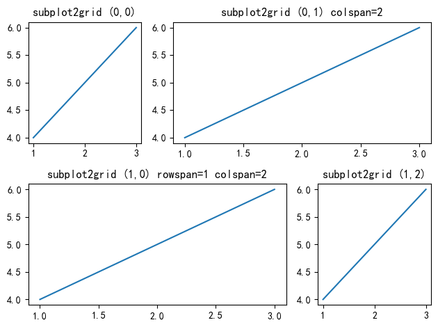
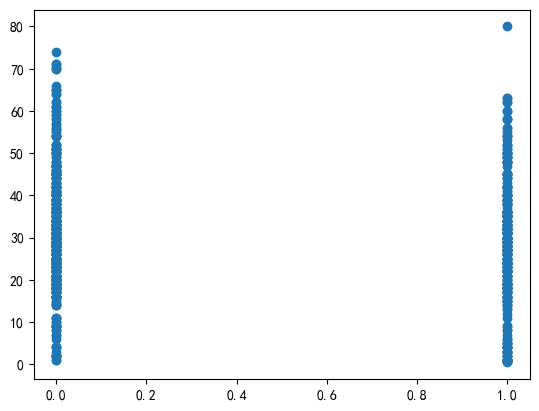
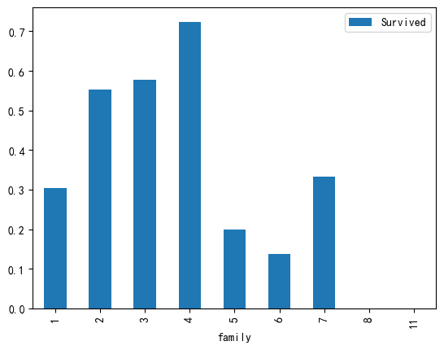
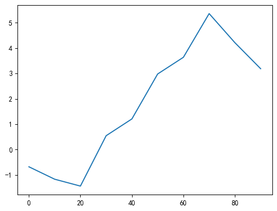
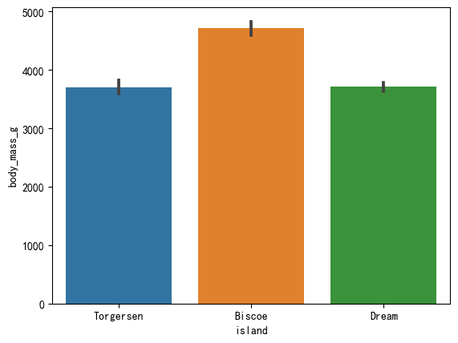
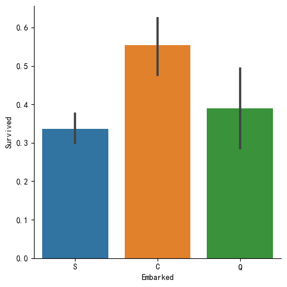
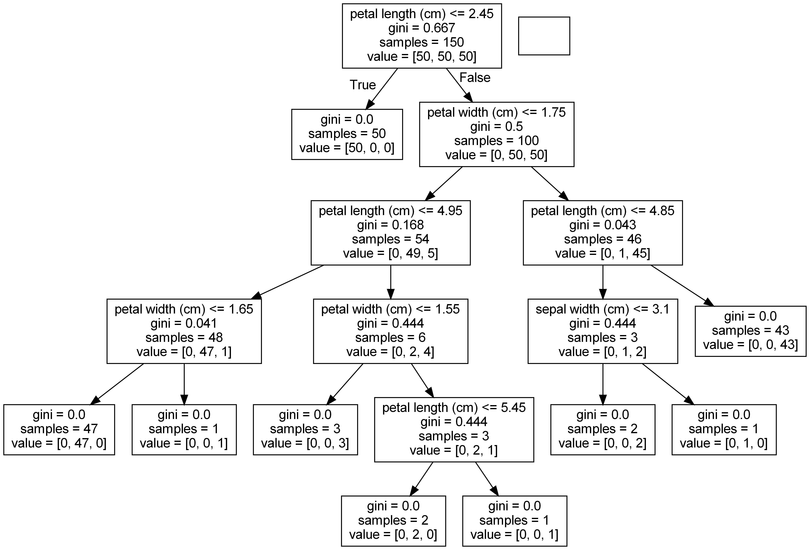

# str

## str.split()

```python
str.split(sep=None, maxsplit=-1)
```

`str.split()`方法<font color=blue>用于将字符串按指定分隔符分割成多个字符串，并返回一个列表。</font>

- 参数说明：

    - `sep` : 可选参数，表示分隔符，可以是一个字符串或None。如果是None，则默认按照空格分割。
    - `maxsplit` : 可选参数，表示分割次数。默认值为-1，表示分割所有符合条件的字符。
    
- 返回值：

    返回一个列表，其中包含了分割后的多个字符串。
    
- 参考链接：

    官方文档：[str.split](https://docs.python.org/3/library/stdtypes.html#str.split)


```python
x = 'a,b,c,d'
y = x.split(',')
print(y)
```

    ['a', 'b', 'c', 'd']
    

## str.strip()

```python
str.strip(chars=None)
```

`str.strip()`方法<font color=blue>用于去除字符串首尾指定的字符（默认为空格）并返回剩余字符串。</font>

- 参数说明：

    - `chars` : 可选参数，表示要去除的字符。如果没有指定，则默认去除字符串首尾的空格。
    
- 返回值：

    返回去除指定字符后的字符串。
    
- 参考链接：

    官方文档：[str.strip](https://docs.python.org/3/library/stdtypes.html#str.strip)


```python
x = '  hello '
y = x.strip()
print(y)
```

    hello
    

# matplotlib

## matplotlib.figure

### matplotlib.figure.Figure

#### matplotlib.figure.Figure.set()

```python
Figure.set(**kwargs)
```

`Figure.set()`方法<font color=blue>设置图形的属性。</font>

- 参数说明：

    - `**kwargs`：表示要设置的属性及其对应的值，以字典形式传入。
    
        - 常用属性包括：
        
            - `alpha`：透明度，取值范围为0~1。
            
            - `facecolor`：背景颜色。
            
            - `figsize`：图形大小，以英寸为单位。
            
            - `dpi`：图形分辨率，每英寸点数。
            
            - `tight_layout`：是否自动调整子图之间的间距和标签位置，取值为True或False。

- 返回值：

    无返回值。
    
- 参考链接：

    官方文档：[matplotlib.figure.Figure.set](https://matplotlib.org/stable/api/_as_gen/matplotlib.figure.Figure.html#matplotlib.figure.Figure.set)

示例：

```python
import matplotlib.pyplot as plt

fig = plt.figure()
fig.set(alpha=0.2)
```

输出：

设置图形透明度为0.2。

## matplotlib.pyplot

### matplotlib.pyplot.figure()

```python
matplotlib.pyplot.figure(num=None, figsize=None, dpi=None, facecolor=None, edgecolor=None, frameon=True, FigureClass=<class 'matplotlib.figure.Figure'>, clear=False, **kwargs)
```

`matplotlib.pyplot.figure()`函数<font color=blue>创建一个新的图形，并返回一个`Figure`对象。</font>

- 参数说明：

    - `num` : 可选参数，表示图形的编号。如果为None，则会自动生成一个编号。如果为一个整数，则会尝试使用这个整数作为图形的编号。如果已经存在一个相同编号的图形，则会将其激活并返回这个图形。如果为一个字符串，则会尝试使用这个字符串作为图形的窗口标题。
    - `figsize` : 可选参数，表示图形的大小，以英寸为单位。默认为`[6.4, 4.8]`。
    - `dpi` : 可选参数，表示图形的分辨率（每英寸点数）。默认为`100`。
    - `facecolor` : 可选参数，表示图形的背景颜色。默认为白色。
    - `edgecolor` : 可选参数，表示图形的边框颜色。默认为白色。
    - `frameon` : 可选参数，表示是否显示图形的边框。默认为True。
    - `FigureClass` : 可选参数，指定要使用的`Figure`类。默认为`matplotlib.figure.Figure`。
    - `clear` : 可选参数，表示是否清空图形。默认为False。
    - `**kwargs` : 其他可选参数，用于传递给`Figure`类的构造函数。

- 返回值：

    返回一个`Figure`对象，表示创建的图形。
    
- 参考链接：

    官方文档：[matplotlib.pyplot.figure](https://matplotlib.org/stable/api/_as_gen/matplotlib.pyplot.figure.html)

示例：

```python
import matplotlib.pyplot as plt

fig = plt.figure(figsize=(8, 6), dpi=100)
```

在这个例子中，我们使用`figure()`函数创建了一个大小为`[8, 6]`，分辨率为`100`的新图形，并将其赋值给变量`fig`。

### matplotlib.pyplot.title()

```python
matplotlib.pyplot.title(label, fontdict=None, loc='center', pad=None, 
                        **kwargs)
```

`matplotlib.pyplot.title()`函数<font color=blue>设置图形的标题。</font>

- 参数说明：

    - `label`：标题的文本内容。
    
    - `fontdict`：用于设置字体、大小、颜色等格式的字典。
    
    - `loc`：标题的位置，取值为'center'、'left'、'right'。
    
    - `pad`：标题与图形边缘的距离。
    
    - 其他参数请参考官方文档。
    
- 返回值：

    无返回值。
    
- 参考链接：

    官方文档：[matplotlib.pyplot.title](https://matplotlib.org/stable/api/_as_gen/matplotlib.pyplot.title.html)

示例：

```python
import matplotlib.pyplot as plt

plt.title(u'携带不同家人数量的乘客获救情况')
```

输出：

在图形的中央位置添加一个文本标题。

### matplotlib.pyplot.subplot2grid()

```python
plt.subplot2grid(shape, loc, rowspan=1, colspan=1, fig=None, **kwargs)
```

`plt.subplot2grid()`函数<font color=blue>在一个网格中创建一个子图，并返回Axes对象。</font>

- 参数说明：

    - `shape` : 整数元组，表示网格的形状，如(2,3)表示分为2行3列。
    - `loc` : 整数元组，表示子图所在的网格位置，从(0,0)算起。
    - `rowspan` : 可选参数，表示子图占用的行数，默认为1。
    - `colspan` : 可选参数，表示子图占用的列数，默认为1。
    - `fig` : 可选参数，表示要在哪个Figure上创建子图，默认为当前Figure。
    - `**kwargs` : 其他可选参数，如projection、polar等。

- 返回值：

    返回创建的Axes对象。
    
- 参考链接：

    官方文档：[matplotlib.pyplot.subplot2grid](https://matplotlib.org/stable/api/_as_gen/matplotlib.pyplot.subplot2grid.html)


```python
import matplotlib.pyplot as plt

plt.subplot2grid((2,3), (0,0))
plt.plot([1, 2, 3], [4, 5, 6])
plt.title('subplot2grid (0,0)')

plt.subplot2grid((2,3), (0,1), colspan=2)
plt.plot([1, 2, 3], [4, 5, 6])
plt.title('subplot2grid (0,1) colspan=2')

plt.subplot2grid((2,3), (1,0), rowspan=1, colspan=2)
plt.plot([1, 2, 3], [4, 5, 6])
plt.title('subplot2grid (1,0) rowspan=1 colspan=2')

plt.subplot2grid((2,3), (1,2))
plt.plot([1, 2, 3], [4, 5, 6])
plt.title('subplot2grid (1,2)')

plt.tight_layout()
plt.show()
```


    

    


### matplotlib.pyplot.scatter()

```python
matplotlib.pyplot.scatter(x, y, s=None, c=None, marker=None, cmap=None, norm=None, vmin=None, vmax=None, alpha=None, linewidths=None, verts=None, edgecolors=None, *, plotnonfinite=False, data=None, **kwargs)
```

`matplotlib.pyplot.scatter()`函数<font color=blue>用于绘制散点图。</font>

- 参数说明：

    - `x` : x轴数据。
    - `y` : y轴数据。
    - `s` : 可选参数，表示散点的大小。
    - `c` : 可选参数，表示散点的颜色。
    - `marker` : 可选参数，表示散点的形状。
    - `cmap` : 可选参数，表示使用的颜色图。
    - `norm` : 可选参数，表示数据归一化。
    - `vmin` : 可选参数，表示数据最小值。
    - `vmax` : 可选参数，表示数据最大值。
    - `alpha` : 可选参数，表示散点的透明度。
    - `linewidths` : 可选参数，表示散点的线宽。
    - `verts` : 可选参数，表示自定义散点的形状。
    - `edgecolors` : 可选参数，表示散点的边缘颜色。
    - `plotnonfinite` : 可选参数，表示是否绘制非有限数据。
    - `data` : 可选参数，表示要使用的DataFrame或Series对象。
    - `**kwargs` : 可选参数，表示其他关键字参数。

- 返回值：

    返回绘制的散点图对象。

- 参考链接：

    官方文档：[matplotlib.pyplot.scatter](https://matplotlib.org/stable/api/_as_gen/matplotlib.pyplot.scatter.html)

示例中，`plt.scatter(data_train.Survived, data_train.Age)`绘制了一个以`data_train.Survived`为x轴数据，`data_train.Age`为y轴数据的散点图。


```python
import matplotlib.pyplot as plt
import pandas as pd

# 读取数据
data_train = pd.read_csv('./datasets/train.csv')

# 绘制散点图
plt.scatter(data_train.Survived, data_train.Age)
plt.show()
```


    

    


# pandas

## pandas.get_dummies()

```python
pandas.get_dummies(data, prefix=None, prefix_sep='_', dummy_na=False, columns=None, sparse=False, drop_first=False, dtype=None)
```

`pandas.get_dummies()`函数<font color=blue>用于将分类变量转换为哑变量（0或1）。</font>

- 参数说明：

    - `data` : 要转换的DataFrame或Series。
    - `prefix` : 字符串或字符串列表，用于前缀名称。默认为None。
    - `prefix_sep` : 用于分隔前缀和列名称的字符串。默认为'_'。
    - `dummy_na` : 添加一列以指示缺失值。默认为False。
    - `columns` : 要转换的列名的列表或None，表示要在DataFrame中转换的列。默认为None，表示转换所有列。
    - `sparse` : 返回稀疏DataFrame。默认为False。
    - `drop_first` : 是否删除每个类别的第一个哑变量。默认为False。
    - `dtype` : 输出数组的数据类型。默认为np.uint8。

- 返回值：

    返回一个新的DataFrame，其中分类变量被转换为哑变量（0或1）。
    
- 参考链接：

    官方文档：[pandas.get_dummies](https://pandas.pydata.org/pandas-docs/stable/reference/api/pandas.get_dummies.html)
    
示例：

```python
import pandas as pd

df = pd.DataFrame({'A': ['a', 'b', 'c', 'a'], 'B': ['x', 'y', 'z', 'x']})

dummies = pd.get_dummies(df)

print(dummies)
```

输出：

```
   A_a  A_b  A_c  B_x  B_y  B_z
0    1    0    0    1    0    0
1    0    1    0    0    1    0
2    0    0    1    0    0    1
3    1    0    0    1    0    0
```

该示例中使用 `pd.DataFrame()` 函数创建一个DataFrame，并使用 `pd.get_dummies()` 函数将分类变量转换为哑变量。在DataFrame中使用`pd.get_dummies()`函数来进行分类变量的转换。

## pandas.crosstab()

```python
pandas.crosstab(index, columns, values=None, rownames=None, colnames=None, aggfunc=None, margins=False, margins_name='All', dropna=True, normalize=False)
```

`pandas.crosstab()`函数<font color=blue>用于计算数据透视表，返回一个DataFrame。</font>

- 参数说明：

    - `index` : 布尔数组、Series、一组数组或者DataFrame，表示用于行索引的数据。
    - `columns` : 布尔数组、Series、一组数组或者DataFrame，表示用于列索引的数据。
    - `values` : 可选参数，表示要聚合的值列。默认不传入则计算出现次数。
    - `rownames` : 可选参数，表示行索引的名称。
    - `colnames` : 可选参数，表示列索引的名称。
    - `aggfunc` : 可选参数，表示聚合函数。默认使用numpy.sum。
    - `margins` : 可选参数，表示是否添加行/列总计。默认为False。
    - `margins_name` : 可选参数，表示行/列总计的名称。默认为“All”。
    - `dropna` : 可选参数，表示是否删除缺失的列/行。默认为True。
    - `normalize` : 可选参数，表示是否将结果标准化。默认为False。
    
- 返回值：

    返回一个DataFrame，其中包含了计算出的数据透视表。
    
- 参考链接：

    官方文档：[pandas.crosstab](https://pandas.pydata.org/pandas-docs/stable/reference/api/pandas.crosstab.html)

该示例中使用 `pd.crosstab()` 函数对 `data_train` 数据集中的 `Title` 和 `Sex` 进行了交叉制表，得到了一个包含了不同 `Title` 和 `Sex` 组合的计数表格。其中 `Title` 列是由 `data_train` 中 `Name` 列中抽取出来的称谓信息，包括了如 Mr、Mrs、Miss、Master 等不同称谓。而 `Sex` 列则是表示性别，包括了 female 和 male。结果表格中的每个单元格表示了在对应的 `Title` 和 `Sex` 组合下，数据集中出现的个数。


```python
import pandas as pd

data_train = pd.read_csv('./datasets/train.csv')

data_train['Title'] = data_train['Name'].str.extract(' ([A-Za-z]+)\.', expand=False)

print(pd.crosstab(data_train['Title'], data_train['Sex']))
```

    Sex       female  male
    Title                 
    Capt           0     1
    Col            0     2
    Countess       1     0
    Don            0     1
    Dr             1     6
    Jonkheer       0     1
    Lady           1     0
    Major          0     2
    Master         0    40
    Miss         182     0
    Mlle           2     0
    Mme            1     0
    Mr             0   517
    Mrs          125     0
    Ms             1     0
    Rev            0     6
    Sir            0     1
    

## pandas.cut()

```python
pandas.cut(x, bins, right=True, labels=None, retbins=False, precision=3, include_lowest=False, duplicates='raise', ordered=True)
```

`pandas.cut()`函数<font color=blue>将一组数据按照指定的区间进行分组，并返回对应的分组标签。</font>

- 参数说明：

    - `x` : 要分组的数据。
    - `bins` : 指定分组的区间边界。可以是整数、序列或者Pandas IntervalIndex对象。
    - `right` : 可选参数，指定区间是否包含右端点。默认为`True`，即包含右端点。
    - `labels` : 可选参数，指定分组标签。如果不指定，则返回区间的序号。
    - `retbins` : 可选参数，是否返回分组边界。默认为`False`，即不返回分组边界。
    - `precision` : 可选参数，指定区间边界的精度。默认为`3`。
    - `include_lowest` : 可选参数，指定区间是否包含左端点。默认为`False`，即不包含左端点。
    - `duplicates` : 可选参数，指定是否允许重复的区间边界。默认为`'raise'`，即不允许重复的区间边界。
    - `ordered` : 可选参数，指定区间是否有序。默认为`True`，即有序。
    
- 返回值：

    返回一个`pandas.Series`对象，包含对应的分组标签。
    
- 参考链接：

    官方文档：[pandas.cut](https://pandas.pydata.org/pandas-docs/stable/reference/api/pandas.cut.html)

在这个例子中，我们使用`pd.cut()`函数将`train.csv`数据集中的`Age`列按照指定的区间进行分组，并将结果赋值给`Age_group`列。其中：

- `bins=[0, 18, 30, 45, 60, 100]`表示将数据分为`0-18`、`18-30`、`30-45`、`45-60`、`60-100`五个区间。

函数会自动根据指定的区间边界进行分组，并返回一个对应的分组标签。


```python
import pandas as pd

data_train = pd.read_csv('./datasets/train.csv')
bins = [0, 18, 30, 45, 60, 100]
data_train['Age_group'] = pd.cut(data_train['Age'], bins)

data_train['Age_group']
```


    0      (18.0, 30.0]
    1      (30.0, 45.0]
    2      (18.0, 30.0]
    3      (30.0, 45.0]
    4      (30.0, 45.0]
               ...     
    886    (18.0, 30.0]
    887    (18.0, 30.0]
    888             NaN
    889    (18.0, 30.0]
    890    (30.0, 45.0]
    Name: Age_group, Length: 891, dtype: category
    Categories (5, interval[int64, right]): [(0, 18] < (18, 30] < (30, 45] < (45, 60] < (60, 100]]


## pandas.qcut()

```python
pandas.qcut(x, q, labels=None, retbins=False, precision=3, duplicates='raise')
```

`pandas.qcut()`函数<font color=blue>用于基于样本分位数将数据分成离散的类别。</font>

- 参数说明：

    - `x` : 要分箱的一维 ndarray 或 Series 类型数据。
    - `q` : 生成的箱的数量或分位数列表。例如，如果 `q=4`，则会将数据分成四分位数。如果 `q=[0, 0.25, 0.5, 0.75, 1]`，则会将数据分成五个等分点。
    - `labels` : 用于指定箱的标签。默认为None，表示使用整数标签。
    - `retbins` : 是否返回箱子的边界。默认为False。
    - `precision` : 箱端点的精度（小数点后的位数）。默认为3。
    - `duplicates` : 在分位数中发现重复值时的行为。可选参数包括{'raise', 'drop'}。默认为'raise'，表示抛出一个异常。

- 返回值：

    返回一个 Categorical 对象。
    
- 参考链接：

    官方文档：[pandas.qcut](https://pandas.pydata.org/pandas-docs/stable/reference/api/pandas.qcut.html)
    
示例：

```python
import pandas as pd
import numpy as np

data = np.random.randn(100)

categories = pd.qcut(data, q=4)

print(categories)
```

输出：

```
[(0.103, 0.659], (0.103, 0.659], (0.103, 0.659], (-2.844, -0.647], (0.103, 0.659], ..., (0.103, 0.659], (-2.844, -0.647], (-0.647, 0.103], (0.103, 0.659], (-0.647, 0.103]]
Length: 100
Categories (4, interval[float64]): [(-2.844, -0.647] < (-0.647, 0.103] < (0.103, 0.659] < (0.659, 2.313]]
```

该示例中使用 `np.random.randn()` 函数创建一个包含100个随机数的一维 ndarray 数据，并使用 `pd.qcut()` 函数将这些数据分成四个等分点。在DataFrame中使用`pd.qcut()`函数来进行数据的分箱。

## pandas.concat()

```python
pandas.concat(objs, axis=0, join='outer', ignore_index=False, keys=None, levels=None, names=None, verify_integrity=False, sort=None, copy=True)
```

`pandas.concat()`函数<font color=blue>用于在一定轴上将多个DataFrame或Series进行合并。</font>

- 参数说明：

    - `objs` : 要合并的DataFrame或Series的序列或映射。如果是字典，则将字典键用作键参数，并将值用作objs参数。
    - `axis` : 可选参数，表示合并的轴。默认为0，表示按行合并；1表示按列合并。
    - `join` : 可选参数，表示合并的方式。默认为outer，表示要使用联合方式合并；inner表示要使用交集方式合并。
    - `ignore_index` : 可选参数，表示是否忽略原始索引并生成新的整数索引。默认为False。
    - `keys` : 可选参数，表示在合并轴上构建层次化索引，用于在数据合并后标识数据来源。默认为None。
    - `levels` : 可选参数，表示用于构建MultiIndex的级别（分层）名称。默认为None。
    - `names` : 可选参数，表示用于创建联合轴的名称。默认为None。
    - `verify_integrity` : 可选参数，表示在联合轴上检查重复项。默认为False。
    - `sort` : 可选参数，表示在联合轴上排序。默认为None。
    - `copy` : 可选参数，表示是否复制数据。默认为True。
    
- 返回值：

    返回一个新的DataFrame或Series，其中包含了合并后的数据。
    
- 参考链接：

    官方文档：[pandas.concat](https://pandas.pydata.org/pandas-docs/stable/reference/api/pandas.concat.html)
    
该示例中使用 `pd.concat()` 函数将三个DataFrame进行合并，并将结果存储在 `result` 变量中。`pd.concat()` 函数可以用于多个DataFrame或Series的拼接，可以按照指定的轴进行合并，也可以使用不同的合并方式进行拼接。


```python
import pandas as pd

df1 = pd.DataFrame({'A': ['A0', 'A1', 'A2', 'A3'],
                    'B': ['B0', 'B1', 'B2', 'B3'],
                    'C': ['C0', 'C1', 'C2', 'C3'],
                    'D': ['D0', 'D1', 'D2', 'D3']})
df2 = pd.DataFrame({'A': ['A4', 'A5', 'A6', 'A7'],
                    'B': ['B4', 'B5', 'B6', 'B7'],
                    'C': ['C4', 'C5', 'C6', 'C7'],
                    'D': ['D4', 'D5', 'D6', 'D7']})
df3 = pd.DataFrame({'A': ['A8', 'A9', 'A10', 'A11'],
                    'B': ['B8', 'B9', 'B10', 'B11'],
                    'C': ['C8', 'C9', 'C10', 'C11'],
                    'D': ['D8', 'D9', 'D10', 'D11']})

result = pd.concat([df1, df2, df3], ignore_index=True)

print(result)
```

          A    B    C    D
    0    A0   B0   C0   D0
    1    A1   B1   C1   D1
    2    A2   B2   C2   D2
    3    A3   B3   C3   D3
    4    A4   B4   C4   D4
    5    A5   B5   C5   D5
    6    A6   B6   C6   D6
    7    A7   B7   C7   D7
    8    A8   B8   C8   D8
    9    A9   B9   C9   D9
    10  A10  B10  C10  D10
    11  A11  B11  C11  D11
    

## pandas.factorize()

```python
pandas.factorize(values, sort=False, na_sentinel=-1, size_hint=None)
```

`pandas.factorize()`函数<font color=blue>用于将分类变量转换为连续的数值变量，返回一个元组，包含因子和唯一值。</font>

- 参数说明：

    - `values` : 要编码的一维数组或 Series 类型数据。
    - `sort` : 是否按照唯一值的大小排序。默认为False。
    - `na_sentinel` : 要用于表示缺失值的哨兵值。默认为-1。
    - `size_hint` : 用于存储编码因子的数组的建议大小。默认为None。

- 返回值：

    返回一个元组，包含因子和唯一值。
    
- 参考链接：

    官方文档：[pandas.factorize](https://pandas.pydata.org/pandas-docs/stable/reference/api/pandas.factorize.html)
    
示例：

```python
import pandas as pd

df = pd.DataFrame({'A': ['a', 'b', 'c', 'a']})

factors, unique_values = pd.factorize(df['A'])

print(factors)
print(unique_values)
```

输出：

```
[0 1 2 0]
['a' 'b' 'c']
```

该示例中使用 `pd.DataFrame()` 函数创建一个DataFrame，并使用 `pd.factorize()` 函数将分类变量转换为连续的数值变量。在DataFrame中使用`pd.factorize()`函数来进行分类变量的转换。

## pandas.Series

### pandas.Series.map()

```python
pandas.Series.map(arg, na_action=None)
```

`pandas.Series.map()`函数<font color=blue>用于对Series中的每个元素应用一个函数。</font>

- 参数说明：

    - `arg` : 一个函数或字典型对象，用于转换Series中的元素。
    - `na_action` : {None, 'ignore'}，默认为None。如果为'ignore'，则忽略缺失值。
    
- 返回值：

    返回一个新的Series。
    
- 参考链接：

    官方文档：[pandas.Series.map](https://pandas.pydata.org/pandas-docs/stable/reference/api/pandas.Series.map.html)
    
示例：

```python
import pandas as pd

s = pd.Series(['cat', 'dog', 'snake', 'cat'])

s_mapped = s.map({'cat': 'kitten', 'dog': 'puppy'})

print(s_mapped)
```

输出：

```
0    kitten
1     puppy
2       NaN
3    kitten
dtype: object
```

该示例中使用 `pd.Series()` 函数创建一个Series，并使用 `pd.Series.map()` 函数将字典型对象映射到Series中的元素。在Series中使用`pd.Series.map()`函数来对每个元素应用一个函数。

### pandas.Series.mode()

```python
pandas.Series.mode(self, dropna=True)
```

`pandas.Series.mode()`函数<font color=blue>用于计算序列中的众数。</font>

- 参数说明：

    - `dropna` : 可选参数，表示是否在计算众数之前删除缺失值。默认为True。
    
- 返回值：

    返回包含序列中众数的Series。
    
- 参考链接：

    官方文档：[pandas.Series.mode](https://pandas.pydata.org/pandas-docs/stable/reference/api/pandas.Series.mode.html)
    
示例：

```python
import pandas as pd

s = pd.Series([1, 2, 2, 3, 3, 4, 5, 5])

mode = s.mode()

print(mode)
```

输出：

```
0    2
1    3
2    5
dtype: int64
```

该示例中使用 `pd.Series()` 函数创建一个Series，并使用 `pd.Series.mode()` 函数计算序列中的众数。函数返回一个包含众数的Series，如果有多个众数，则会返回所有众数的Series。

### pandas.Series.str

#### pandas.Series.str.extract()

```python
Series.str.extract(pat, flags=0, expand=True)
```

`Series.str.extract()`方法<font color=blue>用于提取字符串中符合正则表达式的部分。</font>

- 参数说明：

    - `pat` : 字符串或正则表达式，表示要匹配的模式。
    - `flags` : 可选参数，表示正则表达式的匹配模式，如是否区分大小写等。
    - `expand` : 可选参数，表示是否将提取的结果转换成DataFrame。默认为True。
    
- 返回值：

    返回一个Series，其中包含了提取出来的字符串部分。
    
- 参考链接：

    官方文档：[pandas.Series.str.extract](https://pandas.pydata.org/pandas-docs/stable/reference/api/pandas.Series.str.extract.html)


```python
import pandas as pd

data_train = pd.read_csv('./datasets/train.csv')

data_train['Title'] = data_train['Name'].str.extract(' ([A-Za-z]+)\.', expand=False)

print(data_train['Title'])
```

    0        Mr
    1       Mrs
    2      Miss
    3       Mrs
    4        Mr
           ... 
    886     Rev
    887    Miss
    888    Miss
    889      Mr
    890      Mr
    Name: Title, Length: 891, dtype: object
    

### pandas.Series.apply()

```python
pandas.Series.apply(self, func, convert_dtype=True, args=(), **kwds)
```

`pandas.Series.apply()`函数<font color=blue>对Series对象中的每个元素应用指定的函数，并返回一个新的Series对象。</font>

- 参数说明：

    - `func` : 要应用的函数。可以是函数名、lambda函数或者自定义函数。
    - `convert_dtype` : 可选参数，是否尝试将函数返回值的数据类型转换为与输入数据类型相同。默认为`True`。
    - `args` : 可选参数，要传递给`func`函数的位置参数。
    - `**kwds` : 可选参数，要传递给`func`函数的关键字参数。
    
- 返回值：

    返回一个新的Series对象。
    
- 参考链接：

    官方文档：[pandas.Series.apply](https://pandas.pydata.org/docs/reference/api/pandas.Series.apply.html)


```python
import pandas as pd

s = pd.Series([1, 2, 3, 4, 5])

def square(x):
    return x ** 2

s_squared = s.apply(square)

print(s_squared)
```

    0     1
    1     4
    2     9
    3    16
    4    25
    dtype: int64
    

## pandas.DataFrame()

```python
pandas.DataFrame(data=None, index=None, columns=None, dtype=None, copy=False)
```

`pandas.DataFrame()`函数<font color=blue>构建一个二维的、大小可变的数据结构。</font>

- 参数说明：

    - `data`：数据，可以是字典、数组、DataFrame等。如果是字典，则键值对应列名和列数据；如果是数组，则每一列对应一维数组；如果是DataFrame，则生成与原DataFrame相同结构的新DataFrame。
    
    - `index`：行标签，长度必须与数据的行数相同。如果未指定，则默认为`RangeIndex`类型的整数序列。
    
    - `columns`：列标签，长度必须与数据的列数相同。如果未指定，则默认为`RangeIndex`类型的整数序列。
    
    - `dtype`：指定数据类型，如float、int、str等。
    
    - `copy`：是否复制数据，默认为False，如果为True，则生成一个新的DataFrame，否则使用原始数据的引用。
    
- 返回值：

    返回一个DataFrame对象。
    
- 参考链接：

    官方文档：[pandas.DataFrame](https://pandas.pydata.org/pandas-docs/stable/reference/api/pandas.DataFrame.html)

生成一个二维的、大小可变的数据结构，包括两列'未获救'和'获救'，以及四行数据。

### pandas.DataFrame.drop()

```python
pandas.DataFrame.drop(labels=None, axis=0, index=None, columns=None, level=None, inplace=False, errors='raise')
```

`pandas.DataFrame.drop()`函数<font color=blue>用于删除DataFrame中的行或列。</font>

- 参数说明：

    - `labels` : 要删除的行或列标签。可以是单个标签或标签列表。默认为None，表示删除行。
    - `axis` : 指定删除行还是列。可选参数包括{0 or 'index', 1 or 'columns'}。默认为0。
    - `index` : 要删除的行标签。可以是单个标签或标签列表。默认为None。
    - `columns` : 要删除的列标签。可以是单个标签或标签列表。默认为None。
    - `level` : 指定删除多级索引的哪个级别。默认为None。
    - `inplace` : 是否在原地进行修改。默认为False。
    - `errors` : 删除不存在的标签时是否引发异常。可选参数包括{'raise', 'ignore'}。默认为'raise'。

- 返回值：

    返回一个新的DataFrame，或者在inplace为True时返回None。
    
- 参考链接：

    官方文档：[pandas.DataFrame.drop](https://pandas.pydata.org/pandas-docs/stable/reference/api/pandas.DataFrame.drop.html)
    
示例：

```python
import pandas as pd

df = pd.DataFrame({'A': [1, 2, 3], 'B': [4, 5, 6], 'C': [7, 8, 9]})

new_df = df.drop(labels=['A'], axis=1)

print(new_df)
```

输出：

```
   B  C
0  4  7
1  5  8
2  6  9
```

该示例中使用 `pd.DataFrame()` 函数创建一个DataFrame，并使用 `pd.DataFrame.drop()` 函数删除'A'列。在DataFrame中使用 `pd.DataFrame.drop()` 函数进行行或列删除。

### pandas.DataFrame.to_csv()

```python
pandas.DataFrame.to_csv(path_or_buf=None, sep=',', na_rep='', float_format=None, columns=None, header=True, index=True, index_label=None, mode='w', encoding=None, compression='infer', quoting=None, quotechar='"', line_terminator=None, chunksize=None, date_format=None, doublequote=True, escapechar=None, decimal='.')
```

`pandas.DataFrame.to_csv()`函数<font color=blue>将DataFrame数据保存到CSV文件中。</font>

- 参数说明：

    - `path_or_buf` : 文件路径或文件句柄。如果传递了文件句柄，则必须以文本模式打开。如果没有传递，则返回CSV数据的字符串。
    - `sep` : 字段分隔符。默认为','。
    - `na_rep` : 缺失值的表示形式。默认为空字符串''。
    - `float_format` : 浮点型格式字符串。默认为None。
    - `columns` : 写入CSV文件的列。默认为None，表示写入所有列。
    - `header` : 是否包含列名。默认为True。
    - `index` : 是否包含行索引。默认为True。
    - `index_label` : 索引列的标签。默认为None。
    - `mode` : 写入文件的模式。可选参数包括{'w', 'a', 'w+', 'a+'}。默认为'w'。
    - `encoding` : 文件编码。默认为None。
    - `compression` : 文件压缩类型。可选参数包括{'gzip', 'bz2', 'zip', 'xz', None}。默认为'infer'。
    - `quoting` : 引用约定。可选参数包括{csv.QUOTE_ALL, csv.QUOTE_MINIMAL, csv.QUOTE_NONNUMERIC, csv.QUOTE_NONE}。默认为None。
    - `quotechar` : 引号字符。默认为'"'。
    - `line_terminator` : 行终止符。默认为None。
    - `chunksize` : 分块写入的大小。默认为None。
    - `date_format` : 日期格式字符串。默认为None。
    - `doublequote` : 是否将引号转义为两个引号。默认为True。
    - `escapechar` : 转义字符。默认为None。
    - `decimal` : 小数点字符。默认为'.'。

- 返回值：

    无返回值。
    
- 参考链接：

    官方文档：[pandas.DataFrame.to_csv](https://pandas.pydata.org/pandas-docs/stable/reference/api/pandas.DataFrame.to_csv.html)
    
示例：

```python
import pandas as pd

df = pd.DataFrame({'A': [1, 2, 3], 'B': [4, 5, 6], 'C': [7, 8, 9]})

df.to_csv('./datasets/test.csv', index=None)
```

该示例中使用 `pd.DataFrame()` 函数创建一个DataFrame，并使用 `pd.DataFrame.to_csv()` 函数将DataFrame数据保存到CSV文件中。在DataFrame中使用 `pd.DataFrame.to_csv()` 函数进行数据保存。

### pandas.DataFrame.sort_values()

```python
pandas.DataFrame.sort_values(by, axis=0, ascending=True, inplace=False, kind='quicksort', na_position='last', ignore_index=False, key=None)
```

`pandas.DataFrame.sort_values()`函数<font color=blue>用于按照指定的列或行来排序DataFrame。</font>

- 参数说明：

    - `by` : 指定按照哪个列或行进行排序。可以是单个标签或标签列表。如果是标签列表，则可以选择axis来指定列或行排序。默认为None。
    - `axis` : 指定按照哪个轴来排序。可选参数包括{0 or 'index', 1 or 'columns'}。默认为0。
    - `ascending` : 指定升序或降序排列。默认为True。
    - `inplace` : 是否在原地排序。默认为False。
    - `kind` : 排序算法。可选参数包括{'quicksort', 'mergesort', 'heapsort'}。默认为'quicksort'。
    - `na_position` : 为空值的元素的位置。可选参数包括{'first', 'last'}。默认为'last'。
    - `ignore_index` : 是否忽略排序后的索引。默认为False。
    - `key` : 排序前的函数。默认为None。

- 返回值：

    返回一个排序后的DataFrame。
    
- 参考链接：

    官方文档：[pandas.DataFrame.sort_values](https://pandas.pydata.org/pandas-docs/stable/reference/api/pandas.DataFrame.sort_values.html)
    
示例：

```python
import pandas as pd

df = pd.DataFrame({'A': [2, 1, 3], 'B': [4, 5, 6], 'C': [7, 9, 8]})

sorted_df = df.sort_values(by='A', ascending=False)

print(sorted_df)
```

输出：

```
   A  B  C
2  3  6  8
0  2  4  7
1  1  5  9
```

该示例中使用 `pd.DataFrame()` 函数创建一个DataFrame，并使用 `pd.DataFrame.sort_values()` 函数按照'A'列的值进行排序。在DataFrame中使用 `pd.DataFrame.sort_values()` 函数进行排序操作。

### pandas.DataFrame.abs()

```python
pandas.DataFrame.abs()
```

`pandas.DataFrame.abs()`函数<font color=blue>用于返回DataFrame中每个元素的绝对值。</font>

- 参数说明：

    无参数。

- 返回值：

    返回一个包含DataFrame中每个元素的绝对值的DataFrame。
    
- 参考链接：

    官方文档：[pandas.DataFrame.abs](https://pandas.pydata.org/pandas-docs/stable/reference/api/pandas.DataFrame.abs.html)
    
示例：

```python
import pandas as pd

df = pd.DataFrame({'A': [-1, 2, -3], 'B': [4, -5, 6], 'C': [-7, 8, -9]})

abs_df = df.abs()

print(abs_df)
```

输出：

```
   A  B  C
0  1  4  7
1  2  5  8
2  3  6  9
```

该示例中使用 `pd.DataFrame()` 函数创建一个DataFrame，并使用 `pd.DataFrame.abs()` 函数返回DataFrame中每个元素的绝对值。在DataFrame中使用 `pd.DataFrame.abs()` 函数进行每个元素的绝对值计算。

### pandas.DataFrame.corr()

```python
pandas.DataFrame.corr(method='pearson', min_periods=1)
```

`pandas.DataFrame.corr()`函数<font color=blue>用于计算DataFrame各列之间的相关性。</font>

- 参数说明：

    - `method` : 相关系数计算方法。可选参数包括{'pearson', 'kendall', 'spearman'}。默认为'pearson'。
    - `min_periods` : 参与计算的最小数量的观察值。默认为1。

- 返回值：

    返回一个DataFrame，包含各列之间的相关性。
    
- 参考链接：

    官方文档：[pandas.DataFrame.corr](https://pandas.pydata.org/pandas-docs/stable/reference/api/pandas.DataFrame.corr.html)
    
示例：

```python
import pandas as pd

df = pd.DataFrame({'A': [1, 2, 3], 'B': [4, 5, 6], 'C': [7, 8, 9]})

corr_matrix = df.corr()

print(corr_matrix)
```

输出：

```
          A         B         C
A  1.000000  1.000000  1.000000
B  1.000000  1.000000  1.000000
C  1.000000  1.000000  1.000000
```

该示例中使用 `pd.DataFrame()` 函数创建一个DataFrame，并使用 `pd.DataFrame.corr()` 函数计算各列之间的相关性。在DataFrame中使用 `pd.DataFrame.corr()` 函数进行相关性计算。

### pandas.DataFrame.rename()

```python
pandas.DataFrame.rename(mapper=None, index=None, columns=None, axis=None, copy=True, inplace=False, level=None, errors='ignore')
```

`pandas.DataFrame.rename()`函数<font color=blue>用于重命名行或列索引。</font>

- 参数说明：

    - `mapper` : 字典型对象或函数用于重命名列名或索引。如果是字典型对象，格式为{原始值：新值}。如果是函数，格式为func(x)。
    - `index` : 字典型对象或函数用于重命名行索引。如果是字典型对象，格式为{原始值：新值}。如果是函数，格式为func(x)。
    - `columns` : 字典型对象或函数用于重命名列名。如果是字典型对象，格式为{原始值：新值}。如果是函数，格式为func(x)。
    - `axis` : 轴向，0表示行，1表示列，默认为0。
    - `copy` : 是否复制。默认为True。
    - `inplace` : 是否在原DataFrame上进行操作。默认为False。
    - `level` : 如果轴是多重索引的（即DataFrame的列或行有多个级别），则用于指定要重命名的级别。默认为None。
    - `errors` : 如果出现任何与列名或行名重命名相关的错误，如重复项，是否引发异常。可选参数包括{'raise', 'ignore'}。默认为'ignore'。

- 返回值：

    返回一个重命名后的新DataFrame，或者如果 `inplace=True`，则返回 `None`。
    
- 参考链接：

    官方文档：[pandas.DataFrame.rename](https://pandas.pydata.org/pandas-docs/stable/reference/api/pandas.DataFrame.rename.html)
    
示例：

```python
import pandas as pd

df = pd.DataFrame({'A': [1, 2, 3], 'B': [4, 5, 6]})

df.rename(columns={'A': 'new_A'}, inplace=True)

print(df)
```

输出：

```
   new_A  B
0      1  4
1      2  5
2      3  6
```

该示例中使用 `pd.DataFrame()` 函数创建一个DataFrame，并使用 `pd.DataFrame.rename()` 函数将列名 'A' 重命名为 'new_A'。在DataFrame中使用`pd.DataFrame.rename()`函数来进行行或列索引的重命名。

### pandas.DataFrame.loc[]

```python
pandas.DataFrame.loc[self, row_indexer, col_indexer]
```

`pandas.DataFrame.loc[]`函数<font color=blue>是用于根据行标签和列标签来选择DataFrame中的数据。</font>

- 参数说明：

    - `row_indexer` : 行标签。可以是单个标签，标签列表或布尔数组。
    - `col_indexer` : 列标签。可以是单个标签，标签列表或布尔数组。
    
- 返回值：

    返回一个DataFrame，该DataFrame包含所选行和列中的数据。
    
- 参考链接：

    官方文档：[pandas.DataFrame.loc](https://pandas.pydata.org/pandas-docs/stable/reference/api/pandas.DataFrame.loc.html)
    
示例：

```python
import pandas as pd

df = pd.DataFrame({'A': [1, 2, 3, 4], 'B': [5, 6, 7, 8], 'C': [9, 10, 11, 12]}, index=['a', 'b', 'c', 'd'])

value = df.loc['a', 'A']

print(value)
```

输出：

```
1
```

该示例中使用 `pd.DataFrame()` 函数创建一个DataFrame，并使用 `.loc['a', 'A']` 选取行标签为 'a'，列标签为 'A' 的元素。在DataFrame中使用`.loc[]`函数来选取指定的行和列。

### pandas.DataFrame.iloc[]

```python
pandas.DataFrame.iloc[self, row_indexer, col_indexer]
```

`pandas.DataFrame.iloc[]`函数<font color=blue>是用于根据行号和列号来选择DataFrame中的数据。</font>

- 参数说明：

    - `row_indexer` : 行号。可以是整数，切片对象，布尔数组或可迭代对象。
    - `col_indexer` : 列号。可以是整数，切片对象，布尔数组或可迭代对象。
    
- 返回值：

    返回一个DataFrame，该DataFrame包含所选行和列中的数据。
    
- 参考链接：

    官方文档：[pandas.DataFrame.iloc](https://pandas.pydata.org/pandas-docs/stable/reference/api/pandas.DataFrame.iloc.html)
    
示例：

```python
import pandas as pd

s = pd.Series([1, 2, 3, 4, 5])

value = s.iloc[0]

print(value)
```

输出：

```
1
```

该示例中使用 `pd.Series()` 函数创建一个Series，并使用 `.iloc[0]` 选取Series中的第一个元素。在DataFrame中也可以使用`.iloc[]`函数来选取指定的行和列。

### pandas.DataFrame.append()

```python
pandas.DataFrame.append(other, ignore_index=False, verify_integrity=False, sort=None)
```

`pandas.DataFrame.append()`函数<font color=blue>用于将一个DataFrame追加到另一个DataFrame中。</font>

- 参数说明：

    - `other` : 要追加的DataFrame。
    - `ignore_index` : 可选参数，表示是否忽略原始索引并为新的DataFrame生成一个新的整数索引。默认为False。
    - `verify_integrity` : 可选参数，表示是否检查新的DataFrame是否有重复的索引。如果有，则会抛出一个ValueError错误。默认为False。
    - `sort` : 可选参数，表示是否按照列名排序。默认为None。
    
- 返回值：

    返回一个新的DataFrame，其中包含了原始DataFrame和要追加的DataFrame。
    
- 参考链接：

    官方文档：[pandas.DataFrame.append](https://pandas.pydata.org/pandas-docs/stable/reference/api/pandas.DataFrame.append.html)
    
该示例中使用 `train.append()` 函数将 `test` 数据集追加到 `train` 数据集中，并将结果存储在 `train_and_test` 变量中。追加函数也可以用于Series的拼接，以及将DataFrame中的一部分数据追加到另一个DataFrame中。


```python
import pandas as pd

train = pd.read_csv('./datasets/train.csv')
test = pd.read_csv('./datasets/test.csv')

train_and_test = train.append(test, sort=False)

print(train_and_test.head())
```

       PassengerId  Survived  Pclass  \
    0            1       0.0       3   
    1            2       1.0       1   
    2            3       1.0       3   
    3            4       1.0       1   
    4            5       0.0       3   
    
                                                    Name     Sex   Age  SibSp  \
    0                            Braund, Mr. Owen Harris    male  22.0      1   
    1  Cumings, Mrs. John Bradley (Florence Briggs Th...  female  38.0      1   
    2                             Heikkinen, Miss. Laina  female  26.0      0   
    3       Futrelle, Mrs. Jacques Heath (Lily May Peel)  female  35.0      1   
    4                           Allen, Mr. William Henry    male  35.0      0   
    
       Parch            Ticket     Fare Cabin Embarked  
    0      0         A/5 21171   7.2500   NaN        S  
    1      0          PC 17599  71.2833   C85        C  
    2      0  STON/O2. 3101282   7.9250   NaN        S  
    3      0            113803  53.1000  C123        S  
    4      0            373450   8.0500   NaN        S  
    

    C:\Users\jie\AppData\Local\Temp\ipykernel_27456\3998503210.py:6: FutureWarning: The frame.append method is deprecated and will be removed from pandas in a future version. Use pandas.concat instead.
      train_and_test = train.append(test, sort=False)
    

### pandas.DataFrame.describe()

```python
pandas.DataFrame.describe(self, percentiles=None, include=None, exclude=None, datetime_is_numeric=False, date_unit=None, **kwargs)
```

`pandas.DataFrame.describe()`函数<font color=blue>对DataFrame中的数值列进行汇总统计，并返回一个包含汇总统计信息的DataFrame对象。</font>

- 参数说明：

    - `percentiles` : 可选参数，指定要计算的百分位数。默认为`[.25, .5, .75]`。
    - `include` : 可选参数，指定要包含的列数据类型。默认为`None`，即包括所有数值列。
    - `exclude` : 可选参数，指定要排除的列数据类型。默认为`None`，即不排除任何列。
    - `datetime_is_numeric` : 可选参数，指定是否将日期时间列视为数值列。默认为`False`，即不视为数值列。
    - `date_unit` : 可选参数，指定日期时间列的时间单位。默认为`None`，即自动推断。
    - `**kwargs` : 其他可选参数，用于传递给`numpy.percentile()`函数。

- 返回值：

    返回一个包含汇总统计信息的DataFrame对象。
    
- 参考链接：

    官方文档：[pandas.DataFrame.describe](https://pandas.pydata.org/docs/reference/api/pandas.DataFrame.describe.html)

在这个例子中，我们使用`describe()`函数对`train.csv`数据集中的`Age`列进行汇总统计，并将结果赋值给变量`age_summary`。然后，我们使用`print()`函数打印出这个汇总统计信息。


```python
import pandas as pd

data_train = pd.read_csv('./datasets/train.csv')
age_summary = data_train['Age'].describe()
print(age_summary)
```

    count    714.000000
    mean      29.699118
    std       14.526497
    min        0.420000
    25%       20.125000
    50%       28.000000
    75%       38.000000
    max       80.000000
    Name: Age, dtype: float64
    

### pandas.DataFrame.astype()

```python
DataFrame.astype(dtype, copy=True, errors='raise')
```

`DataFrame.astype()`函数<font color=blue>将DataFrame中的数据类型进行转换。</font>

- 参数说明：

    - `dtype` : 数据类型，可以是numpy的数据类型，也可以是Python内置的数据类型。可以是一个字典，键值对为原始数据类型和目标数据类型。
    - `copy` : 可选参数，表示是否复制数据。默认为True，也就是复制数据。如果为False，则会在原始数据上进行类型转换。
    - `errors` : 可选参数，表示如何处理类型转换错误。默认为'raise'，也就是遇到错误会抛出异常。如果为'ignore'，则会忽略错误，不会进行类型转换。

- 返回值：

    返回类型转换后的DataFrame对象。
    
- 参考链接：

    官方文档：[pandas.DataFrame.astype](https://pandas.pydata.org/pandas-docs/stable/reference/api/pandas.DataFrame.astype.html)

示例：

```python
import pandas as pd

data = {'name': ['Alice', 'Bob', 'Charlie'], 'age': ['25', '30', '35'], 'score': ['80.5', '90.0', '85.5']}
df = pd.DataFrame(data)

print(df.dtypes)

df['age'] = df['age'].astype(int)
df['score'] = df['score'].astype(float)

print(df.dtypes)
```

输出：

```
name     object
age      object
score    object
dtype: object

name      object
age        int32
score    float64
dtype: object
```

在这个例子中，我们首先创建了一个包含三列数据的DataFrame，其中'name'列是字符串类型，'age'列和'score'列是数值类型的字符串。我们可以使用`dtypes`属性查看每列的数据类型。然后我们使用`astype()`函数将'age'列转换为整数类型，将'score'列转换为浮点数类型。最后，我们再次使用`dtypes`属性查看每列的数据类型，可以看到类型已经被成功转换了。

### pandas.DataFrame.info()

```python
DataFrame.info(verbose=None, buf=None, max_cols=None, memory_usage=None, null_counts=None)
```

`DataFrame.info()`函数<font color=blue>打印出关于 DataFrame 的基本信息，包括每列的非空值数量和数据类型。</font>

- 参数说明：

    - `verbose` : 可选参数，表示是否输出详细信息。默认为 `None`，即简要输出。如果设置为 `True`，则输出所有列的详细信息。
    - `buf` : 可选参数，表示输出流，默认为 `None`。
    - `max_cols` : 可选参数，表示最大输出列数，默认为 `None`，即输出所有列。
    - `memory_usage` : 可选参数，表示是否在详细信息中包含内存使用情况，默认为 `None`。
    - `null_counts` : 可选参数，表示是否在详细信息中包含空值数量，默认为 `None`。

- 返回值：

    无返回值，直接在控制台输出信息。
    
- 参考链接：

    官方文档：[pandas.DataFrame.info](https://pandas.pydata.org/pandas-docs/stable/reference/api/pandas.DataFrame.info.html)

示例：

```python
import pandas as pd

data_train = pd.read_csv('train.csv')
data_train.info()
```

输出：

```
<class 'pandas.core.frame.DataFrame'>
RangeIndex: 891 entries, 0 to 890
Data columns (total 12 columns):
 #   Column       Non-Null Count  Dtype  
---  ------       --------------  -----  
 0   PassengerId  891 non-null    int64  
 1   Survived     891 non-null    int64  
 2   Pclass       891 non-null    int64  
 3   Name         891 non-null    object 
 4   Sex          891 non-null    object 
 5   Age          714 non-null    float64
 6   SibSp        891 non-null    int64  
 7   Parch        891 non-null    int64  
 8   Ticket       891 non-null    object 
 9   Fare         891 non-null    float64
 10  Cabin        204 non-null    object 
 11  Embarked     889 non-null    object 
dtypes: float64(2), int64(5), object(5)
memory usage: 83.7+ KB
```

### pandas.DataFrame.isnull()

```python
pandas.DataFrame.isnull(self)
```

`pandas.DataFrame.isnull()`函数<font color=blue>用于检测DataFrame中的缺失值。</font>

- 参数说明：

    无参数。
    
- 返回值：

    返回一个由布尔值组成的DataFrame，其中缺失值用True表示，非缺失值用False表示。
    
- 参考链接：

    官方文档：[pandas.DataFrame.isnull](https://pandas.pydata.org/pandas-docs/stable/reference/api/pandas.DataFrame.isnull.html)
    
示例：

```python
import pandas as pd

df = pd.DataFrame({'A': [1, 2, None, 4], 'B': [5, None, None, 8], 'C': [9, 10, None, None]})

null_values = df.isnull()

print(null_values)
```

输出：

```
       A      B     C
0  False  False  False
1  False   True  False
2   True   True   True
3  False  False   True
```

该示例中使用 `pd.DataFrame()` 函数创建一个DataFrame，并使用 `.isnull()` 函数检测DataFrame中的缺失值。在DataFrame中使用`.isnull()`函数来检测缺失值。

### pandas.DataFrame.fillna()

```python
pandas.DataFrame.fillna(value=None, method=None, axis=None, inplace=False, 
                         limit=None, downcast=None)
```

`pandas.DataFrame.fillna()`函数<font color=blue>将数据框中的缺失值替换为指定值。</font>

- 参数说明：

    - `value`：用于替换缺失值的值，可以是标量、字典、序列等。
    
    - `method`：用于指定缺失值的填充方式，可以是'ffill'、'bfill'等。
    
    - `axis`：指定沿哪个轴进行填充，可以是0或1。
    
    - `inplace`：是否在原数据框上进行修改，默认为False。
    
    - `limit`：最多填充的缺失值数量。
    
    - `downcast`：是否对填充后的数据进行类型转换，默认为None。
    
- 返回值：

    返回填充后的数据框。
    
- 参考链接：

    官方文档：[pandas.DataFrame.fillna](https://pandas.pydata.org/pandas-docs/stable/reference/api/pandas.DataFrame.fillna.html)

示例：

```python
data_train['Cabin'] = data_train.Cabin.fillna('U0')
```

输出：

将Cabin列中的缺失值替换为'U0'。


```python
import pandas as pd

df = pd.DataFrame({'A': [1, 2, None, 4], 'B': [5, None, None, 8], 'C': [9, 10, None, None]})

df.fillna(value=0, inplace=True)

print(df)
```

         A    B     C
    0  1.0  5.0   9.0
    1  2.0  0.0  10.0
    2  0.0  0.0   0.0
    3  4.0  8.0   0.0
    

### pandas.DataFrame.transpose()

```python
pandas.DataFrame.transpose(copy=True)
```

`pandas.DataFrame.transpose()`函数<font color=blue>将数据框的行列转置。</font>

- 参数说明：

    - `copy`：是否返回副本，默认为True。
    
- 返回值：

    返回一个转置后的DataFrame对象。
    
- 参考链接：

    官方文档：[pandas.DataFrame.transpose](https://pandas.pydata.org/pandas-docs/stable/reference/api/pandas.DataFrame.transpose.html)

将数据框的行列进行转置，生成新的数据框。


```python
import pandas as pd

is_null = data_train.isnull().sum()
not_null = data_train.notnull().sum()
df = pd.DataFrame({'为空':is_null, '非空':not_null})
df
```


<div>
<style scoped>
    .dataframe tbody tr th:only-of-type {
        vertical-align: middle;
    }

    .dataframe tbody tr th {
        vertical-align: top;
    }

    .dataframe thead th {
        text-align: right;
    }
</style>
<table border="1" class="dataframe">
  <thead>
    <tr style="text-align: right;">
      <th></th>
      <th>为空</th>
      <th>非空</th>
    </tr>
  </thead>
  <tbody>
    <tr>
      <th>PassengerId</th>
      <td>0</td>
      <td>891</td>
    </tr>
    <tr>
      <th>Survived</th>
      <td>0</td>
      <td>891</td>
    </tr>
    <tr>
      <th>Pclass</th>
      <td>0</td>
      <td>891</td>
    </tr>
    <tr>
      <th>Name</th>
      <td>0</td>
      <td>891</td>
    </tr>
    <tr>
      <th>Sex</th>
      <td>0</td>
      <td>891</td>
    </tr>
    <tr>
      <th>Age</th>
      <td>177</td>
      <td>714</td>
    </tr>
    <tr>
      <th>SibSp</th>
      <td>0</td>
      <td>891</td>
    </tr>
    <tr>
      <th>Parch</th>
      <td>0</td>
      <td>891</td>
    </tr>
    <tr>
      <th>Ticket</th>
      <td>0</td>
      <td>891</td>
    </tr>
    <tr>
      <th>Fare</th>
      <td>0</td>
      <td>891</td>
    </tr>
    <tr>
      <th>Cabin</th>
      <td>687</td>
      <td>204</td>
    </tr>
    <tr>
      <th>Embarked</th>
      <td>2</td>
      <td>889</td>
    </tr>
    <tr>
      <th>family</th>
      <td>0</td>
      <td>891</td>
    </tr>
  </tbody>
</table>
</div>


```python
df.transpose()
```


<div>
<style scoped>
    .dataframe tbody tr th:only-of-type {
        vertical-align: middle;
    }

    .dataframe tbody tr th {
        vertical-align: top;
    }

    .dataframe thead th {
        text-align: right;
    }
</style>
<table border="1" class="dataframe">
  <thead>
    <tr style="text-align: right;">
      <th></th>
      <th>PassengerId</th>
      <th>Survived</th>
      <th>Pclass</th>
      <th>Name</th>
      <th>Sex</th>
      <th>Age</th>
      <th>SibSp</th>
      <th>Parch</th>
      <th>Ticket</th>
      <th>Fare</th>
      <th>Cabin</th>
      <th>Embarked</th>
      <th>family</th>
    </tr>
  </thead>
  <tbody>
    <tr>
      <th>为空</th>
      <td>0</td>
      <td>0</td>
      <td>0</td>
      <td>0</td>
      <td>0</td>
      <td>177</td>
      <td>0</td>
      <td>0</td>
      <td>0</td>
      <td>0</td>
      <td>687</td>
      <td>2</td>
      <td>0</td>
    </tr>
    <tr>
      <th>非空</th>
      <td>891</td>
      <td>891</td>
      <td>891</td>
      <td>891</td>
      <td>891</td>
      <td>714</td>
      <td>891</td>
      <td>891</td>
      <td>891</td>
      <td>891</td>
      <td>204</td>
      <td>889</td>
      <td>891</td>
    </tr>
  </tbody>
</table>
</div>


### pandas.DataFrame.groupby()

```python
pandas.DataFrame.groupby(by=None, axis=0, level=None, as_index=True, 
                          sort=True, group_keys=True, squeeze=False, 
                          observed=False, **kwargs)
```

`pandas.DataFrame.groupby()`函数<font color=blue>对数据进行分组操作。</font>

- 参数说明：

    - `by`：分组依据，可以是列名、多个列名组成的列表、字典、函数等。
    
    - `axis`：按行或列进行分组，取值为0或1，默认为0。
    
    - `level`：多级分组时使用，指定分组层级的位置。
    
    - `as_index`：是否将分组列作为索引，取值为True或False，默认为True。
    
    - `sort`：是否按照分组键进行排序，取值为True或False，默认为True。
    
    - 其他参数请参考官方文档。
    
- 返回值：

    返回一个`GroupBy`对象。
    
- 参考链接：

    官方文档：[pandas.DataFrame.groupby](https://pandas.pydata.org/pandas-docs/stable/reference/api/pandas.DataFrame.groupby.html)

对旅客家庭成员数量进行分组，计算每组中幸存旅客的比例，并绘制柱状图。

### pandas.DataFrame.plot

#### pandas.DataFrame.plot.bar()

```python
pandas.DataFrame.plot.bar(x=None, y=None, **kwargs)
```

`pandas.DataFrame.plot.bar()`函数<font color=blue>绘制柱状图。</font>

- 参数说明：

    - `x`：x轴变量名称。
    
    - `y`：y轴变量名称。
    
    - 其他参数请参考官方文档。
    
- 返回值：

    返回一个`matplotlib.axes.Axes`对象。
    
- 参考链接：

    官方文档：[pandas.DataFrame.plot.bar](https://pandas.pydata.org/pandas-docs/stable/reference/api/pandas.DataFrame.plot.bar.html)


绘制一个以家庭成员数量为x轴，幸存旅客比例为y轴的柱状图。


```python
import pandas as pd

data_train = pd.read_csv('./datasets/train.csv')
data_train['family'] = data_train['Parch'] + data_train['SibSp'] + 1
data_train[['family', 'Survived']].groupby('family').mean().plot.bar()
```


    <Axes: xlabel='family'>


    

    


```python
import pandas as pd

Survived_0 = [549, 342, 123, 85]
Survived_1 = [342, 233, 109, 40]
df = pd.DataFrame({u'未获救':Survived_0, u'获救':Survived_1})

df
```


<div>
<style scoped>
    .dataframe tbody tr th:only-of-type {
        vertical-align: middle;
    }

    .dataframe tbody tr th {
        vertical-align: top;
    }

    .dataframe thead th {
        text-align: right;
    }
</style>
<table border="1" class="dataframe">
  <thead>
    <tr style="text-align: right;">
      <th></th>
      <th>未获救</th>
      <th>获救</th>
    </tr>
  </thead>
  <tbody>
    <tr>
      <th>0</th>
      <td>549</td>
      <td>342</td>
    </tr>
    <tr>
      <th>1</th>
      <td>342</td>
      <td>233</td>
    </tr>
    <tr>
      <th>2</th>
      <td>123</td>
      <td>109</td>
    </tr>
    <tr>
      <th>3</th>
      <td>85</td>
      <td>40</td>
    </tr>
  </tbody>
</table>
</div>


## pandas.Series

### pandas.Series.dropna()

```python
pandas.Series.dropna(axis=0, how='any', thresh=None, subset=None, inplace=False)
```

`pandas.Series.dropna()`函数<font color=blue>删除掉序列中的缺失值（NaN）。</font>

- 参数说明：

    - `axis`：删除缺失值的轴，0表示删除行，1表示删除列，默认为0。
    
    - `how`：删除缺失值的方式，'any'表示只要存在缺失值就删除，'all'表示只有全部为缺失值才删除，默认为'any'。
    
    - `thresh`：允许的缺失值数量，如果某行或某列的缺失值数量超过该值，则删除该行或该列。
    
    - `subset`：指定包含缺失值的列名或行名。
    
    - `inplace`：是否在原序列上进行修改，默认为False。
    
- 返回值：

    返回一个删除缺失值后的新序列。
    
- 参考链接：

    官方文档：[pandas.Series.dropna](https://pandas.pydata.org/pandas-docs/stable/reference/api/pandas.Series.dropna.html)

### pandas.Series.mode()

```python
pandas.Series.mode(dropna=True)
```

`pandas.Series.mode()`函数<font color=blue>计算序列中的众数。</font>

- 参数说明：

    - `dropna`：是否删除缺失值，默认为True。
    
- 返回值：

    返回一个包含众数的序列。
    
- 参考链接：

    官方文档：[pandas.Series.mode](https://pandas.pydata.org/pandas-docs/stable/reference/api/pandas.Series.mode.html)

示例：

```python
embarked_mode = data_train.Embarked.dropna().mode().values
```

输出：

计算Embarked列中的众数，即出现次数最多的值。首先使用`dropna()`函数删除Embarked列中的缺失值，然后再使用`mode()`函数计算众数。

### pandas.Series.value_counts()

```python
Series.value_counts(normalize=False, sort=True, ascending=False, bins=None, dropna=True)
```

`pandas.Series.value_counts()`函数<font color=blue>可用于计算序列中每个值的出现次数。</font>

- 参数说明：

    - `normalize` : 可选参数，表示是否返回频率而不是计数。
    - `sort` : 可选参数，表示是否按频率进行排序。
    - `ascending` : 可选参数，表示是否按升序排序。
    - `bins` : 可选参数，表示要使用的箱数。
    - `dropna` : 可选参数，表示是否从计数中排除NaN值。

- 返回值：

    返回一个包含每个值的计数或频率的Series对象。

- 参考链接：

    官方文档：[pandas.Series.value_counts](https://pandas.pydata.org/docs/reference/api/pandas.Series.value_counts.html)

示例中，`s.value_counts()`计算了Series对象中每个值的出现次数，并返回一个Series对象。


```python
import pandas as pd

# 创建一个Series对象
s = pd.Series([1, 2, 2, 3, 3, 3, 4, 4, 4, 4])

# 计算每个值的出现次数
counts = s.value_counts()

print(counts)
```

    4    4
    3    3
    2    2
    1    1
    dtype: int64
    

### pandas.Series.plot()

```python
Series.plot(kind='line', x=None, y=None, ax=None, subplots=False, sharex=None, sharey=False, layout=None, figsize=None, use_index=True, title=None, grid=None, legend=True, style=None, logx=False, logy=False, loglog=False, xticks=None, yticks=None, xlim=None, ylim=None, rot=None, fontsize=None, colormap=None, table=False, yerr=None, xerr=None, secondary_y=False, sort_columns=False, **kwargs)
```

`pandas.Series.plot()`函数<font color=blue>可用于绘制序列数据。</font>

- 参数说明：

    - `kind` : 可选参数，表示要绘制的图形类型。包括：'line'（默认）、'bar'、'barh'、'hist'、'box'、'kde'、'density'、'area'、'pie'、'scatter'、'hexbin'。
    - `x` : 可选参数，表示要绘制的数据的x轴数据。
    - `y` : 可选参数，表示要绘制的数据的y轴数据。
    - `ax` : 可选参数，表示要绘制的图形对象。
    - `subplots` : 可选参数，表示是否为每个序列创建单独的子图。
    - `sharex` : 可选参数，表示是否共享x轴。
    - `sharey` : 可选参数，表示是否共享y轴。
    - `layout` : 可选参数，表示子图布局。
    - `figsize` : 可选参数，表示图形大小。
    - `use_index` : 可选参数，表示是否使用索引作为标签。
    - `title` : 可选参数，表示图形的标题。
    - `grid` : 可选参数，表示是否显示网格线。
    - `legend` : 可选参数，表示是否显示图例。
    - `style` : 可选参数，表示样式字符串。
    - `logx` : 可选参数，表示是否对x轴进行对数缩放。
    - `logy` : 可选参数，表示是否对y轴进行对数缩放。
    - `loglog` : 可选参数，表示是否对x轴和y轴进行对数缩放。
    - `xticks` : 可选参数，表示x轴刻度。
    - `yticks` : 可选参数，表示y轴刻度。
    - `xlim` : 可选参数，表示x轴的范围。
    - `ylim` : 可选参数，表示y轴的范围。
    - `rot` : 可选参数，表示x轴标签的旋转角度。
    - `fontsize` : 可选参数，表示字体大小。
    - `colormap` : 可选参数，表示使用的颜色图。
    - `table` : 可选参数，表示是否绘制表格。
    - `yerr` : 可选参数，表示y轴误差条形图。
    - `xerr` : 可选参数，表示x轴误差条形图。
    - `secondary_y` : 可选参数，表示是否在右侧y轴上绘制。
    - `sort_columns` : 可选参数，表示是否按列名排序。
    - `**kwargs` : 可选参数，表示其他关键字参数。

- 返回值：

    返回绘制的图形对象。

- 参考链接：

    官方文档：[pandas.Series.plot](https://pandas.pydata.org/docs/reference/api/pandas.Series.plot.html)


```python
import pandas as pd
import numpy as np
import matplotlib.pyplot as plt

# 创建一个Series对象
s = pd.Series(np.random.randn(10).cumsum(), index=np.arange(0, 100, 10))

# 绘制折线图
s.plot()
plt.show()
```


    

    


# seaborn

## sns.barplot()

```python
sns.barplot(x=None, y=None, hue=None, data=None, order=None, hue_order=None, estimator=<function mean at 0x7f9b3c0e70d0>, ci=95, n_boot=1000, units=None, seed=None, orient=None, color=None, palette=None, saturation=0.75, errcolor='.26', errwidth=None, capsize=None, dodge=True, ax=None, **kwargs)
```

`sns.barplot()`函数<font color=blue>绘制一个条形图。</font>

- 参数说明：

    - `x` : 指定x轴数据列的名称或位置索引。
    - `y` : 指定y轴数据列的名称或位置索引。
    - `hue` : 分组变量的名称或位置索引。如果指定了该参数，则会为每个分组绘制一个子图。
    - `data` : 数据集，可以是Pandas DataFrame，Numpy数组，Python字典等。
    - `order` : 可选参数，指定x轴上条形的顺序。默认为None，即按照数据的顺序绘制。
    - `hue_order` : 可选参数，指定颜色变量的顺序。默认为None，即按照数据的顺序绘制。
    - `estimator` : 可选参数，指定每个分组的汇总函数。默认为`mean`，即计算每个分组的平均值。可以是任何可调用的函数，比如`numpy.median`等。
    - `ci` : 可选参数，指定误差条的置信区间。默认为`95`，即95%置信区间。
    - `n_boot` : 可选参数，指定用于计算置信区间的引导重复次数。默认为`1000`。
    - `units` : 可选参数，如果指定，则会对每个单位进行独立的聚合。比如对于一个医院数据集，可以指定`units='Hospital'`，则会对每个医院进行独立的聚合。
    - `seed` : 可选参数，指定用于生成随机数的种子值。
    - `orient` : 可选参数，指定条形的方向。默认为`'v'`，即垂直方向。如果指定为`'h'`，则为水平方向。
    - `color` : 可选参数，指定所有条形的颜色。如果指定了`palette`参数，则会被忽略。
    - `palette` : 可选参数，指定颜色变量的调色板名称。可以是字符串，也可以是调色板对象。
    - `saturation` : 可选参数，指定颜色的饱和度。默认为`0.75`。
    - `errcolor` : 可选参数，指定误差条的颜色。默认为`.26`。
    - `errwidth` : 可选参数，指定误差条的线宽。默认为None，即自适应线宽。
    - `capsize` : 可选参数，指定误差条的顶端和底端的线宽。默认为None，即自适应线宽。
    - `dodge` : 可选参数，指定是否对每个分组进行分组。默认为True，即分组。
    - `ax` : 可选参数，指定要绘制的轴。如果为None，则使用当前轴。
    - `**kwargs` : 其他可选参数，用于传递给`matplotlib.pyplot.bar()`函数。

- 返回值：

    返回一个`matplotlib.axes.Axes`对象，表示创建的条形图。
    
- 参考链接：

    官方文档：[seaborn.barplot](https://seaborn.pydata.org/generated/seaborn.barplot.html)

在这个例子中，我们使用`sns.barplot()`函数绘制了一个条形图，其中：

- `x='Age_int'`表示使用`'Age_int'`列作为x轴数据；
- `y='survived'`表示使用`'survived'`列作为y轴数据；
- `data=rate`表示使用`titanic`数据集；
- `hue=None`表示不使用分组变量。

函数会自动计算每个年龄段的生还率，并绘制相应的条形图。


```python
df = sns.load_dataset("penguins")
sns.barplot(data=df, x="island", y="body_mass_g")
```


    <Axes: xlabel='island', ylabel='body_mass_g'>


    

    


## seaborn.catplot()

```python
seaborn.catplot(x=None, y=None, hue=None, data=None, row=None, col=None, 
                col_wrap=None, estimator=<function mean at 0x7f9c6c48a8c0>, 
                ci=95, n_boot=1000, units=None, seed=None, order=None, 
                hue_order=None, row_order=None, col_order=None, 
                kind='strip', height=5, aspect=1, orient=None, 
                color=None, palette=None, legend=True, legend_out=True, 
                sharex=True, sharey=True, margin_titles=False, 
                facet_kws=None, **kwargs)
```

`seaborn.catplot()`函数<font color=blue>绘制分类变量的图形。</font>

- 参数说明：

    - `x`：x轴变量名称。
    
    - `y`：y轴变量名称。
    
    - `hue`：分组变量名称，用于在同一图形中区分不同组别的数据，如不同类别或不同时间段等。
    
    - `data`：数据集。
    
    - `kind`：图形类型，包括'point'、'bar'、'strip'、'swarm'、'box'、'violin'、'boxen'等。
    
    - `estimator`：用于聚合数据的函数，如求平均值、中位数等，默认为`numpy.mean`。
    
    - `ci`：置信区间的大小，取值范围为0~100。
    
    - `n_boot`：用于计算置信区间的重复采样次数。
    
    - `units`：用于标识同一观测值的多个测量结果。
    
    - `order`：x轴变量排序方式。
    
    - `hue_order`：分组变量排序方式。
    
    - `palette`：调色板，用于指定颜色。
    
    - 其他参数请参考官方文档。
    
- 返回值：

    返回一个`FacetGrid`对象。
    
- 参考链接：

    官方文档：[seaborn.catplot](https://seaborn.pydata.org/generated/seaborn.catplot.html)

绘制一个以Embarked为x轴，Survived为y轴的柱状图，用于分析不同登船港口乘客的生还率。


```python
import seaborn as sns
import pandas as pd

data_train = pd.read_csv('./datasets/train.csv')
sns.catplot(x='Embarked', y='Survived', data=data_train, kind='bar')
```


    <seaborn.axisgrid.FacetGrid at 0x16b64d655d0>


    

    


## seaborn.FacetGrid()

```python
seaborn.FacetGrid(data, row=None, col=None, hue=None, col_wrap=None, 
                  sharex=True, sharey=True, height=3, aspect=1, **kwargs)
```

`seaborn.FacetGrid()`函数<font color=blue>用于绘制网格图。</font>

- 参数说明：

    - `data`：用于绘图的数据框。
    
    - `row`：按行分面的变量名。
    
    - `col`：按列分面的变量名。
    
    - `hue`：用于指定分类变量的列名。
    
    - `col_wrap`：每行的最大列数。
    
    - `sharex`：是否共享x轴。
    
    - `sharey`：是否共享y轴。
    
    - `height`：每个子图的高度，单位为英寸。
    
    - `aspect`：每个子图的纵横比。
    
    - 其他参数请参考官方文档。
    
- 返回值：

    返回一个`FacetGrid`对象。
    
- 参考链接：

    官方文档：[seaborn.FacetGrid](https://seaborn.pydata.org/generated/seaborn.FacetGrid.html)

示例：

```python
facet = sns.FacetGrid(data_train, hue="Survived", aspect=4)
```

输出：

创建一个按Survived列分组的网格图，每个子图的纵横比为4:1。

### seaborn.FacetGrid.set()

```python
seaborn.FacetGrid.set(xlim=None, ylim=None, xticks=None, yticks=None, 
                       xticklabels=None, yticklabels=None, xlabel=None, ylabel=None)
```

`seaborn.FacetGrid.set()`函数<font color=blue>用于设置网格图的属性。</font>

- 参数说明：

    - `xlim`：x轴的范围。
    
    - `ylim`：y轴的范围。
    
    - `xticks`：x轴刻度。
    
    - `yticks`：y轴刻度。
    
    - `xticklabels`：x轴刻度标签。
    
    - `yticklabels`：y轴刻度标签。
    
    - `xlabel`：x轴标签。
    
    - `ylabel`：y轴标签。
    
- 返回值：

    无返回值。
    
- 参考链接：

    官方文档：[seaborn.FacetGrid.set](https://seaborn.pydata.org/generated/seaborn.FacetGrid.set.html)

示例：

```python
facet.set(xlim=(0, data_train['Age'].max()))
```

输出：

设置x轴的范围为(0, data_train['Age'].max())，即Age列的最大值。

### seaborn.FacetGrid.add_legend()

```python
seaborn.FacetGrid.add_legend(legend_data=None, title=None, label_order=None, **kwargs)
```

`seaborn.FacetGrid.add_legend()`函数<font color=blue>用于添加图例。</font>

- 参数说明：

    - `legend_data`：用于指定图例文本和颜色的字典。
    
    - `title`：图例的标题。
    
    - `label_order`：图例标签的顺序。
    
    - 其他参数请参考官方文档。
    
- 返回值：

    无返回值。
    
- 参考链接：

    官方文档：[seaborn.FacetGrid.add_legend](https://seaborn.pydata.org/generated/seaborn.FacetGrid.add_legend.html)

示例：

```python
facet.add_legend()
```

输出：

在网格图中添加图例。

## seaborn.kdeplot()

```python
seaborn.kdeplot(data, data2=None, shade=False, vertical=False, kernel='gau', bw='scott', 
                gridsize=100, cut=3, clip=None, legend=True, cumulative=False, shade_lowest=True, 
                cbar=False, cbar_ax=None, cbar_kws=None, ax=None, **kwargs)
```

`seaborn.kdeplot()`函数<font color=blue>用于绘制核密度估计图。</font>

- 参数说明：

    - `data`：用于绘图的数据。
    
    - `data2`：如果需要在同一张图中绘制两个变量的核密度估计图，则需要指定该参数。
    
    - `shade`：是否为密度曲线下方的区域填充颜色。
    
    - `vertical`：是否将曲线绘制为竖直方向。
    
    - `kernel`：核函数，可以是'gau'、'cos'、'biw'等。
    
    - `bw`：带宽选择方法，可以是'scott'、'silverman'等。
    
    - `gridsize`：密度图中的网格数。
    
    - 其他参数请参考官方文档。
    
- 返回值：

    返回一个`AxesSubplot`对象。
    
- 参考链接：

    官方文档：[seaborn.kdeplot](https://seaborn.pydata.org/generated/seaborn.kdeplot.html)

示例：

```python
facet.map(sns.kdeplot, 'Age', shade=True)
```

输出：

在网格图上绘制以Age列为x轴的核密度估计图，区域填充颜色。

# sklearn

## sklearn.metrics
### sklearn.metrics.roc_auc_score()

```python
sklearn.metrics.roc_auc_score(y_true, y_score, average='macro', sample_weight=None, max_fpr=None, multi_class='raise', labels=None)
```

`sklearn.metrics.roc_auc_score()`函数<font color=blue>用于计算二元分类或多元分类问题中ROC曲线下的面积。</font>

- 参数说明：

    - `y_true` : 实际标签。
    - `y_score` : 分类器的预测得分。
    - `average` : 指定多分类情况下如何计算平均值。可选参数包括{'micro', 'macro', 'weighted', 'samples'}。默认为'macro'。
    - `sample_weight` : 样本权重。默认为None。
    - `max_fpr` : 最大假正例率。默认为None。
    - `multi_class` : 多分类策略。可选参数包括{'raise', 'ovr', 'ovo'}。默认为'raise'。
    - `labels` : 分类标签。默认为None。

- 返回值：

    返回ROC曲线下的面积。
    
- 参考链接：

    官方文档：[sklearn.metrics.roc_auc_score](https://scikit-learn.org/stable/modules/generated/sklearn.metrics.roc_auc_score.html)
    
示例：

```python
from sklearn.metrics import roc_auc_score
from sklearn.datasets import make_classification
from sklearn.linear_model import LogisticRegression

X, y = make_classification(random_state=0)
clf = LogisticRegression(random_state=0).fit(X, y)
y_pred = clf.predict_proba(X)[:, 1]
score = roc_auc_score(y, y_pred)

print(score)
```

输出：

```
0.984711595551
```

该示例中使用 `make_classification()` 函数生成一个二元分类问题的数据集，并使用 `LogisticRegression()` 函数创建一个逻辑回归分类器对象。在分类器对象上使用 `fit()` 函数进行训练，并对训练集进行预测，使用 `roc_auc_score()` 函数计算ROC曲线下的面积。

## sklearn.tree
### sklearn.tree.DecisionTreeClassifier()

```python
sklearn.tree.DecisionTreeClassifier(criterion='gini', splitter='best', max_depth=None, min_samples_split=2, min_samples_leaf=1, min_weight_fraction_leaf=0.0, max_features=None, random_state=None, max_leaf_nodes=None, min_impurity_decrease=0.0, min_impurity_split=None, class_weight=None, ccp_alpha=0.0)
```

`sklearn.tree.DecisionTreeClassifier()`是一个用于分类的决策树模型。

- 参数说明：

    - `criterion` : 使用的划分质量度量方法。默认是基尼不纯度（gini），也可以选择信息增益（entropy）。
    - `splitter` : 用于在每个节点选择分裂的策略。默认是best，也可以选择random。
    - `max_depth` : 决策树的最大深度。默认为None，表示不限制深度。
    - `min_samples_split` : 分裂一个内部节点需要的最小样本数。默认为2。
    - `min_samples_leaf` : 每个叶子节点需要的最小样本数。默认为1。
    - `min_weight_fraction_leaf` : 每个叶子节点需要的最小加权分数。默认为0。
    - `max_features` : 在寻找最佳分割时要考虑的特征数量。默认是所有特征。
    - `random_state` : 随机数种子。
    - `max_leaf_nodes` : 最大的叶子节点数量。默认为None，表示不限制叶子节点数量。
    - `min_impurity_decrease` : 如果该分裂导致杂质的减少量小于或等于该值，则该分裂将被视为无效。默认值为0。
    - `min_impurity_split` : 已弃用，将在0.25中删除。分裂节点的阈值。如果节点的杂质高于阈值，则该节点将分裂。
    - `class_weight` : 用于在分类中调整与类关联的权重。默认为None，表示所有类的权重都是相等的。
    - `ccp_alpha` : 用于最小化成本复杂性修剪的复杂性参数。默认为0，表示不执行修剪。

- 返回值：

    返回一个决策树分类器对象。
    
- 参考链接：

    官方文档：[sklearn.tree.DecisionTreeClassifier](https://scikit-learn.org/stable/modules/generated/sklearn.tree.DecisionTreeClassifier.html)

示例：

```python
from sklearn.datasets import load_iris
from sklearn.tree import DecisionTreeClassifier

iris = load_iris()
X = iris.data[:, 2:]
y = iris.target

tree_clf = DecisionTreeClassifier(max_depth=2)
tree_clf.fit(X, y)
```

输出：

```
DecisionTreeClassifier(ccp_alpha=0.0, class_weight=None, criterion='gini',
                       max_depth=2, max_features=None, max_leaf_nodes=None,
                       min_impurity_decrease=0.0, min_impurity_split=None,
                       min_samples_leaf=1, min_samples_split=2,
                       min_weight_fraction_leaf=0.0, random_state=None,
                       splitter='best')
```

### sklearn.tree.export_graphviz()

```python
sklearn.tree.export_graphviz(decision_tree, out_file=None, feature_names=None, class_names=None, 
                             label='all', filled=False, leaves_parallel=False, impurity=True, 
                             node_ids=False, proportion=False, rotate=False, rounded=False, 
                             special_characters=False, precision=3)
```

`sklearn.tree.export_graphviz()`函数<font color=blue>将决策树导出为Graphviz格式，以便在Jupyter notebook中可视化。</font>

- 参数说明：

    - `decision_tree` : 要导出的决策树分类器。
    - `out_file` : 可选参数，表示输出文件的名称。如果为 `None`（默认值），则返回生成的字符串。
    - `feature_names` : 可选参数，表示特征的名称列表。如果为 `None`（默认值），则使用整数索引。
    - `class_names` : 可选参数，表示目标类的名称列表。如果为 `None`（默认值），则使用整数索引。
    - `label` : 可选参数，表示节点标签的类型。如果是 `all`（默认值），则将显示所有标签；如果是 `none`，则将不显示任何标签；如果是 `auto`，则将显示以数字命名的标签。
    - `filled` : 可选参数，表示节点是否应该填充颜色。如果为 `False`（默认值），则节点将不填充。
    - `leaves_parallel` : 可选参数，表示是否应该绘制叶节点并排放置。如果为 `False`（默认值），则叶节点将垂直放置。
    - `impurity` : 可选参数，表示节点是否应该显示不纯度。如果为 `True`（默认值），则节点将显示不纯度。
    - `node_ids` : 可选参数，表示节点是否应该显示其ID。如果为 `False`（默认值），则节点将不显示其ID。
    - `proportion` : 可选参数，表示节点是否应该显示类别占比。如果为 `False`（默认值），则节点将不显示类别占比。
    - `rotate` : 可选参数，表示是否应该旋转节点。如果为 `False`（默认值），则节点将不旋转。
    - `rounded` : 可选参数，表示节点是否应该为圆形。如果为 `False`（默认值），则节点将为矩形。
    - `special_characters` : 可选参数，表示是否应该编码特殊字符。如果为 `False`（默认值），则特殊字符将不编码。
    - `precision` : 可选参数，表示输出数字的精度。

- 返回值：

    如果 `out_file` 为 `None`，则返回生成的字符串；否则返回 `None`。
    
- 参考链接：

    官方文档：[sklearn.tree.export_graphviz](https://scikit-learn.org/stable/modules/generated/sklearn.tree.export_graphviz.html)


```python
iris.feature_names
```


    ['sepal length (cm)',
     'sepal width (cm)',
     'petal length (cm)',
     'petal width (cm)']


```python
from sklearn.datasets import load_iris
from sklearn.tree import DecisionTreeClassifier, export_graphviz

iris = load_iris()
X = iris.data
y = iris.target

clf = DecisionTreeClassifier()
clf.fit(X, y)

# dot_data = export_graphviz(clf, out_file=None) 
# print(dot_data)

export_graphviz(clf, out_file="./datasets/clf.dot", feature_names = iris.feature_names)
```


```python
import pydotplus
import matplotlib.pyplot as plt
from IPython.display import Image, display

# 从.dot文件中加载图形
graph = pydotplus.graph_from_dot_file("./datasets/clf.dot")

# 设置Graphviz参数
graph.set_dpi(500)

# 生成图像
image = graph.create_png()

# 保存图像到文件
with open("iris.png", "wb") as f:
    f.write(image)
    
# 使用IPython的display函数显示图像
display(Image(image))
```


    

    


## sklearn.svm

### sklearn.svm.SVC()

```python
sklearn.svm.SVC(C=1.0, kernel='rbf', degree=3, gamma='scale', coef0=0.0, shrinking=True, probability=False, tol=0.001, cache_size=200, class_weight=None, verbose=False, max_iter=-1, decision_function_shape='ovr', break_ties=False, random_state=None)
```

`sklearn.svm.SVC()`函数<font color=blue>用于创建一个支持向量机分类器对象。</font>

- 参数说明：

    - `C` : 正则化强度的倒数。默认为1.0。
    - `kernel` : 核函数类型。可选参数包括{'linear', 'poly', 'rbf', 'sigmoid', 'precomputed'}。默认为'rbf'。
    - `degree` : 多项式核函数的次数。默认为3。
    - `gamma` : 核系数。可选参数包括{'scale', 'auto'}，或者float。默认为'scale'。
    - `coef0` : 核函数中的独立项。默认为0.0。
    - `shrinking` : 是否启用缩放。默认为True。
    - `probability` : 是否启用概率估计。默认为False。
    - `tol` : 停止训练的误差阈值。默认为0.001。
    - `cache_size` : 内存大小。默认为200。
    - `class_weight` : 类别权重。默认为None。
    - `verbose` : 是否输出详细信息。默认为False。
    - `max_iter` : 最大迭代次数。默认为-1，表示无限制。
    - `decision_function_shape` : 多分类策略。可选参数包括{'ovr', 'ovo'}。默认为'ovr'。
    - `break_ties` : 是否打破平局。默认为False。
    - `random_state` : 随机种子。默认为None。

- 返回值：

    返回一个支持向量机分类器对象。
    
- 参考链接：

    官方文档：[sklearn.svm.SVC](https://scikit-learn.org/stable/modules/generated/sklearn.svm.SVC.html)
    
示例：

```python
from sklearn.datasets import load_iris
from sklearn.svm import SVC
from sklearn.model_selection import train_test_split

iris = load_iris()
X, y = iris.data, iris.target
X_train, X_test, y_train, y_test = train_test_split(X, y, random_state=0)

clf = SVC(kernel='linear', C=1, random_state=0)
clf.fit(X_train, y_train)

score = clf.score(X_test, y_test)

print(score)
```

输出：

```
0.973684210526
```

该示例中使用 `load_iris()` 函数加载鸢尾花数据集，并使用 `train_test_split()` 函数将数据集分为训练集和测试集。使用 `SVC()` 函数创建一个支持向量机分类器对象，并在训练集上使用 `fit()` 函数进行训练，使用测试集上的数据进行预测，使用 `score()` 函数计算模型的准确率。

## sklearn.neighbors
### sklearn.neighbors.KNeighborsClassifier()

```python
sklearn.neighbors.KNeighborsClassifier(n_neighbors=5, weights='uniform', algorithm='auto', leaf_size=30, p=2, metric='minkowski', metric_params=None, n_jobs=None)
```

`sklearn.neighbors.KNeighborsClassifier()`函数<font color=blue>用于创建一个K近邻分类器对象。</font>

- 参数说明：

    - `n_neighbors` : K值。默认为5。
    - `weights` : 权重函数。可选参数包括{'uniform', 'distance'}。默认为'uniform'。
    - `algorithm` : 近邻查找算法。可选参数包括{'auto', 'ball_tree', 'kd_tree', 'brute'}。默认为'auto'。
    - `leaf_size` : 构建KD树或球树时的叶子节点大小。默认为30。
    - `p` : 闵可夫斯基距离度量参数。默认为2。
    - `metric` : 距离度量方法。默认为'minkowski'。
    - `metric_params` : 距离度量方法的附加参数。默认为None。
    - `n_jobs` : 并行处理数量。默认为None。

- 返回值：

    返回一个K近邻分类器对象。
    
- 参考链接：

    官方文档：[sklearn.neighbors.KNeighborsClassifier](https://scikit-learn.org/stable/modules/generated/sklearn.neighbors.KNeighborsClassifier.html)
    
示例：

```python
from sklearn.datasets import load_iris
from sklearn.neighbors import KNeighborsClassifier
from sklearn.model_selection import train_test_split

iris = load_iris()
X, y = iris.data, iris.target
X_train, X_test, y_train, y_test = train_test_split(X, y, random_state=0)

clf = KNeighborsClassifier(n_neighbors=3)
clf.fit(X_train, y_train)

score = clf.score(X_test, y_test)

print(score)
```

输出：

```
0.973684210526
```

该示例中使用 `load_iris()` 函数加载鸢尾花数据集，并使用 `train_test_split()` 函数将数据集分为训练集和测试集。使用 `KNeighborsClassifier()` 函数创建一个K近邻分类器对象，并在训练集上使用 `fit()` 函数进行训练，使用测试集上的数据进行预测，使用 `score()` 函数计算模型的准确率。

## sklearn.linear_model

### sklearn.linear_model.LogisticRegression()

```python
sklearn.linear_model.LogisticRegression(penalty='l2', dual=False, tol=0.0001, C=1.0, fit_intercept=True, intercept_scaling=1, class_weight=None, random_state=None, solver='lbfgs', max_iter=100, multi_class='auto', verbose=0, warm_start=False, n_jobs=None, l1_ratio=None)
```

`sklearn.linear_model.LogisticRegression()`函数<font color=blue>用于创建一个逻辑回归分类器对象。</font>

- 参数说明：

    - `penalty` : 正则化类型。可选参数包括{'l1', 'l2', 'elasticnet', 'none'}。默认为'l2'。
    - `dual` : 是否使用对偶问题求解。默认为False。
    - `tol` : 优化精度。默认为0.0001。
    - `C` : 正则化强度的倒数。默认为1.0。
    - `fit_intercept` : 是否拟合截距。默认为True。
    - `intercept_scaling` : 在求解过程中将截距对特征进行缩放。默认为1。
    - `class_weight` : 类别权重。默认为None。
    - `random_state` : 随机种子。默认为None。
    - `solver` : 求解器类型。可选参数包括{'newton-cg', 'lbfgs', 'liblinear', 'sag', 'saga'}。默认为'lbfgs'。
    - `max_iter` : 最大迭代次数。默认为100。
    - `multi_class` : 多分类策略。可选参数包括{'auto', 'ovr', 'multinomial'}。默认为'auto'。
    - `verbose` : 是否输出详细信息。默认为0。
    - `warm_start` : 是否使用上次训练结果继续训练。默认为False。
    - `n_jobs` : 并行处理数量。默认为None。
    - `l1_ratio` : elasticnet正则化比例。默认为None。

- 返回值：

    返回一个逻辑回归分类器对象。
    
- 参考链接：

    官方文档：[sklearn.linear_model.LogisticRegression](https://scikit-learn.org/stable/modules/generated/sklearn.linear_model.LogisticRegression.html)
    
示例：

```python
from sklearn.linear_model import LogisticRegression
from sklearn.datasets import load_iris

X, y = load_iris(return_X_y=True)

clf = LogisticRegression(random_state=0).fit(X, y)

print(clf.predict(X[:2, :]))
```

输出：

```
[0 0]
```

该示例中使用 `load_iris()` 函数加载鸢尾花数据集，并使用 `LogisticRegression()` 函数创建一个逻辑回归分类器对象。在分类器对象上使用 `fit()` 函数进行训练，并使用 `predict()` 函数进行预测。

## sklearn.ensemble

### sklearn.ensemble.RandomForestRegressor()

```python
sklearn.ensemble.RandomForestRegressor(n_estimators=100, *, criterion='mse', max_depth=None, 
                                        min_samples_split=2, min_samples_leaf=1, min_weight_fraction_leaf=0.0, 
                                        max_features='auto', max_leaf_nodes=None, min_impurity_decrease=0.0, 
                                        min_impurity_split=None, bootstrap=True, oob_score=False, n_jobs=None, 
                                        random_state=None, verbose=0, warm_start=False, ccp_alpha=0.0, 
                                        max_samples=None)
```

`sklearn.ensemble.RandomForestRegressor()`函数<font color=blue>是一种随机森林回归模型，它由多个决策树组成，每个决策树都对数据进行预测，最后取平均值作为最终的预测结果。</font>

- 参数说明：

    - `n_estimators` : 随机森林中树的数量。
    - `criterion` : 衡量分割质量的函数。默认值是'mse'，这意味着随机森林使用平均平方误差来衡量分割质量。
    - `max_depth` : 决策树的最大深度。如果为None，则节点将展开，直到所有叶子都是纯净的或所有叶子都包含少于min_samples_split个样本。
    - `min_samples_split` : 拆分内部节点所需的最小样本数。默认值为2。
    - `min_samples_leaf` : 叶节点所需的最小样本数。默认值为1。
    - `min_weight_fraction_leaf` : 叶节点所需的最小加权分数。默认值为0.0。
    - `max_features` : 寻找最佳分割时要考虑的特征数量。默认值是'auto'，这意味着随机森林将考虑sqrt(n_features)个特征。如果是'int'，则随机森林将考虑max_features个特征。如果是'float'，则随机森林将考虑max_features作为百分比，例如0.5表示随机森林将考虑50％的特征。
    - `max_leaf_nodes` : 叶节点数量的最大限制。默认情况下，无限制。
    - `min_impurity_decrease` : 如果分割导致不纯度的减少大于或等于该值，则分割该节点。默认值为0.0。
    - `min_impurity_split` : 已弃用，将在v0.25中删除。在拆分时停止提前(预剪枝)的最小不纯度。如果是None，则从v0.24开始忽略。
    - `bootstrap` : 是否在构建树时使用引导样本。默认是True，这意味着随机森林将使用引导样本。如果是False，则随机森林将使用整个数据集。
    - `oob_score` : 是否在拟合后计算袋外分数。默认是False。
    - `n_jobs` : 使用的并行作业数。默认是None，这意味着使用1个作业。如果是-1，则使用所有可用的处理器。
    - `random_state` : 控制随机种子，用于可重复性。
    - `verbose` : 控制拟合期间的详细程度。
    - `warm_start` : 如果是True，则在之前的调用上继续拟合，否则从头开始建立一个新的森林。
    - `ccp_alpha` : 用于最小化成本复杂度修剪的复杂度参数。默认是0.0。
    - `max_samples` : 在构建每个树时从X中抽取的样本数。默认值为None(抽取所有样本)。

- 返回值：

    返回一个`sklearn.ensemble.RandomForestRegressor`对象。

- 参考链接：

    官方文档：[sklearn.ensemble.RandomForestRegressor](https://scikit-learn.org/stable/modules/generated/sklearn.ensemble.RandomForestRegressor.html)

示例：

```python
from sklearn.ensemble import RandomForestRegressor

rfr = RandomForestRegressor(n_estimators=1000, n_jobs=-1)
```

这段代码使用了`sklearn.ensemble.RandomForestRegressor()`函数来创建了一个随机森林回归器。

- `n_estimators`参数指定了这个随机森林中包含的决策树的数量，它的默认值是100。通过增加树的数量，可以提高模型的准确性，但是这也会增加计算时间。因此，需要根据实际情况来选择树的数量。
- `n_jobs`参数指定了并行作业数，它的默认值是`None`，这意味着使用1个作业。如果将其设置为`-1`，则可以使用所有可用的处理器来进行并行计算，加快训练速度。

需要注意的是，这段代码只是创建了一个随机森林回归器对象，它还没有被训练。在使用这个对象进行预测之前，需要使用`fit()`函数对其进行训练。

### sklearn.ensemble.GradientBoostingClassifier()

```python
sklearn.ensemble.GradientBoostingClassifier(loss='deviance', learning_rate=0.1, n_estimators=100, subsample=1.0, criterion='friedman_mse', min_samples_split=2, min_samples_leaf=1, min_weight_fraction_leaf=0.0, max_depth=3, min_impurity_decrease=0.0, min_impurity_split=None, init=None, random_state=None, max_features=None, verbose=0, max_leaf_nodes=None, warm_start=False, presort='auto', validation_fraction=0.1, n_iter_no_change=None, tol=0.0001)
```

`sklearn.ensemble.GradientBoostingClassifier()`函数<font color=blue>是集成学习中的一种方法，通过迭代加权来弥补分类器较差的部分，以提高分类器的表现。</font>

- 参数说明：

    - `loss` : 损失函数类型。默认是'deviance'，代表对具有概率输出的分类模型采用逻辑回归损失，而对于不具有概率输出的分类模型采用指数损失。可选项包括'deviance'，'exponential'。
    - `learning_rate` : 学习率。必须大于0，小于或等于1。默认是0.1。
    - `n_estimators` : 基分类器数量。因为使用了boosting方法，所以需要多个分类器迭代加权来弥补分类器较差的部分，以提高分类器的表现。默认是100。
    - `subsample` : 用于训练每个基分类器的数据子集的比例。必须大于0，小于或等于1。默认是1.0，即使用所有训练数据。
    - `criterion` : 衡量拆分质量的度量。默认是'friedman_mse'，代表使用均方误差来衡量拆分质量。可选项包括'friedman_mse'，'mse'，'mae'。
    - `min_samples_split` : 拆分内部节点所需的最少样本数。默认是2，即每个内部节点至少需要2个样本才能继续拆分。
    - `min_samples_leaf` : 叶节点所需的最小样本数。默认是1，即每个叶节点至少包含1个样本。
    - `min_weight_fraction_leaf` : 叶节点所需的最小权重分数。默认是0.0。
    - `max_depth` : 基分类器的最大深度。默认是3。
    - `min_impurity_decrease` : 如果拆分导致杂质的减少大于或等于此值，则将拆分该节点。默认是0.0。
    - `min_impurity_split` : 节点拆分所需的最小杂质减少。已弃用，将在0.25时删除。
    - `init` : 初始化估计器。默认为None。
    - `random_state` : 控制随机种子，用于重复性。默认为None。
    - `max_features` : 每个基分类器使用的最大特征数。默认为None，表示使用所有特征。
    - `verbose` : 打印输出的详细程度。默认是0，表示静默输出。
    - `max_leaf_nodes` : 叶节点的最大数量。默认为None，表示无限制的叶节点。
    - `warm_start` : 默认为False，表示使用新的估计器进行拟合。如果为True，则将使用上一个调用的解决方案以递增地拟合。
    - `presort` : 是否对数据进行预排序以加快拆分查找。默认是'auto'，表示预排序如果不会超过max_samples。
    - `validation_fraction` : 用于早期停止方法的预留验证集比例。默认是0.1，即10%的训练数据将用于验证。
    - `n_iter_no_change` : 当验证集损失函数不再改善时要停止训练的连续迭代次数。默认为None，表示不使用早期停止法。
    - `tol` : 用于早期停止方法的训练误差变化的容忍度。默认是0.0001。

- 返回值：

    返回一个GradientBoostingClassifier对象，可用于拟合和预测。

- 参考链接：

    官方文档：[sklearn.ensemble.GradientBoostingClassifier](https://scikit-learn.org/stable/modules/generated/sklearn.ensemble.GradientBoostingClassifier.html)


```python
from sklearn.ensemble import GradientBoostingClassifier
from sklearn.datasets import make_classification
from sklearn.model_selection import train_test_split

# 生成分类数据
X, y = make_classification(random_state=0)
X_train, X_test, y_train, y_test = train_test_split(X, y, random_state=0)

# 建立模型
clf = GradientBoostingClassifier(random_state=0)
clf.fit(X_train, y_train)

# 预测
clf.predict(X_test)
```


    array([1, 0, 1, 0, 0, 1, 1, 0, 1, 1, 1, 0, 0, 0, 0, 0, 0, 0, 1, 1, 1, 0,
           1, 0, 0])


### sklearn.ensemble.BaggingClassifier()

```python
sklearn.ensemble.BaggingClassifier(base_estimator=None, n_estimators=10, max_samples=1.0, max_features=1.0, bootstrap=True, bootstrap_features=False, oob_score=False, warm_start=False, n_jobs=None, random_state=None, verbose=0)
```

`sklearn.ensemble.BaggingClassifier()`函数<font color=blue>是一个基于决策树分类器的集成模型。</font>

- 参数说明：

    - `base_estimator` : 可选参数，表示要使用的基本分类器。默认值为`None`，表示使用`DecisionTreeClassifier`分类器。
    - `n_estimators` : 可选参数，表示集成模型使用的基本分类器数量。默认值为`10`。
    - `max_samples` : 可选参数，表示从样本中抽取出的样本数量。默认值为`1.0`，表示抽取所有样本。
    - `max_features` : 可选参数，表示从特征中抽取出的特征数量。默认值为`1.0`，表示抽取所有特征。
    - `bootstrap` : 可选参数，表示是否使用有放回的抽样方式。默认值为`True`，表示使用有放回的抽样方式。
    - `bootstrap_features` : 可选参数，表示是否在特征抽样时使用有放回的抽样方式。默认值为`False`，表示不使用有放回的抽样方式。
    - `oob_score` : 可选参数，表示是否使用袋外样本来估计模型的性能。默认值为`False`，表示不使用袋外样本来估计模型的性能。
    - `warm_start` : 可选参数，表示是否使用上一次训练的模型参数作为初始化参数。默认值为`False`，表示不使用上一次训练的模型参数作为初始化参数。
    - `n_jobs` : 可选参数，表示使用的CPU数量。默认值为`None`，表示使用全部CPU。
    - `random_state` : 可选参数，表示随机种子。
    - `verbose` : 可选参数，表示是否输出训练过程中的详细信息。默认值为`0`，表示不输出训练过程中的详细信息。

- 返回值：

    返回一个`BaggingClassifier`对象，可以调用`fit()`函数进行训练，并使用`predict()`函数对新的数据进行预测。

- 参考链接：

    官方文档：[sklearn.ensemble.BaggingClassifier](https://scikit-learn.org/stable/modules/generated/sklearn.ensemble.BaggingClassifier.html)

示例：

```python
from sklearn.ensemble import BaggingClassifier
from sklearn.tree import DecisionTreeClassifier

clf = BaggingClassifier(base_estimator=DecisionTreeClassifier())
```

输出：

```
BaggingClassifier(base_estimator=DecisionTreeClassifier(), n_estimators=10)
```


```python
from sklearn.ensemble import BaggingClassifier
from sklearn.tree import DecisionTreeClassifier

clf = BaggingClassifier(base_estimator=DecisionTreeClassifier())
```

### sklearn.ensemble.ExtraTreesClassifier()

```python
sklearn.ensemble.ExtraTreesClassifier(n_estimators=100, *, criterion='gini', max_depth=None, min_samples_split=2, min_samples_leaf=1, min_weight_fraction_leaf=0.0, max_features='auto', max_leaf_nodes=None, min_impurity_decrease=0.0, min_impurity_split=None, bootstrap=False, oob_score=False, n_jobs=None, random_state=None, verbose=0, warm_start=False, class_weight=None, ccp_alpha=0.0, max_samples=None)
```

`sklearn.ensemble.ExtraTreesClassifier()`是一种集成学习方法，它是随机森林（Random Forest）的一种变体，与随机森林不同的是，ExtraTreesClassifier中每个节点分裂时使用的是随机的特征和阈值，而随机森林中每个节点分裂时使用的是最优的特征和阈值。这种随机化的方法可以缓解过拟合问题，提高模型的泛化能力和效果。

- 参数说明：

    - `n_estimators`：表示基分类器的数量，默认为 `100` 个。
    
    - `criterion`：表示衡量分裂质量的评价标准，可以是'gini'或'entropy'，默认为'gini'。
    
    - `max_depth`：表示决策树的最大深度，如果为 `None`，则表示不限制深度。
    
    - `min_samples_split`：表示分裂一个内部节点需要的最小样本数，默认为 `2`。
    
    - `min_samples_leaf`：表示每个叶节点需要的最小样本数，默认为 `1`。
    
    - `min_weight_fraction_leaf`：表示叶节点样本权重和的最小加权分数，默认为 `0.0`。
    
    - `max_features`：表示寻找最佳分割时考虑的特征数，可以是'int'，'float'，'auto'或'sqrt'，默认为'auto'。
    
    - `max_leaf_nodes`：表示叶节点的最大数量，如果为 `None`，则表示不限制叶节点数量。
    
    - `min_impurity_decrease`：表示节点分裂后基尼减少量的最小值，如果小于该值，则不分裂，默认为 `0.0`。
    
    - `min_impurity_split`：表示节点分裂时基尼值的最小下降量，如果小于该值，则不分裂，默认为 `None`。
    
    - `bootstrap`：表示是否使用重采样技术构造基分类器，默认为 `False`。
    
    - `oob_score`：表示是否使用袋外样本来评估模型的准确率，默认为 `False`。
    
    - `n_jobs`：表示使用的CPU数量，如果为 `None`，则表示使用所有CPU。
    
    - `random_state`：表示随机数种子。
    
    - `class_weight`：表示类别权重，可以是'balanced'，也可以是一个字典或数组。默认为 `None`。
    
    - `ccp_alpha`：表示Cost-Complexity Pruning的参数，默认为 `0.0`。
    
    - `max_samples`：表示从输入数据中抽取的随机样本数，可以是一个浮点数（表示抽取的比例），也可以是一个整数（表示抽取的数量），默认为 `None`。

- 返回值：

    返回一个 `ExtraTreesClassifier` 对象，可以调用其方法进行训练和预测。
    
- 参考链接：

    官方文档：[sklearn.ensemble.ExtraTreesClassifier](https://scikit-learn.org/stable/modules/generated/sklearn.ensemble.ExtraTreesClassifier.html)


```python
from sklearn.datasets import make_classification
from sklearn.ensemble import ExtraTreesClassifier

X, y = make_classification(n_samples=1000, n_features=4, random_state=0)

clf = ExtraTreesClassifier(n_estimators=100, random_state=0)
clf.fit(X, y)
print(clf.predict([[0, 0, 0, 0]]))
```

    [1]
    

### sklearn.ensemble.AdaBoostClassifier()

```python
sklearn.ensemble.AdaBoostClassifier(base_estimator=None, n_estimators=50, learning_rate=1.0, algorithm='SAMME.R', random_state=None)
```

`sklearn.ensemble.AdaBoostClassifier()`函数实现了<font color=blue>AdaBoost分类算法</font>，使用一些弱分类器来形成一个强分类器。

- 参数说明：

    - `base_estimator` : 可选参数，表示使用的基本分类器。默认为 `DecisionTreeClassifier(max_depth=1)`，即决策树分类器，也可以自定义分类器，但必须支持样本权重。 
    - `n_estimators` : 可选参数，表示使用的弱分类器数量。默认为50，也可以根据数据集情况进行调整。 
    - `learning_rate` : 可选参数，表示每个弱分类器的贡献系数。默认为1.0，也可以根据数据集情况进行调整。 
    - `algorithm` : 可选参数，表示AdaBoost分类算法的版本。默认为'SAMME.R'，即使用实数权重的SAMME算法。 
    - `random_state` : 可选参数，表示随机数生成器的种子。 
    
- 返回值：

    返回一个AdaBoost分类器对象。
    
- 参考链接：

    官方文档：[sklearn.ensemble.AdaBoostClassifier](https://scikit-learn.org/stable/modules/generated/sklearn.ensemble.AdaBoostClassifier.html)


```python
from sklearn.ensemble import AdaBoostClassifier
from sklearn.datasets import make_classification
from sklearn.model_selection import train_test_split

X, y = make_classification(n_features=4, random_state=0)
X_train, X_test, y_train, y_test = train_test_split(X, y, random_state=0)

clf = AdaBoostClassifier(n_estimators=100, random_state=0)
clf.fit(X_train, y_train)
print(clf.score(X_test, y_test))
```

    0.72
    

### sklearn.ensemble.BaggingClassifier()

```python
sklearn.ensemble.BaggingClassifier(base_estimator=None, n_estimators=10, max_samples=1.0, max_features=1.0, bootstrap=True, bootstrap_features=False, n_jobs=None, random_state=None, verbose=0)
```

`sklearn.ensemble.BaggingClassifier()`函数实现了<font color=blue>Bagging分类算法</font>，使用随机抽样的方式，从原始数据集中抽取若干个子集，分别训练一个基分类器，最后将这些分类器的预测结果进行结合。

- 参数说明：

    - `base_estimator` : 可选参数，表示使用的基本分类器。默认为 `DecisionTreeClassifier()`，即决策树分类器，也可以自定义分类器。 
    - `n_estimators` : 可选参数，表示使用的基分类器数量。默认为10，也可以根据数据集情况进行调整。 
    - `max_samples` : 可选参数，表示每个基分类器使用的样本数的比例。默认为1.0，即全部使用，也可以根据数据集情况进行调整。 
    - `max_features` : 可选参数，表示每个基分类器使用的特征数的比例。默认为1.0，即全部使用，也可以根据数据集情况进行调整。 
    - `bootstrap` : 可选参数，表示是否进行有放回的随机抽样。默认为True，即采用有放回的随机抽样。 
    - `bootstrap_features` : 可选参数，表示是否在随机抽样时，对特征也进行有放回的抽样。默认为False，即只对样本有放回抽样。 
    - `n_jobs` : 可选参数，表示并行计算时使用的CPU核心数量。默认为None，即使用所有可用的CPU核心。 
    - `random_state` : 可选参数，表示随机数生成器的种子。 
    - `verbose` : 可选参数，表示是否输出详细信息。默认为0，即不输出详细信息。 
    
- 返回值：

    返回一个Bagging分类器对象。
    
- 参考链接：

    官方文档：[sklearn.ensemble.BaggingClassifier](https://scikit-learn.org/stable/modules/generated/sklearn.ensemble.BaggingClassifier.html)


```python
from sklearn.datasets import make_classification
from sklearn.ensemble import BaggingClassifier
from sklearn.model_selection import train_test_split

X, y = make_classification(n_samples=10000, n_features=10, n_informative=5, random_state=0)
X_train, X_test, y_train, y_test = train_test_split(X, y, random_state=0)

clf = BaggingClassifier(n_estimators=100)
clf.fit(X_train, y_train)
print(clf.score(X_test, y_test))
```

    0.9236
    

### sklearn.feature_extraction.DictVectorizer()

```python
class sklearn.feature_extraction.DictVectorizer(sparse=True, dtype=<class 'numpy.float64'>, separator='=', sort=True, ...)
```

`DictVectorizer`类实现了将字典转换为矩阵的功能。字典中的每个键值对被视为一个特征，其键作为列名，值作为特征值。

- 参数说明：

    - `sparse` : 布尔类型，表示是否返回稀疏矩阵。默认为`True`。
    - `dtype` : 数组类型，表示输出数组的类型。默认为`numpy.float64`。
    - `separator` : 字符串类型，表示用于键和值之间的分隔符。默认为'='。
    - `sort` : 布尔类型，表示是否按照字典顺序对特征进行排序。默认为`True`。
    - `...` : 其他可选参数，包括`handle_unknown`、`sparse_output`、`...`等。

- 返回值：

    返回一个可以将字典转换为矩阵的类。

- 参考链接：

    官方文档：[sklearn.feature_extraction.DictVectorizer](https://scikit-learn.org/stable/modules/generated/sklearn.feature_extraction.DictVectorizer.html)

其中，`DictVectorizer`类中的`fit_transform()`方法可以同时拟合和转换输入数据。返回值为一个`scipy.sparse`矩阵，可以通过`toarray()`方法将其转换为`numpy.ndarray`类型的数组。`get_feature_names()`方法返回由字典键组成的特征名称列表。


```python
from sklearn.feature_extraction import DictVectorizer

data = [{'age': 25, 'gender': 'male'}, 
        {'age': 30, 'gender': 'female'}, 
        {'age': 20, 'gender': 'male'}, 
        {'age': 35, 'gender': 'unknown'}]

vec = DictVectorizer()
x = vec.fit_transform(data)

print(x.toarray())
print(vec.get_feature_names_out())
```

    [[25.  0.  1.  0.]
     [30.  1.  0.  0.]
     [20.  0.  1.  0.]
     [35.  0.  0.  1.]]
    ['age' 'gender=female' 'gender=male' 'gender=unknown']
    

# lgb

## lgb.Dataset()

```python
lgb.Dataset(data, label=None, reference=None, weight=None, group=None, init_score=None, silent=False, feature_name='auto', categorical_feature='auto', params=None, free_raw_data=True)
```

`lgb.Dataset()`函数<font color=blue>是用于创建轻量级数据集的类。这个类的目标是将数据集转换为轻量级格式以便更快地进行训练。</font>

- 参数说明：

    - `data` : 要转换为数据集的数据。可以是numpy的array，也可以是pandas的DataFrame。
    - `label` : 数据集的标签。
    - `reference` : 引用数据集，可用于共享一些数据，如分类特征的映射表。
    - `weight` : 数据集的权重。
    - `group` : 按特定的分组来指定数据集，用于排序等操作。
    - `init_score` : 数据集的初始化分数。
    - `silent` : 是否在构建数据集时打印信息。
    - `feature_name` : 数据集的特征名称。
    - `categorical_feature` : 类别特征的列名或列号。如果是列名，可以使用逗号分隔的字符串列表。
    - `params` : 其他参数。
    - `free_raw_data` : 是否在创建数据集后释放原始数据。

- 返回值：

    返回一个LightGBM的数据集。

- 参考链接：

    官方文档：[lgb.Dataset](https://lightgbm.readthedocs.io/en/latest/pythonapi/lightgbm.Dataset.html)


```python
import lightgbm as lgb
from sklearn.datasets import load_iris
from sklearn.model_selection import train_test_split

# 加载数据
iris = load_iris()
X_train, X_test, y_train, y_test = train_test_split(iris.data, iris.target, test_size=0.2)

# 创建训练数据集
train_data = lgb.Dataset(X_train, label=y_train)

# 创建测试数据集
test_data = lgb.Dataset(X_test, label=y_test)

# 设置参数
params = {"objective": "multiclass", "num_class": 3}

# 训练模型
clf = lgb.train(params, train_data, valid_sets=[train_data, test_data], callbacks=[lgb.log_evaluation()])

# 预测
y_pred = clf.predict(X_test)
```

    [LightGBM] [Warning] Auto-choosing col-wise multi-threading, the overhead of testing was 0.000068 seconds.
    You can set `force_col_wise=true` to remove the overhead.
    [LightGBM] [Info] Total Bins 89
    [LightGBM] [Info] Number of data points in the train set: 120, number of used features: 4
    [LightGBM] [Info] Start training from score -1.098612
    [LightGBM] [Info] Start training from score -1.073920
    [LightGBM] [Info] Start training from score -1.123930
    [LightGBM] [Warning] No further splits with positive gain, best gain: -inf
    [LightGBM] [Warning] No further splits with positive gain, best gain: -inf
    [LightGBM] [Warning] No further splits with positive gain, best gain: -inf
    [1]	training's multi_logloss: 0.929912	valid_1's multi_logloss: 0.94617
    [LightGBM] [Warning] No further splits with positive gain, best gain: -inf
    [LightGBM] [Warning] No further splits with positive gain, best gain: -inf
    [LightGBM] [Warning] No further splits with positive gain, best gain: -inf
    [2]	training's multi_logloss: 0.797706	valid_1's multi_logloss: 0.826229
    [LightGBM] [Warning] No further splits with positive gain, best gain: -inf
    [LightGBM] [Warning] No further splits with positive gain, best gain: -inf
    [LightGBM] [Warning] No further splits with positive gain, best gain: -inf
    [3]	training's multi_logloss: 0.691199	valid_1's multi_logloss: 0.729702
    [LightGBM] [Warning] No further splits with positive gain, best gain: -inf
    [LightGBM] [Warning] No further splits with positive gain, best gain: -inf
    [LightGBM] [Warning] No further splits with positive gain, best gain: -inf
    [4]	training's multi_logloss: 0.602543	valid_1's multi_logloss: 0.64986
    [LightGBM] [Warning] No further splits with positive gain, best gain: -inf
    [LightGBM] [Warning] No further splits with positive gain, best gain: -inf
    [LightGBM] [Warning] No further splits with positive gain, best gain: -inf
    [5]	training's multi_logloss: 0.529125	valid_1's multi_logloss: 0.585087
    [LightGBM] [Warning] No further splits with positive gain, best gain: -inf
    [LightGBM] [Warning] No further splits with positive gain, best gain: -inf
    [LightGBM] [Warning] No further splits with positive gain, best gain: -inf
    [6]	training's multi_logloss: 0.466738	valid_1's multi_logloss: 0.529408
    [LightGBM] [Warning] No further splits with positive gain, best gain: -inf
    [LightGBM] [Warning] No further splits with positive gain, best gain: -inf
    [LightGBM] [Warning] No further splits with positive gain, best gain: -inf
    [7]	training's multi_logloss: 0.414006	valid_1's multi_logloss: 0.484084
    [LightGBM] [Warning] No further splits with positive gain, best gain: -inf
    [LightGBM] [Warning] No further splits with positive gain, best gain: -inf
    [LightGBM] [Warning] No further splits with positive gain, best gain: -inf
    [8]	training's multi_logloss: 0.368438	valid_1's multi_logloss: 0.444625
    [LightGBM] [Warning] No further splits with positive gain, best gain: -inf
    [LightGBM] [Warning] No further splits with positive gain, best gain: -inf
    [LightGBM] [Warning] No further splits with positive gain, best gain: -inf
    [9]	training's multi_logloss: 0.329356	valid_1's multi_logloss: 0.408858
    [LightGBM] [Warning] No further splits with positive gain, best gain: -inf
    [LightGBM] [Warning] No further splits with positive gain, best gain: -inf
    [LightGBM] [Warning] No further splits with positive gain, best gain: -inf
    [10]	training's multi_logloss: 0.295495	valid_1's multi_logloss: 0.377741
    [LightGBM] [Warning] No further splits with positive gain, best gain: -inf
    [LightGBM] [Warning] No further splits with positive gain, best gain: -inf
    [LightGBM] [Warning] No further splits with positive gain, best gain: -inf
    [11]	training's multi_logloss: 0.266083	valid_1's multi_logloss: 0.351659
    [LightGBM] [Warning] No further splits with positive gain, best gain: -inf
    [LightGBM] [Warning] No further splits with positive gain, best gain: -inf
    [LightGBM] [Warning] No further splits with positive gain, best gain: -inf
    [12]	training's multi_logloss: 0.240274	valid_1's multi_logloss: 0.328579
    [LightGBM] [Warning] No further splits with positive gain, best gain: -inf
    [LightGBM] [Warning] No further splits with positive gain, best gain: -inf
    [LightGBM] [Warning] No further splits with positive gain, best gain: -inf
    [13]	training's multi_logloss: 0.218039	valid_1's multi_logloss: 0.311669
    [LightGBM] [Warning] No further splits with positive gain, best gain: -inf
    [LightGBM] [Warning] No further splits with positive gain, best gain: -inf
    [LightGBM] [Warning] No further splits with positive gain, best gain: -inf
    [14]	training's multi_logloss: 0.198279	valid_1's multi_logloss: 0.294304
    [LightGBM] [Warning] No further splits with positive gain, best gain: -inf
    [LightGBM] [Warning] No further splits with positive gain, best gain: -inf
    [LightGBM] [Warning] No further splits with positive gain, best gain: -inf
    [15]	training's multi_logloss: 0.180898	valid_1's multi_logloss: 0.277412
    [LightGBM] [Warning] No further splits with positive gain, best gain: -inf
    [LightGBM] [Warning] No further splits with positive gain, best gain: -inf
    [LightGBM] [Warning] No further splits with positive gain, best gain: -inf
    [16]	training's multi_logloss: 0.165279	valid_1's multi_logloss: 0.265599
    [LightGBM] [Warning] No further splits with positive gain, best gain: -inf
    [LightGBM] [Warning] No further splits with positive gain, best gain: -inf
    [LightGBM] [Warning] No further splits with positive gain, best gain: -inf
    [17]	training's multi_logloss: 0.151415	valid_1's multi_logloss: 0.253458
    [LightGBM] [Warning] No further splits with positive gain, best gain: -inf
    [LightGBM] [Warning] No further splits with positive gain, best gain: -inf
    [LightGBM] [Warning] No further splits with positive gain, best gain: -inf
    [18]	training's multi_logloss: 0.139382	valid_1's multi_logloss: 0.240373
    [LightGBM] [Warning] No further splits with positive gain, best gain: -inf
    [LightGBM] [Warning] No further splits with positive gain, best gain: -inf
    [LightGBM] [Warning] No further splits with positive gain, best gain: -inf
    [19]	training's multi_logloss: 0.128762	valid_1's multi_logloss: 0.233033
    [LightGBM] [Warning] No further splits with positive gain, best gain: -inf
    [LightGBM] [Warning] No further splits with positive gain, best gain: -inf
    [LightGBM] [Warning] No further splits with positive gain, best gain: -inf
    [20]	training's multi_logloss: 0.1185	valid_1's multi_logloss: 0.222945
    [LightGBM] [Warning] No further splits with positive gain, best gain: -inf
    [LightGBM] [Warning] No further splits with positive gain, best gain: -inf
    [LightGBM] [Warning] No further splits with positive gain, best gain: -inf
    [21]	training's multi_logloss: 0.109542	valid_1's multi_logloss: 0.217394
    [LightGBM] [Warning] No further splits with positive gain, best gain: -inf
    [LightGBM] [Warning] No further splits with positive gain, best gain: -inf
    [LightGBM] [Warning] No further splits with positive gain, best gain: -inf
    [22]	training's multi_logloss: 0.101844	valid_1's multi_logloss: 0.211669
    [LightGBM] [Warning] No further splits with positive gain, best gain: -inf
    [LightGBM] [Warning] No further splits with positive gain, best gain: -inf
    [LightGBM] [Warning] No further splits with positive gain, best gain: -inf
    [23]	training's multi_logloss: 0.0953892	valid_1's multi_logloss: 0.209711
    [LightGBM] [Warning] No further splits with positive gain, best gain: -inf
    [LightGBM] [Warning] No further splits with positive gain, best gain: -inf
    [LightGBM] [Warning] No further splits with positive gain, best gain: -inf
    [24]	training's multi_logloss: 0.0889274	valid_1's multi_logloss: 0.204597
    [LightGBM] [Warning] No further splits with positive gain, best gain: -inf
    [LightGBM] [Warning] No further splits with positive gain, best gain: -inf
    [LightGBM] [Warning] No further splits with positive gain, best gain: -inf
    [25]	training's multi_logloss: 0.0825023	valid_1's multi_logloss: 0.202102
    [LightGBM] [Warning] No further splits with positive gain, best gain: -inf
    [LightGBM] [Warning] No further splits with positive gain, best gain: -inf
    [LightGBM] [Warning] No further splits with positive gain, best gain: -inf
    [26]	training's multi_logloss: 0.0769166	valid_1's multi_logloss: 0.200409
    [LightGBM] [Warning] No further splits with positive gain, best gain: -inf
    [LightGBM] [Warning] No further splits with positive gain, best gain: -inf
    [LightGBM] [Warning] No further splits with positive gain, best gain: -inf
    [27]	training's multi_logloss: 0.0724052	valid_1's multi_logloss: 0.201396
    [LightGBM] [Warning] No further splits with positive gain, best gain: -inf
    [LightGBM] [Warning] No further splits with positive gain, best gain: -inf
    [LightGBM] [Warning] No further splits with positive gain, best gain: -inf
    [28]	training's multi_logloss: 0.0675083	valid_1's multi_logloss: 0.200534
    [LightGBM] [Warning] No further splits with positive gain, best gain: -inf
    [LightGBM] [Warning] No further splits with positive gain, best gain: -inf
    [LightGBM] [Warning] No further splits with positive gain, best gain: -inf
    [29]	training's multi_logloss: 0.0629573	valid_1's multi_logloss: 0.19955
    [LightGBM] [Warning] No further splits with positive gain, best gain: -inf
    [LightGBM] [Warning] No further splits with positive gain, best gain: -inf
    [LightGBM] [Warning] No further splits with positive gain, best gain: -inf
    [30]	training's multi_logloss: 0.0589382	valid_1's multi_logloss: 0.20037
    [LightGBM] [Warning] No further splits with positive gain, best gain: -inf
    [LightGBM] [Warning] No further splits with positive gain, best gain: -inf
    [LightGBM] [Warning] No further splits with positive gain, best gain: -inf
    [31]	training's multi_logloss: 0.0552731	valid_1's multi_logloss: 0.20278
    [LightGBM] [Warning] No further splits with positive gain, best gain: -inf
    [LightGBM] [Warning] No further splits with positive gain, best gain: -inf
    [LightGBM] [Warning] No further splits with positive gain, best gain: -inf
    [32]	training's multi_logloss: 0.0517429	valid_1's multi_logloss: 0.203401
    [LightGBM] [Warning] No further splits with positive gain, best gain: -inf
    [LightGBM] [Warning] No further splits with positive gain, best gain: -inf
    [LightGBM] [Warning] No further splits with positive gain, best gain: -inf
    [33]	training's multi_logloss: 0.0478375	valid_1's multi_logloss: 0.205013
    [LightGBM] [Warning] No further splits with positive gain, best gain: -inf
    [LightGBM] [Warning] No further splits with positive gain, best gain: -inf
    [LightGBM] [Warning] No further splits with positive gain, best gain: -inf
    [34]	training's multi_logloss: 0.0449773	valid_1's multi_logloss: 0.206231
    [LightGBM] [Warning] No further splits with positive gain, best gain: -inf
    [LightGBM] [Warning] No further splits with positive gain, best gain: -inf
    [LightGBM] [Warning] No further splits with positive gain, best gain: -inf
    [35]	training's multi_logloss: 0.0417463	valid_1's multi_logloss: 0.208348
    [LightGBM] [Warning] No further splits with positive gain, best gain: -inf
    [LightGBM] [Warning] No further splits with positive gain, best gain: -inf
    [LightGBM] [Warning] No further splits with positive gain, best gain: -inf
    [36]	training's multi_logloss: 0.0389905	valid_1's multi_logloss: 0.209271
    [LightGBM] [Warning] No further splits with positive gain, best gain: -inf
    [LightGBM] [Warning] No further splits with positive gain, best gain: -inf
    [LightGBM] [Warning] No further splits with positive gain, best gain: -inf
    [37]	training's multi_logloss: 0.036497	valid_1's multi_logloss: 0.210766
    [LightGBM] [Warning] No further splits with positive gain, best gain: -inf
    [LightGBM] [Warning] No further splits with positive gain, best gain: -inf
    [LightGBM] [Warning] No further splits with positive gain, best gain: -inf
    [38]	training's multi_logloss: 0.0338765	valid_1's multi_logloss: 0.214703
    [LightGBM] [Warning] No further splits with positive gain, best gain: -inf
    [LightGBM] [Warning] No further splits with positive gain, best gain: -inf
    [LightGBM] [Warning] No further splits with positive gain, best gain: -inf
    [39]	training's multi_logloss: 0.0315817	valid_1's multi_logloss: 0.217515
    [LightGBM] [Warning] No further splits with positive gain, best gain: -inf
    [LightGBM] [Warning] No further splits with positive gain, best gain: -inf
    [LightGBM] [Warning] No further splits with positive gain, best gain: -inf
    [40]	training's multi_logloss: 0.0297116	valid_1's multi_logloss: 0.218751
    [LightGBM] [Warning] No further splits with positive gain, best gain: -inf
    [LightGBM] [Warning] No further splits with positive gain, best gain: -inf
    [LightGBM] [Warning] No further splits with positive gain, best gain: -inf
    [41]	training's multi_logloss: 0.0273431	valid_1's multi_logloss: 0.223781
    [LightGBM] [Warning] No further splits with positive gain, best gain: -inf
    [LightGBM] [Warning] No further splits with positive gain, best gain: -inf
    [LightGBM] [Warning] No further splits with positive gain, best gain: -inf
    [42]	training's multi_logloss: 0.025519	valid_1's multi_logloss: 0.227553
    [LightGBM] [Warning] No further splits with positive gain, best gain: -inf
    [LightGBM] [Warning] No further splits with positive gain, best gain: -inf
    [LightGBM] [Warning] No further splits with positive gain, best gain: -inf
    [43]	training's multi_logloss: 0.0239762	valid_1's multi_logloss: 0.231233
    [LightGBM] [Warning] No further splits with positive gain, best gain: -inf
    [LightGBM] [Warning] No further splits with positive gain, best gain: -inf
    [LightGBM] [Warning] No further splits with positive gain, best gain: -inf
    [44]	training's multi_logloss: 0.0225754	valid_1's multi_logloss: 0.235259
    [LightGBM] [Warning] No further splits with positive gain, best gain: -inf
    [LightGBM] [Warning] No further splits with positive gain, best gain: -inf
    [LightGBM] [Warning] No further splits with positive gain, best gain: -inf
    [45]	training's multi_logloss: 0.0212713	valid_1's multi_logloss: 0.239155
    [LightGBM] [Warning] No further splits with positive gain, best gain: -inf
    [LightGBM] [Warning] No further splits with positive gain, best gain: -inf
    [LightGBM] [Warning] No further splits with positive gain, best gain: -inf
    [46]	training's multi_logloss: 0.0200716	valid_1's multi_logloss: 0.241686
    [LightGBM] [Warning] No further splits with positive gain, best gain: -inf
    [LightGBM] [Warning] No further splits with positive gain, best gain: -inf
    [LightGBM] [Warning] No further splits with positive gain, best gain: -inf
    [47]	training's multi_logloss: 0.0192419	valid_1's multi_logloss: 0.242778
    [LightGBM] [Warning] No further splits with positive gain, best gain: -inf
    [LightGBM] [Warning] No further splits with positive gain, best gain: -inf
    [LightGBM] [Warning] No further splits with positive gain, best gain: -inf
    [48]	training's multi_logloss: 0.0178341	valid_1's multi_logloss: 0.2494
    [LightGBM] [Warning] No further splits with positive gain, best gain: -inf
    [LightGBM] [Warning] No further splits with positive gain, best gain: -inf
    [LightGBM] [Warning] No further splits with positive gain, best gain: -inf
    [49]	training's multi_logloss: 0.0171629	valid_1's multi_logloss: 0.250727
    [LightGBM] [Warning] No further splits with positive gain, best gain: -inf
    [LightGBM] [Warning] No further splits with positive gain, best gain: -inf
    [LightGBM] [Warning] No further splits with positive gain, best gain: -inf
    [50]	training's multi_logloss: 0.0157409	valid_1's multi_logloss: 0.257552
    [LightGBM] [Warning] No further splits with positive gain, best gain: -inf
    [LightGBM] [Warning] No further splits with positive gain, best gain: -inf
    [LightGBM] [Warning] No further splits with positive gain, best gain: -inf
    [51]	training's multi_logloss: 0.015057	valid_1's multi_logloss: 0.25883
    [LightGBM] [Warning] No further splits with positive gain, best gain: -inf
    [LightGBM] [Warning] No further splits with positive gain, best gain: -inf
    [LightGBM] [Warning] No further splits with positive gain, best gain: -inf
    [52]	training's multi_logloss: 0.0143873	valid_1's multi_logloss: 0.258528
    [LightGBM] [Warning] No further splits with positive gain, best gain: -inf
    [LightGBM] [Warning] No further splits with positive gain, best gain: -inf
    [LightGBM] [Warning] No further splits with positive gain, best gain: -inf
    [53]	training's multi_logloss: 0.0133769	valid_1's multi_logloss: 0.265363
    [LightGBM] [Warning] No further splits with positive gain, best gain: -inf
    [LightGBM] [Warning] No further splits with positive gain, best gain: -inf
    [LightGBM] [Warning] No further splits with positive gain, best gain: -inf
    [54]	training's multi_logloss: 0.0128545	valid_1's multi_logloss: 0.268192
    [LightGBM] [Warning] No further splits with positive gain, best gain: -inf
    [LightGBM] [Warning] No further splits with positive gain, best gain: -inf
    [LightGBM] [Warning] No further splits with positive gain, best gain: -inf
    [55]	training's multi_logloss: 0.0123488	valid_1's multi_logloss: 0.269636
    [LightGBM] [Warning] No further splits with positive gain, best gain: -inf
    [LightGBM] [Warning] No further splits with positive gain, best gain: -inf
    [LightGBM] [Warning] No further splits with positive gain, best gain: -inf
    [56]	training's multi_logloss: 0.0115353	valid_1's multi_logloss: 0.276496
    [LightGBM] [Warning] No further splits with positive gain, best gain: -inf
    [LightGBM] [Warning] No further splits with positive gain, best gain: -inf
    [LightGBM] [Warning] No further splits with positive gain, best gain: -inf
    [57]	training's multi_logloss: 0.0110404	valid_1's multi_logloss: 0.276139
    [LightGBM] [Warning] No further splits with positive gain, best gain: -inf
    [LightGBM] [Warning] No further splits with positive gain, best gain: -inf
    [LightGBM] [Warning] No further splits with positive gain, best gain: -inf
    [58]	training's multi_logloss: 0.010339	valid_1's multi_logloss: 0.282804
    [LightGBM] [Warning] No further splits with positive gain, best gain: -inf
    [LightGBM] [Warning] No further splits with positive gain, best gain: -inf
    [LightGBM] [Warning] No further splits with positive gain, best gain: -inf
    [59]	training's multi_logloss: 0.00998522	valid_1's multi_logloss: 0.28556
    [LightGBM] [Warning] No further splits with positive gain, best gain: -inf
    [LightGBM] [Warning] No further splits with positive gain, best gain: -inf
    [LightGBM] [Warning] No further splits with positive gain, best gain: -inf
    [60]	training's multi_logloss: 0.0093922	valid_1's multi_logloss: 0.287448
    [LightGBM] [Warning] No further splits with positive gain, best gain: -inf
    [LightGBM] [Warning] No further splits with positive gain, best gain: -inf
    [LightGBM] [Warning] No further splits with positive gain, best gain: -inf
    [61]	training's multi_logloss: 0.00904007	valid_1's multi_logloss: 0.287216
    [LightGBM] [Warning] No further splits with positive gain, best gain: -inf
    [LightGBM] [Warning] No further splits with positive gain, best gain: -inf
    [LightGBM] [Warning] No further splits with positive gain, best gain: -inf
    [62]	training's multi_logloss: 0.00850731	valid_1's multi_logloss: 0.2902
    [LightGBM] [Warning] No further splits with positive gain, best gain: -inf
    [LightGBM] [Warning] No further splits with positive gain, best gain: -inf
    [LightGBM] [Warning] No further splits with positive gain, best gain: -inf
    [63]	training's multi_logloss: 0.00805432	valid_1's multi_logloss: 0.291465
    [LightGBM] [Warning] No further splits with positive gain, best gain: -inf
    [LightGBM] [Warning] No further splits with positive gain, best gain: -inf
    [LightGBM] [Warning] No further splits with positive gain, best gain: -inf
    [64]	training's multi_logloss: 0.00759928	valid_1's multi_logloss: 0.295632
    [LightGBM] [Warning] No further splits with positive gain, best gain: -inf
    [LightGBM] [Warning] No further splits with positive gain, best gain: -inf
    [LightGBM] [Warning] No further splits with positive gain, best gain: -inf
    [65]	training's multi_logloss: 0.00731596	valid_1's multi_logloss: 0.295469
    [LightGBM] [Warning] No further splits with positive gain, best gain: -inf
    [LightGBM] [Warning] No further splits with positive gain, best gain: -inf
    [LightGBM] [Warning] No further splits with positive gain, best gain: -inf
    [66]	training's multi_logloss: 0.00683263	valid_1's multi_logloss: 0.297319
    [LightGBM] [Warning] No further splits with positive gain, best gain: -inf
    [LightGBM] [Warning] No further splits with positive gain, best gain: -inf
    [LightGBM] [Warning] No further splits with positive gain, best gain: -inf
    [67]	training's multi_logloss: 0.00658945	valid_1's multi_logloss: 0.297184
    [LightGBM] [Warning] No further splits with positive gain, best gain: -inf
    [LightGBM] [Warning] No further splits with positive gain, best gain: -inf
    [LightGBM] [Warning] No further splits with positive gain, best gain: -inf
    [68]	training's multi_logloss: 0.00615538	valid_1's multi_logloss: 0.300296
    [LightGBM] [Warning] No further splits with positive gain, best gain: -inf
    [LightGBM] [Warning] No further splits with positive gain, best gain: -inf
    [LightGBM] [Warning] No further splits with positive gain, best gain: -inf
    [69]	training's multi_logloss: 0.00598346	valid_1's multi_logloss: 0.300742
    [LightGBM] [Warning] No further splits with positive gain, best gain: -inf
    [LightGBM] [Warning] No further splits with positive gain, best gain: -inf
    [LightGBM] [Warning] No further splits with positive gain, best gain: -inf
    [70]	training's multi_logloss: 0.00564894	valid_1's multi_logloss: 0.301451
    [LightGBM] [Warning] No further splits with positive gain, best gain: -inf
    [LightGBM] [Warning] No further splits with positive gain, best gain: -inf
    [LightGBM] [Warning] No further splits with positive gain, best gain: -inf
    [71]	training's multi_logloss: 0.00547441	valid_1's multi_logloss: 0.303412
    [LightGBM] [Warning] No further splits with positive gain, best gain: -inf
    [LightGBM] [Warning] No further splits with positive gain, best gain: -inf
    [LightGBM] [Warning] No further splits with positive gain, best gain: -inf
    [72]	training's multi_logloss: 0.00525835	valid_1's multi_logloss: 0.304972
    [LightGBM] [Warning] No further splits with positive gain, best gain: -inf
    [LightGBM] [Warning] No further splits with positive gain, best gain: -inf
    [LightGBM] [Warning] No further splits with positive gain, best gain: -inf
    [73]	training's multi_logloss: 0.00510747	valid_1's multi_logloss: 0.306516
    [LightGBM] [Warning] No further splits with positive gain, best gain: -inf
    [LightGBM] [Warning] No further splits with positive gain, best gain: -inf
    [LightGBM] [Warning] No further splits with positive gain, best gain: -inf
    [74]	training's multi_logloss: 0.00483428	valid_1's multi_logloss: 0.307752
    [LightGBM] [Warning] No further splits with positive gain, best gain: -inf
    [LightGBM] [Warning] No further splits with positive gain, best gain: -inf
    [LightGBM] [Warning] No further splits with positive gain, best gain: -inf
    [75]	training's multi_logloss: 0.00471199	valid_1's multi_logloss: 0.308236
    [LightGBM] [Warning] No further splits with positive gain, best gain: -inf
    [LightGBM] [Warning] No further splits with positive gain, best gain: -inf
    [LightGBM] [Warning] No further splits with positive gain, best gain: -inf
    [76]	training's multi_logloss: 0.00446074	valid_1's multi_logloss: 0.309836
    [LightGBM] [Warning] No further splits with positive gain, best gain: -inf
    [LightGBM] [Warning] No further splits with positive gain, best gain: -inf
    [LightGBM] [Warning] No further splits with positive gain, best gain: -inf
    [77]	training's multi_logloss: 0.00431253	valid_1's multi_logloss: 0.309997
    [LightGBM] [Warning] No further splits with positive gain, best gain: -inf
    [LightGBM] [Warning] No further splits with positive gain, best gain: -inf
    [LightGBM] [Warning] No further splits with positive gain, best gain: -inf
    [78]	training's multi_logloss: 0.00416645	valid_1's multi_logloss: 0.31405
    [LightGBM] [Warning] No further splits with positive gain, best gain: -inf
    [LightGBM] [Warning] No further splits with positive gain, best gain: -inf
    [LightGBM] [Warning] No further splits with positive gain, best gain: -inf
    [79]	training's multi_logloss: 0.00405195	valid_1's multi_logloss: 0.316104
    [LightGBM] [Warning] No further splits with positive gain, best gain: -inf
    [LightGBM] [Warning] No further splits with positive gain, best gain: -inf
    [LightGBM] [Warning] No further splits with positive gain, best gain: -inf
    [80]	training's multi_logloss: 0.00384156	valid_1's multi_logloss: 0.318374
    [LightGBM] [Warning] No further splits with positive gain, best gain: -inf
    [LightGBM] [Warning] No further splits with positive gain, best gain: -inf
    [LightGBM] [Warning] No further splits with positive gain, best gain: -inf
    [81]	training's multi_logloss: 0.00370959	valid_1's multi_logloss: 0.318505
    [LightGBM] [Warning] No further splits with positive gain, best gain: -inf
    [LightGBM] [Warning] No further splits with positive gain, best gain: -inf
    [LightGBM] [Warning] No further splits with positive gain, best gain: -inf
    [82]	training's multi_logloss: 0.00354627	valid_1's multi_logloss: 0.321736
    [LightGBM] [Warning] No further splits with positive gain, best gain: -inf
    [LightGBM] [Warning] No further splits with positive gain, best gain: -inf
    [LightGBM] [Warning] No further splits with positive gain, best gain: -inf
    [83]	training's multi_logloss: 0.00342737	valid_1's multi_logloss: 0.322031
    [LightGBM] [Warning] No further splits with positive gain, best gain: -inf
    [LightGBM] [Warning] No further splits with positive gain, best gain: -inf
    [LightGBM] [Warning] No further splits with positive gain, best gain: -inf
    [84]	training's multi_logloss: 0.00327146	valid_1's multi_logloss: 0.324076
    [LightGBM] [Warning] No further splits with positive gain, best gain: -inf
    [LightGBM] [Warning] No further splits with positive gain, best gain: -inf
    [LightGBM] [Warning] No further splits with positive gain, best gain: -inf
    [85]	training's multi_logloss: 0.00317275	valid_1's multi_logloss: 0.326419
    [LightGBM] [Warning] No further splits with positive gain, best gain: -inf
    [LightGBM] [Warning] No further splits with positive gain, best gain: -inf
    [LightGBM] [Warning] No further splits with positive gain, best gain: -inf
    [86]	training's multi_logloss: 0.00304654	valid_1's multi_logloss: 0.330916
    [LightGBM] [Warning] No further splits with positive gain, best gain: -inf
    [LightGBM] [Warning] No further splits with positive gain, best gain: -inf
    [LightGBM] [Warning] No further splits with positive gain, best gain: -inf
    [87]	training's multi_logloss: 0.00294329	valid_1's multi_logloss: 0.331022
    [LightGBM] [Warning] No further splits with positive gain, best gain: -inf
    [LightGBM] [Warning] No further splits with positive gain, best gain: -inf
    [LightGBM] [Warning] No further splits with positive gain, best gain: -inf
    [88]	training's multi_logloss: 0.00281729	valid_1's multi_logloss: 0.334374
    [LightGBM] [Warning] No further splits with positive gain, best gain: -inf
    [LightGBM] [Warning] No further splits with positive gain, best gain: -inf
    [LightGBM] [Warning] No further splits with positive gain, best gain: -inf
    [89]	training's multi_logloss: 0.00272447	valid_1's multi_logloss: 0.334737
    [LightGBM] [Warning] No further splits with positive gain, best gain: -inf
    [LightGBM] [Warning] No further splits with positive gain, best gain: -inf
    [LightGBM] [Warning] No further splits with positive gain, best gain: -inf
    [90]	training's multi_logloss: 0.00260152	valid_1's multi_logloss: 0.337029
    [LightGBM] [Warning] No further splits with positive gain, best gain: -inf
    [LightGBM] [Warning] No further splits with positive gain, best gain: -inf
    [LightGBM] [Warning] No further splits with positive gain, best gain: -inf
    [91]	training's multi_logloss: 0.00253842	valid_1's multi_logloss: 0.340106
    [LightGBM] [Warning] No further splits with positive gain, best gain: -inf
    [LightGBM] [Warning] No further splits with positive gain, best gain: -inf
    [LightGBM] [Warning] No further splits with positive gain, best gain: -inf
    [92]	training's multi_logloss: 0.0024325	valid_1's multi_logloss: 0.340798
    [LightGBM] [Warning] No further splits with positive gain, best gain: -inf
    [LightGBM] [Warning] No further splits with positive gain, best gain: -inf
    [LightGBM] [Warning] No further splits with positive gain, best gain: -inf
    [93]	training's multi_logloss: 0.00234858	valid_1's multi_logloss: 0.342874
    [LightGBM] [Warning] No further splits with positive gain, best gain: -inf
    [LightGBM] [Warning] No further splits with positive gain, best gain: -inf
    [LightGBM] [Warning] No further splits with positive gain, best gain: -inf
    [94]	training's multi_logloss: 0.00227099	valid_1's multi_logloss: 0.343049
    [LightGBM] [Warning] No further splits with positive gain, best gain: -inf
    [LightGBM] [Warning] No further splits with positive gain, best gain: -inf
    [LightGBM] [Warning] No further splits with positive gain, best gain: -inf
    [95]	training's multi_logloss: 0.00217367	valid_1's multi_logloss: 0.347847
    [LightGBM] [Warning] No further splits with positive gain, best gain: -inf
    [LightGBM] [Warning] No further splits with positive gain, best gain: -inf
    [LightGBM] [Warning] No further splits with positive gain, best gain: -inf
    [96]	training's multi_logloss: 0.00212246	valid_1's multi_logloss: 0.350973
    [LightGBM] [Warning] No further splits with positive gain, best gain: -inf
    [LightGBM] [Warning] No further splits with positive gain, best gain: -inf
    [LightGBM] [Warning] No further splits with positive gain, best gain: -inf
    [97]	training's multi_logloss: 0.00204721	valid_1's multi_logloss: 0.351196
    [LightGBM] [Warning] No further splits with positive gain, best gain: -inf
    [LightGBM] [Warning] No further splits with positive gain, best gain: -inf
    [LightGBM] [Warning] No further splits with positive gain, best gain: -inf
    [98]	training's multi_logloss: 0.00195761	valid_1's multi_logloss: 0.351039
    [LightGBM] [Warning] No further splits with positive gain, best gain: -inf
    [LightGBM] [Warning] No further splits with positive gain, best gain: -inf
    [LightGBM] [Warning] No further splits with positive gain, best gain: -inf
    [99]	training's multi_logloss: 0.00189117	valid_1's multi_logloss: 0.351476
    [LightGBM] [Warning] No further splits with positive gain, best gain: -inf
    [LightGBM] [Warning] No further splits with positive gain, best gain: -inf
    [LightGBM] [Warning] No further splits with positive gain, best gain: -inf
    [100]	training's multi_logloss: 0.00183291	valid_1's multi_logloss: 0.356639
    

# XGBClassifier()

```python
XGBClassifier(
    objective='binary:logistic',
    use_label_encoder=False,
    eval_metric='logloss',
    **kwargs,
)
```

`XGBClassifier()`函数是XGBoost库中的分类器，用于训练和预测分类问题。

- 参数说明：
    
    - `objective` : 字符串类型，可选参数，默认值为`'binary:logistic'`，表示分类的目标函数。对于二分类问题，取值通常为`'binary:logistic'`，对于多分类问题，取值通常为`'multi:softmax'`或者`'multi:softprob'`。
    
    - `use_label_encoder` : 布尔类型，可选参数，默认值为`False`，表示是否使用标签编码器进行标签编码。如果为`True`，则使用标签编码器进行标签编码，如果为`False`，则不使用标签编码器进行标签编码。
    
    - `eval_metric` : 字符串类型，可选参数，默认值为`'logloss'`，表示模型评估指标。对于分类问题，通常使用`'logloss'`或者`'error'`作为模型评估指标。
    
    - `**kwargs` : 其他可选参数，包括但不限于`learning_rate`，`max_depth`，`n_estimators`等。
    
- 返回值：

    返回一个XGBoost分类器对象。
    
- 参考链接：

    官方文档：[XGBClassifier](https://xgboost.readthedocs.io/en/latest/python/python_api.html#xgboost.XGBClassifier)


```python
from xgboost import XGBClassifier
from sklearn.datasets import load_breast_cancer
from sklearn.model_selection import train_test_split
from sklearn.metrics import accuracy_score

# 加载数据
data = load_breast_cancer()
X = data.data
y = data.target

# 划分数据集
X_train, X_test, y_train, y_test = train_test_split(X, y, test_size=0.3, random_state=42)

# 定义模型
model = XGBClassifier()

# 训练模型
model.fit(X_train, y_train)

# 预测
y_pred = model.predict(X_test)

# 评估
accuracy = accuracy_score(y_test, y_pred)
print("Accuracy: %.2f%%" % (accuracy * 100.0))
```

    Accuracy: 98.25%
    
