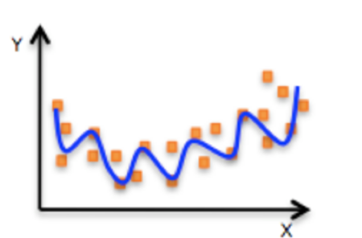

# 线性回归
利用**回归方程**(函数)对**一个或多个自变量(特征值)和因变量(目标值)之间**关系进行建模的一种分析方式。

## 线性回归的分类

- 线性关系

    - 单变量线性关系
    
        
    - 多变量线性关系
    
        
- 非线性关系

    

## sklearn.linear_model.LinearRegression()

```python
sklearn.linear_model.LinearRegression(fit_intercept=True, normalize=False, copy_X=True, n_jobs=None)
```

`sklearn.linear_model.LinearRegression()`函数<font color=blue>实现线性回归算法。</font>

- 参数说明：

    - `fit_intercept` : 可选参数，表示是否拟合截距。默认为`True`。
    - `normalize` : 可选参数，表示是否对回归向量进行归一化。默认为`False`。
    - `copy_X` : 可选参数，表示是否将`X`复制。默认为`True`。
    - `n_jobs` : 可选参数，表示并行运算的数量。默认为`None`，表示不并行计算。

- 返回值：

    返回`LinearRegression`对象。

- 参考链接：

    官方文档：[sklearn.linear_model.LinearRegression](https://scikit-learn.org/stable/modules/generated/sklearn.linear_model.LinearRegression.html)


```python
from sklearn.linear_model import LinearRegression
```

## 案例
### 构造数据集


```python
x = [[80, 86],
    [82, 80],
    [85, 78],
    [90, 90],
    [86, 82],
    [82, 90],
    [78, 80],
    [92, 94]]

y = [84.2, 80.6, 80.1, 90, 83.2, 87.6, 79.4, 93.4]
```

## 机器学习


```python
# 实例化API
estimator = LinearRegression()
# 使用fit方法进行训练
estimator.fit(x,y)

estimator.coef_

estimator.predict([[100, 80]])
```


    array([86.])


# 数学:求导
## 常见函数的导数
以下是一些常见函数及其导数的示例：
| 公式            | 例子                       |
|---------------|---------------------------|
| $f(x) = c$    | $f(x) = 5$                 |
| 导数：$f'(x) = 0$  | 导数：$f'(x) = 0$          |
|               |                           |
| $f(x) = x^n$  | $f(x) = x^3$               |
| 导数：$f'(x) = nx^{n-1}$ | 导数：$f'(x) = 3x^2$        |
|               |                           |
| $f(x) = e^x$  | $f(x) = e^x$               |
| 导数：$f'(x) = e^x$      | 导数：$f'(x) = e^x$         |
|               |                           |
| $f(x) = \ln(x)$ | $f(x) = \ln(x)$            |
| 导数：$f'(x) = \frac{1}{x}$ | 导数：$f'(x) = \frac{1}{x}$ |
|               |                           |
| $f(x) = \sin(x)$ | $f(x) = \sin(x)$           |
| 导数：$f'(x) = \cos(x)$ | 导数：$f'(x) = \cos(x)$     |
|               |                           |
| $f(x) = \cos(x)$ | $f(x) = \cos(x)$           |
| 导数：$f'(x) = -\sin(x)$ | 导数：$f'(x) = -\sin(x)$    |
|               |                           |
| $f(x) = \tan(x)$ | $f(x) = \tan(x)$           |
| 导数：$f'(x) = \sec^2(x)$ | 导数：$f'(x) = \sec^2(x)$   |
|               |                           |
| $f(x) = \arcsin(x)$ | $f(x) = \arcsin(x)$       |
| 导数：$f'(x) = \frac{1}{\sqrt{1-x^2}}$ | 导数：$f'(x) = \frac{1}{\sqrt{1-x^2}}$ |
|               |                           |
| $f(x) = \arccos(x)$ | $f(x) = \arccos(x)$       |
| 导数：$f'(x) = -\frac{1}{\sqrt{1-x^2}}$ | 导数：$f'(x) = -\frac{1}{\sqrt{1-x^2}}$ |
|               |                           |
| $f(x) = \arctan(x)$ | $f(x) = \arctan(x)$       |
| 导数：$f'(x) = \frac{1}{1+x^2}$ | 导数：$f'(x) = \frac{1}{1+x^2}$ |

## 导数的四则运算
| 公式 | 例子 |
| --- | --- |
| 常数乘法规则 | $\frac{d}{dx}(c \cdot f(x)) = c \cdot \frac{df(x)}{dx}$ |
| 加法规则 | $\frac{d}{dx}(f(x) + g(x)) = \frac{df(x)}{dx} + \frac{dg(x)}{dx}$ |
| 减法规则 | $\frac{d}{dx}(f(x) - g(x)) = \frac{df(x)}{dx} - \frac{dg(x)}{dx}$ |
| 乘法规则 | $\frac{d}{dx}(f(x) \cdot g(x)) = f(x) \cdot \frac{dg(x)}{dx} + g(x) \cdot \frac{df(x)}{dx}$ |
| 除法规则 | $\frac{d}{dx}\left(\frac{f(x)}{g(x)}\right) = \frac{g(x) \cdot \frac{df(x)}{dx} - f(x) \cdot \frac{dg(x)}{dx}}{(g(x))^2}$ |
| 幂函数规则 | $\frac{d}{dx}(f(x)^n) = n \cdot f(x)^{n-1} \cdot \frac{df(x)}{dx}$ |
| 指数函数规则 | $\frac{d}{dx}(e^{f(x)}) = e^{f(x)} \cdot \frac{df(x)}{dx}$ |
| 对数函数规则 | $\frac{d}{dx}(\log_b(f(x))) = \frac{1}{\ln(b) \cdot f(x)} \cdot \frac{df(x)}{dx}$ |
| 正弦函数规则 | $\frac{d}{dx}(\sin(f(x))) = \cos(f(x)) \cdot \frac{df(x)}{dx}$ |
| 余弦函数规则 | $\frac{d}{dx}(\cos(f(x))) = -\sin(f(x)) \cdot \frac{df(x)}{dx}$ |
| 正切函数规则 | $\frac{d}{dx}(\tan(f(x))) = \sec^2(f(x)) \cdot \frac{df(x)}{dx}$ |

# 线性回归的损失和优化
## 损失函数

$$\begin{aligned}J\left(w\right)=(\text{h}(x_1)-y_1)^2+(\text{h}(x_2)-y_2)^2+\cdots+(\text{h}(x_{m})-y_{m})^2 = \sum_{i=1}^{m}(\text{h}(x_{i})-y_{i})^2\end{aligned}$$
- $y_i$为第i个训练样本的真实值
- $h(x_i)$为第i个训练样本特征值组合预测函数
- 又称最小二乘法

可以通过一些优化方法去优化（其实是数学当中的求导功能）回归的总损失。

## 优化算法
目的是找到最小损失对应的W值。
### 正规方程
$$w=(X^TX)^{-1}X^Ty$$
- 理解：X为特征值矩阵，y为目标值矩阵。直接求到最好的结果
- 缺点：当特征过多过复杂时，求解速度太慢并且得不到结果


#### 正规方程求解举例
$$\begin{gathered}\begin{array}{c|c|c|c|c|c|c} & \textbf{Size} & \text{Number of} & \text{Number of} & \text{Age of home} & \text{Price } \\  &  & \text{bedrooms} & \text{floors} &  &  \\ x_0 & x_1 & x_2 & x_3 & x_4 & y \\ \hline1 & 2104 & 5 & 1 & 45 & 450 \\ 1 & 1416 & 3 & 2 & 40 & 232 \\ 1 & 1534 & 3 & 2 & 30 & 315 \\ 1 & 852 & 2 & 1 & 36 & 178\end{array} \\ X=\begin{bmatrix}1 & 2104 & 5 & 1 & 45 \\ 1 & 1416 & 3 & 2 & 40 \\ 1 & 1534 & 3 & 2 & 30 \\ 1 & 852 & 2 & 1 & 36\end{bmatrix}\end{gathered}$$
即
$$\begin{array}{|c|c|c|c|c|c|}\hline\text{X}(0)&\text{X}(1)&\text{X}(2)&\text{X}(3)&\text{X}(4)&\text{y}\\ \hline1&2104&5&1&45&460\\ \hline1&1416&3&2&40&232\\ \hline1&1544&3&2&30&315\\ \hline1&852&2&1&36&178\\ \hline\end{array}$$
参数求解
$$\left\{\begin{bmatrix}1&1&1&1\\2104&1416&1534&852\\5&3&3&2\\1&2&2&1\\45&40&30&36\end{bmatrix}\times\begin{bmatrix}1&2104&5&1&45\\1&1416&3&2&40\\1&1534&3&2&30\\1&852&2&1&36\end{bmatrix}\right\}^{-1}\times\begin{bmatrix}1&1&1&1\\2104&1416&1534&852\\5&3&3&2\\1&2&2&1\\45&40&30&36\end{bmatrix}\times\begin{bmatrix}460\\232\\315\\178\end{bmatrix}$$


#### 正规方程的推导
把该损失函数转换成矩阵写法：
$$\begin{aligned}
J\left(w\right)& =(\mathrm h(x_1)-y_1)^2+(\mathrm h(x_2)-y_2)^2+\cdots+(\mathrm h(x_m)-y_m)^2  \\
&=\sum_{i=1}^{m}(\mathrm{h}(x_{i})-y_{i})^{2} \\
&=(Xw-y)^2
\end{aligned}$$

其中y是真实值矩阵，X是特征值矩阵，w是权重矩阵

把损失函数分开书写：
$$(Xw-y)^2=(Xw-y)^T(Xw-y)$$

对展开上式进行求导：

$$\begin{aligned}
\frac{\partial}{\partial w}[(X w-y)^{T}(X w-y)]
&=\frac{\partial}{\partial w}[(w^{T}X^{T}-y^{T})(Xw-y)]  \\
&={\frac{\partial}{\partial w}}(w^{T}X^{T}X w-w^{T}X^{T}y-y^{T}X w+y^{T}y) \\
&=X^{T}X w+X^{T}X w-X^{T}y-X^{T}y
\end{aligned}$$

需要求得求导函数的极小值，即上式求导结果为0，经过化解，得结果为：
$$X^TXw=X^Ty$$

经过化解为：
$$w=(X^TX)^{-1}X^Ty$$

    补充：需要用到的矩阵求导公式：
$$\begin{aligned}
&\frac{dx^TA}{dx}=A
& \\
&\frac{dAx}{dx}=A^T
& \\
&\frac{dx^TAx}{dx}=A^T
\end{aligned}$$

### 梯度下降
- 在单变量的函数中，梯度其实就是函数的微分，代表着函数在某个给定点的切线的斜率；
- 在多变量函数中，梯度是一个向量，向量有方向，梯度的方向就指出了函数在给定点的上升最快的方向；
    - 在微积分里面，对多元函数的参数求∂偏导数，把求得的各个参数的偏导数以向量的形式写出来，就是梯度。

#### 梯度下降举例
##### 单变量梯度下降举例
我们假设有一个单变量的函数:  $\mathcal{J}(\theta)=\theta^2$

函数的微分:  $\mathcal{J}'(\theta)=2\theta$

初始化，起点为：$\theta(0)=1$

学习率：$\alpha=0.4$

梯度下降的迭代计算过程:

$\begin{aligned}
\theta^0 &=1  \\
\theta^1 &=\theta^0-\alpha*J'(\theta^0)  \\
&=1-0.4*2 \\
&=0.2 \\
\theta^2 &=\theta^1-\alpha*J'(\theta^1)  \\
&=0.04 \\
\theta^3 &=0.008  \\
\theta^4 &=0.0016 
\end{aligned}$

经过四次的运算，也就是走了四步，基本就抵达了函数的最低点，也就是山底:


##### 多变量梯度下降举例
我们假设有一个目标函数:  $J(\theta)={\theta_{1}}^{2}+{\theta_{2}}^{2}$

现在要通过梯度下降法计算这个函数的最小值。我们通过观察就能发现最小值其实就是 (0，0)点。但是接下来，我们会从梯度下降算法开始一步步计算到这个最小值! 

我们假设初始的起点为: $\theta^{0} = (1, 3)$

学习率：$\alpha=0.1$

函数的梯度为:$J'(\theta)=(2\theta_{1},2\theta_{2})$

进行多次迭代:

$\begin{aligned}
\theta^{0}& =(1,3)  \\
\theta^1& =\theta^0-\alpha\nabla J(\Theta)  \\
&=(1,3)-0.1(2,6) \\
&=(0.8,2.4) \\
\theta^{2}& =(0.8,2.4)-0.1(1.6,4.8)  \\
&=(0.64,1.92) \\
\theta^{3}& =(0.512,1.536)  \\
\theta^{4}& =(0.4096,1.228800000000000001)  \\
 \\
\theta^{10}& =(0.10737418240000003,0.3221225472000005)  \\
 \\
\theta^{50}& =(1.1417981541647683\mathrm{e}^{-05},3.425394462494306\mathrm{e}^{-95})  \\
 \\
\theta^{100}& =(1.6296287810675902\mathrm{e}^{-10},4.888886332020277\mathrm{e}^{-10}) 
\end{aligned}$

我们发现，已经基本靠近函数的最小值点


##### 梯度下降公式

$$\theta_{i+1}=\theta_i-\alpha\frac{\partial}{\partial\theta_i}J(\theta)$$

- α -- 就是步长
    - 步长太小 -- 下山太慢
    - 步长太大 -- 容易跳过极小值点
- 为什么梯度要加一个负号
    - 梯度方向是上升最快方向,负号就是下降最快方向


#### 两种方法对比
|梯度下降|正规方程|
|---------------|---------------------------|
|需要选择学习率|不需要|
|需要迭代求解|一次运算得出|
|特征数量较大可以使用|需要计算方程，时间复杂度高O(n3)|

#### 算法选择依据
- 小规模数据：
    - 正规方程：LinearRegression(不能解决拟合问题)
    - 岭回归
- 大规模数据：
    - 梯度下降法：SGDRegressor

# 梯度下降方法介绍
## 梯度下降的相关概念
- 步长(Learning rate)：
    - 步长决定了在梯度下降迭代的过程中，每一步沿梯度负方向前进的长度。
- 特征(feature)：
    - 指的是样本中输入部分，比如2个单特征的样本
        - $(x^{(0)},y^{(0)}),(x^{(1)},y^{(1)})$
    - 则第一个样本特征为$x^{(0)}$，第一个样本输出为$y^{(0)}$。
- 假设函数(hypothesis function)：
    - 在监督学习中，为了拟合输入样本，而使用的假设函数，记为$h_\theta(x)$
        - 比如对于单个特征的m个样本$(x^{(i)},y^{(i)})(i=1,2,...m)$,可以采用拟合函数如下：$h_\theta(x)=\theta_0+\theta_1x$
- 损失函数(loss function)：
    - 为了评估模型拟合的好坏，通常用损失函数来度量拟合的程度。损失函数极小化，意味着拟合程度最好，对应的模型参数即为最优参数。
    - 在线性回归中，损失函数通常为样本输出和假设函数的差取平方。比如对于m个样本$(x_i,y_i)(i=1,2,...m)$采用线性回归，
    
        损失函数为：$J(\theta_0,\theta_1)=\sum\limits_{i=1}^m(h_\theta(x_i)-y_i)^2$
        
        其中$x_i$表示第i个样本特征，$y_i$表示第i个样本对应的输出，$h_θ(x_i)$为假设函数。
        
## 梯度下降的推导流程
1) 先决条件： 确认优化模型的假设函数和损失函数。

    比如对于线性回归，假设函数表示为$h_\theta(x_1,x_2,...,x_n)=\theta_0+\theta_1x_1+...+\theta_nx_n$,
    
    其中$\theta_i(i=0,1,2...n)$为模型参数，$x_i(i=0,1,2...n)$为每个样本的n个特征值。
    
    这个表示可以简化，我们增加一个特征$x_0=1$ ，这样$h_{\theta}(x_0,x_1,\dots x_n)=\sum_{i=0}^{n}\theta_i x_i$。

    同样是线性回归，对应于上面的假设函数，损失函数为：
    
    $J(\theta_{0},\theta_{1}\ldots,\theta_{n})=\frac{1}{2m}\sum_{j=0}^{m}(h_{\theta}(x_{0}^{(j)},x_{1}^{(j)},\ldots x_{n}^{(j)})-y_{j})^{2}$
    
2) 算法相关参数初始化

    主要是初始化$\theta_0,\theta_1\ldots,\theta_n$,算法终止距离$ε$以及步长$α$。在没有任何先验知识的时候，我喜欢将所有的θ 初始化为0， 将步长初始化为1。在调优的时候再优化。
3) 算法过程：

    3.1 确定当前位置的损失函数的梯度，对于$\theta_i$,其梯度表达式如下：
    $$\frac{\partial}{\partial\theta_i}J(\theta_0,\theta_1\ldots,\theta_n)$$
    
    3.2 用步长乘以损失函数的梯度，得到当前位置下降的距离，即:
    $$\alpha\frac{\partial}{\partial\theta_{i}}J\left(\theta_{0},\theta_{1},\ldots,\theta_{n}\right)$$
    
    3.3 确定是否所有的$\theta_i$，梯度下降的距离都小于ε，如果小于ε则算法终止，当前所有的$\theta(i = 0, 1, ...n)$即为最终结果。否则进⼊步骤4.
4) 更新所有的$\theta$，对于$\theta_i$，其更新表达式如下。更新完毕后继续转入步骤1.
$$\theta_{i}=\theta_{i}-\alpha\frac{1}{m}\sum_{j=0}^{m}(h_{\theta}(x_{0}^{(j)},x_{1}^{(j)},\ldots x_{n}^{j})-y_{j})x_{i}^{(j)}$$

### 线性回归的例子来具体描述梯度下降
1. 先决条件： 确认优化模型的假设函数和损失函数。
    - 假设函数：$$(x_1^{(0)},x_2^{(0)},...x_n^{(0)},y_0),(x_1^{(1)},x_2^{(1)},...x_n^{(1)},y_1),...(x_1^{(m)},x_2^{(m)},...x_n^{(m)},y_m)$$
    - 损失函数：$$J(\theta_{0},\theta_{1}\ldots,\theta_{n})=\frac{1}{2m}\sum_{j=0}^{m}(h_{\theta}(x_{0}^{(j)},x_{1}^{(j)},\ldots x_{n}^{(j)})-y_{j})^{2}$$
2. 算法相关参数初始化

    将所有的θ 初始化为0， 将步长初始化为1。
3) 算法过程：

    3.1 确定当前位置的损失函数的梯度，对于$\theta_i$,偏导数表达式如下：
    $$\frac{\partial}{\partial\theta_{i}}J(\theta_{0},\theta_{1},\ldots,\theta_{n})=\frac{1}{m}\sum_{j=0}^{m}(h_{\theta}(x_{0}^{(j)},x_{1}^{(j)},\ldots x_{n}^{(j)})-y_{j})x_{i}^{(j)}$$
    由于样本中没有x 上式中令所有的$x^{j}_{0}$为1.
    
    3.2 用步长乘以损失函数的梯度，得到当前位置下降的距离，即:
    $$\alpha\frac{\partial}{\partial\theta_{i}}J(\theta_{0},\theta_{1},\ldots,\theta_{n})=\frac{\alpha}{m}\sum_{j=0}^{m}(h_{\theta}(x_{0}^{(j)},x_{1}^{(j)},\ldots x_{n}^{(j)})-y_{j})x_{i}^{(j)}$$
    
    3.3 确定是否所有的$\theta_i$，梯度下降的距离都小于ε，如果小于ε则算法终止，当前所有的$\theta(i = 0, 1, ...n)$即为最终结果。否则进⼊步骤4.
    
4) 更新所有的$\theta$，对于$\theta_i$，其更新表达式如下。更新完毕后继续转入步骤1.
$$\theta_{i}=\theta_{i}-\alpha\frac{1}{m}\sum_{j=0}^{m}(h_{\theta}(x_{0}^{(j)},x_{1}^{(j)},\ldots x_{n}^{j})-y_{j})x_{i}^{(j)}$$

## 梯度下降法大家族
### 全梯度下降算法(Full gradient descent; FG)
具体做法也就是在更新参数时使用所有的样本来进行更新。计算训练集所有样本误差，对其求和再取平均值作为目标函数(**在进行计算的时候,计算所有样本的误差平均值,作为我的目标函数**)。
$$\theta_{i}=\theta_{i}-\alpha\sum_{j=1}^{m}(h_{\theta}(x_{0}^{(j)},x_{1}^{(j)},\dots x_{n}^{(j)})-y_{j})x_{i}^{(j)}$$
- 由于我们有m个样本，这⾥求梯度的时候就⽤了所有m个样本的梯度数据。

- 注意：
    - 因为在执行每次更新时，我们需要在整个数据集上计算所有的梯度，所以批梯度下降法的速度会很慢，同时，批梯度下降法无法处理超出内存容量限制的数据集。
    - **批梯度下降法同样也不能在线更新模型，即在运行的过程中，不能增加新的样本**。

### 随机梯度下降算法(Stochastic gradient descent; SG)
每次只代入计算一个样本目标函数的梯度来更新权重，再取下一个样本重复此过程，直到损失函数值停止下降或损失函数值小于某个可以容忍的阈值(**每次只选择一个样本进行考核**)。
$$\theta_i=\theta_i-\alpha(h_\theta(x_0^{(j)},x_1^{(j)},\dots x_n^{(j)})-y_j)x_i^{(j)}$$
- 每次只使用一个样本迭代，若遇上噪声则容易陷入局部最优解。

### 小批量梯度下降算法(Mini-batch gradient descent; mini-batch)
小批量梯度下降(mini-batch)算法是FG和SG的折中方案,在一定程度上兼顾了以上两种方法的优点。每次从训练样本集上随机抽取一个小样本集，在抽出来的小样本集上采用FG迭代更新权重。(**选择一部分样本进行考核**)。

被抽出的小样本集所含样本点的个数称为batch_size，通常设置为2的幂次方，更有利于GPU加速处理。

$$\theta_i=\theta_i-\alpha\sum\limits_{j=t}^{l+x-1}(h_\theta(x_0^{(j)},x_1^{(j)},\dots x_n^{(j)})-y_j)x_i^{(j)}$$
- 若batch_size=1，则变成了SG
- 若batch_size=n，则变成了FG


### 随机平均梯度下降算法(Stochastic average gradient descent; SAG)
在SG方法中，虽然避开了运算成本大的问题，但对于大数据训练而言，SG效果常不尽如人意，因为每一轮梯度更新都完全与上一轮的数据和梯度无关。

随机平均梯度算法克服了这个问题，在内存中为每一个样本都维护一个旧的梯度，随机选择第i个样本来更新此样本的梯度，其他样本的梯度保持不变，然后求得所有梯度的平均值，进而更新了参数。(**会给每个样本都维持一个平均值,后期计算的时候,参考这个平均值**)
$$\theta_i=\theta_i-\frac{\alpha}{n}(h_\theta(x_0^{(j)},x_1^{(j)},\dots x_n^{(j)})-y_j)x_i^{(j)}$$
- 我们知道sgd是当前权重减去步长乘以梯度，得到新的权重。sag中的a，就是平均的意思，具体说，就是在第k步迭代的时候，我考虑的这一步和前面n-1个梯度的平均值，当前权重减去步长乘以最近n个梯度的平均值。
- n是自己设置的，当n=1的时候，就是普通的sgd。
- 这个想法非常的简单，在随机中又增加了确定性，类似于mini-batch sgd的作用，但不同的是，sag又没有去计算更多的样本，只是利用了之前计算出来的梯度，所以每次迭代的计算成本远小于mini-batch sgd，和sgd相当。效果而言，sag相对于sgd，收敛速度快了很多。这一点下面的论文中有具体的描述和证明。
- SAG论文链接：https://arxiv.org/pdf/1309.2388.pdf

# API
## sklearn.linear_model.LinearRegression()

```python
sklearn.linear_model.LinearRegression(fit_intercept=True, normalize=False, copy_X=True, n_jobs=None)
```

`sklearn.linear_model.LinearRegression()`函数<font color=blue>实现线性回归算法。</font>

- 参数说明：

    - `fit_intercept` : 可选参数，表示是否拟合截距。默认为`True`。
    - `normalize` : 可选参数，表示是否对回归向量进行归一化。默认为`False`。
    - `copy_X` : 可选参数，表示是否将`X`复制。默认为`True`。
    - `n_jobs` : 可选参数，表示并行运算的数量。默认为`None`，表示不并行计算。
- 属性
    - `LinearRegression.coef_`：回归系数
    - `LinearRegression.intercept_`：偏置
- 返回值：

    返回`LinearRegression`对象。

- 参考链接：

    官方文档：[sklearn.linear_model.LinearRegression](https://scikit-learn.org/stable/modules/generated/sklearn.linear_model.LinearRegression.html)

## sklearn.linear_model.SGDRegressor()

```python
sklearn.linear_model.SGDRegressor(loss='squared_loss', penalty='l2', alpha=0.0001, l1_ratio=0.15, fit_intercept=True, max_iter=1000, tol=1e-3, epsilon=0.1, learning_rate='invscaling', eta0=0.01, power_t=0.25, early_stopping=False, validation_fraction=0.1, n_iter_no_change=5, warm_start=False, average=False)
```

`sklearn.linear_model.SGDRegressor()`函数<font color=blue>实现使用随机梯度下降算法训练的线性回归模型。</font>

- 参数说明：

    - `loss` : 可选参数，表示使用的损失函数。默认为`squared_loss`，即平方损失函数。
    - `penalty` : 可选参数，表示正则化项。默认为`l2`。
    - `alpha` : 可选参数，表示正则化项的系数。默认为`0.0001`。
    - `l1_ratio` : 可选参数，表示`L1`正则化项在正则化项中的比例。如果`penalty`不是`elasticnet`，则此参数无效。默认为`0.15`。
    - `fit_intercept` : 可选参数，表示是否拟合截距。默认为`True`。
    - `max_iter` : 可选参数，表示最大迭代次数。默认为`1000`。
    - `tol` : 可选参数，表示算法的收敛容差。默认为`1e-3`。
    - `epsilon` : 可选参数，表示`epsilon-insensitive`损失函数中的`epsilon`参数。默认为`0.1`。
    - `learning_rate` : 可选参数，表示学习率的类型。默认为`invscaling`，即逆比例衰减。
    - `eta0` : 可选参数，表示学习率的初始值。默认为`0.01`。
    - `power_t` : 可选参数，表示学习率的指数。默认为`0.25`。
    - `early_stopping` : 可选参数，表示是否启用早期停止。默认为`False`。
    - `validation_fraction` : 可选参数，表示用于早期停止的验证集的比例。默认为`0.1`。
    - `n_iter_no_change` : 可选参数，表示在早期停止期间迭代次数不变的最大次数。默认为`5`。
    - `warm_start` : 可选参数，表示是否使用上一次训练的解作为初始值。默认为`False`。
    - `average` : 可选参数，表示是否使用平均化的权重。默认为`False`。

- 属性：
    - `SGDRegressor.coef_`：回归系数
    - `SGDRegressor.intercept_`：偏置
- 返回值：

    返回`SGDRegressor`对象。

- 参考链接：

    官方文档：[sklearn.linear_model.SGDRegressor](https://scikit-learn.org/stable/modules/generated/sklearn.linear_model.SGDRegressor.html)

## sklearn.metrics.mean_squared_error()

```python
sklearn.metrics.mean_squared_error(y_true, y_pred)
```

`sklearn.metrics.mean_squared_error()`函数<font color=blue>计算均方误差（MSE）。</font>

- 参数说明：

    - `y_true` : 真实值。
    - `y_pred` : 预测值。

- 返回值：

    返回均方误差（MSE）。

- 参考链接：

    官方文档：[sklearn.metrics.mean_squared_error](https://scikit-learn.org/stable/modules/generated/sklearn.metrics.mean_squared_error.html)

# 案例1：房价预测

## 正规方程实现
### 1.获取数据


```python
from sklearn.datasets import fetch_california_housing
housing = fetch_california_housing()
housing
```


    {'data': array([[   8.3252    ,   41.        ,    6.98412698, ...,    2.55555556,
               37.88      , -122.23      ],
            [   8.3014    ,   21.        ,    6.23813708, ...,    2.10984183,
               37.86      , -122.22      ],
            [   7.2574    ,   52.        ,    8.28813559, ...,    2.80225989,
               37.85      , -122.24      ],
            ...,
            [   1.7       ,   17.        ,    5.20554273, ...,    2.3256351 ,
               39.43      , -121.22      ],
            [   1.8672    ,   18.        ,    5.32951289, ...,    2.12320917,
               39.43      , -121.32      ],
            [   2.3886    ,   16.        ,    5.25471698, ...,    2.61698113,
               39.37      , -121.24      ]]),
     'target': array([4.526, 3.585, 3.521, ..., 0.923, 0.847, 0.894]),
     'frame': None,
     'target_names': ['MedHouseVal'],
     'feature_names': ['MedInc',
      'HouseAge',
      'AveRooms',
      'AveBedrms',
      'Population',
      'AveOccup',
      'Latitude',
      'Longitude'],
     'DESCR': '.. _california_housing_dataset:\n\nCalifornia Housing dataset\n--------------------------\n\n**Data Set Characteristics:**\n\n    :Number of Instances: 20640\n\n    :Number of Attributes: 8 numeric, predictive attributes and the target\n\n    :Attribute Information:\n        - MedInc        median income in block group\n        - HouseAge      median house age in block group\n        - AveRooms      average number of rooms per household\n        - AveBedrms     average number of bedrooms per household\n        - Population    block group population\n        - AveOccup      average number of household members\n        - Latitude      block group latitude\n        - Longitude     block group longitude\n\n    :Missing Attribute Values: None\n\nThis dataset was obtained from the StatLib repository.\nhttps://www.dcc.fc.up.pt/~ltorgo/Regression/cal_housing.html\n\nThe target variable is the median house value for California districts,\nexpressed in hundreds of thousands of dollars ($100,000).\n\nThis dataset was derived from the 1990 U.S. census, using one row per census\nblock group. A block group is the smallest geographical unit for which the U.S.\nCensus Bureau publishes sample data (a block group typically has a population\nof 600 to 3,000 people).\n\nA household is a group of people residing within a home. Since the average\nnumber of rooms and bedrooms in this dataset are provided per household, these\ncolumns may take surprisingly large values for block groups with few households\nand many empty houses, such as vacation resorts.\n\nIt can be downloaded/loaded using the\n:func:`sklearn.datasets.fetch_california_housing` function.\n\n.. topic:: References\n\n    - Pace, R. Kelley and Ronald Barry, Sparse Spatial Autoregressions,\n      Statistics and Probability Letters, 33 (1997) 291-297\n'}


```python
import pandas as pd

data = pd.DataFrame(housing.data, columns=['MedInc','HouseAge','AveRooms','AveBedrms','Population','AveOccup','Latitude','Longitude'])
data["MedHouseVal"] = housing.target
data
```


<div>
<style scoped>
    .dataframe tbody tr th:only-of-type {
        vertical-align: middle;
    }

    .dataframe tbody tr th {
        vertical-align: top;
    }

    .dataframe thead th {
        text-align: right;
    }
</style>
<table border="1" class="dataframe">
  <thead>
    <tr style="text-align: right;">
      <th></th>
      <th>MedInc</th>
      <th>HouseAge</th>
      <th>AveRooms</th>
      <th>AveBedrms</th>
      <th>Population</th>
      <th>AveOccup</th>
      <th>Latitude</th>
      <th>Longitude</th>
      <th>MedHouseVal</th>
    </tr>
  </thead>
  <tbody>
    <tr>
      <th>0</th>
      <td>8.3252</td>
      <td>41.0</td>
      <td>6.984127</td>
      <td>1.023810</td>
      <td>322.0</td>
      <td>2.555556</td>
      <td>37.88</td>
      <td>-122.23</td>
      <td>4.526</td>
    </tr>
    <tr>
      <th>1</th>
      <td>8.3014</td>
      <td>21.0</td>
      <td>6.238137</td>
      <td>0.971880</td>
      <td>2401.0</td>
      <td>2.109842</td>
      <td>37.86</td>
      <td>-122.22</td>
      <td>3.585</td>
    </tr>
    <tr>
      <th>2</th>
      <td>7.2574</td>
      <td>52.0</td>
      <td>8.288136</td>
      <td>1.073446</td>
      <td>496.0</td>
      <td>2.802260</td>
      <td>37.85</td>
      <td>-122.24</td>
      <td>3.521</td>
    </tr>
    <tr>
      <th>3</th>
      <td>5.6431</td>
      <td>52.0</td>
      <td>5.817352</td>
      <td>1.073059</td>
      <td>558.0</td>
      <td>2.547945</td>
      <td>37.85</td>
      <td>-122.25</td>
      <td>3.413</td>
    </tr>
    <tr>
      <th>4</th>
      <td>3.8462</td>
      <td>52.0</td>
      <td>6.281853</td>
      <td>1.081081</td>
      <td>565.0</td>
      <td>2.181467</td>
      <td>37.85</td>
      <td>-122.25</td>
      <td>3.422</td>
    </tr>
    <tr>
      <th>...</th>
      <td>...</td>
      <td>...</td>
      <td>...</td>
      <td>...</td>
      <td>...</td>
      <td>...</td>
      <td>...</td>
      <td>...</td>
      <td>...</td>
    </tr>
    <tr>
      <th>20635</th>
      <td>1.5603</td>
      <td>25.0</td>
      <td>5.045455</td>
      <td>1.133333</td>
      <td>845.0</td>
      <td>2.560606</td>
      <td>39.48</td>
      <td>-121.09</td>
      <td>0.781</td>
    </tr>
    <tr>
      <th>20636</th>
      <td>2.5568</td>
      <td>18.0</td>
      <td>6.114035</td>
      <td>1.315789</td>
      <td>356.0</td>
      <td>3.122807</td>
      <td>39.49</td>
      <td>-121.21</td>
      <td>0.771</td>
    </tr>
    <tr>
      <th>20637</th>
      <td>1.7000</td>
      <td>17.0</td>
      <td>5.205543</td>
      <td>1.120092</td>
      <td>1007.0</td>
      <td>2.325635</td>
      <td>39.43</td>
      <td>-121.22</td>
      <td>0.923</td>
    </tr>
    <tr>
      <th>20638</th>
      <td>1.8672</td>
      <td>18.0</td>
      <td>5.329513</td>
      <td>1.171920</td>
      <td>741.0</td>
      <td>2.123209</td>
      <td>39.43</td>
      <td>-121.32</td>
      <td>0.847</td>
    </tr>
    <tr>
      <th>20639</th>
      <td>2.3886</td>
      <td>16.0</td>
      <td>5.254717</td>
      <td>1.162264</td>
      <td>1387.0</td>
      <td>2.616981</td>
      <td>39.37</td>
      <td>-121.24</td>
      <td>0.894</td>
    </tr>
  </tbody>
</table>
<p>20640 rows × 9 columns</p>
</div>


### 2.数据集划分


```python
from sklearn.model_selection import train_test_split

x_train, x_test, y_train, y_test = train_test_split(housing.data, housing.target, test_size = 0.2, random_state=22)
```

### 3.特征工程——标准化


```python
from sklearn.preprocessing import StandardScaler

transfer = StandardScaler()
x_train = transfer.fit_transform(x_train)
x_test = transfer.transform(x_test)
```

### 4.机器学习——线性回归（正规方程）


```python
from sklearn.linear_model import LinearRegression

estimator = LinearRegression()
estimator.fit(x_train, y_train)
```


<style>#sk-container-id-1 {color: black;background-color: white;}#sk-container-id-1 pre{padding: 0;}#sk-container-id-1 div.sk-toggleable {background-color: white;}#sk-container-id-1 label.sk-toggleable__label {cursor: pointer;display: block;width: 100%;margin-bottom: 0;padding: 0.3em;box-sizing: border-box;text-align: center;}#sk-container-id-1 label.sk-toggleable__label-arrow:before {content: "▸";float: left;margin-right: 0.25em;color: #696969;}#sk-container-id-1 label.sk-toggleable__label-arrow:hover:before {color: black;}#sk-container-id-1 div.sk-estimator:hover label.sk-toggleable__label-arrow:before {color: black;}#sk-container-id-1 div.sk-toggleable__content {max-height: 0;max-width: 0;overflow: hidden;text-align: left;background-color: #f0f8ff;}#sk-container-id-1 div.sk-toggleable__content pre {margin: 0.2em;color: black;border-radius: 0.25em;background-color: #f0f8ff;}#sk-container-id-1 input.sk-toggleable__control:checked~div.sk-toggleable__content {max-height: 200px;max-width: 100%;overflow: auto;}#sk-container-id-1 input.sk-toggleable__control:checked~label.sk-toggleable__label-arrow:before {content: "▾";}#sk-container-id-1 div.sk-estimator input.sk-toggleable__control:checked~label.sk-toggleable__label {background-color: #d4ebff;}#sk-container-id-1 div.sk-label input.sk-toggleable__control:checked~label.sk-toggleable__label {background-color: #d4ebff;}#sk-container-id-1 input.sk-hidden--visually {border: 0;clip: rect(1px 1px 1px 1px);clip: rect(1px, 1px, 1px, 1px);height: 1px;margin: -1px;overflow: hidden;padding: 0;position: absolute;width: 1px;}#sk-container-id-1 div.sk-estimator {font-family: monospace;background-color: #f0f8ff;border: 1px dotted black;border-radius: 0.25em;box-sizing: border-box;margin-bottom: 0.5em;}#sk-container-id-1 div.sk-estimator:hover {background-color: #d4ebff;}#sk-container-id-1 div.sk-parallel-item::after {content: "";width: 100%;border-bottom: 1px solid gray;flex-grow: 1;}#sk-container-id-1 div.sk-label:hover label.sk-toggleable__label {background-color: #d4ebff;}#sk-container-id-1 div.sk-serial::before {content: "";position: absolute;border-left: 1px solid gray;box-sizing: border-box;top: 0;bottom: 0;left: 50%;z-index: 0;}#sk-container-id-1 div.sk-serial {display: flex;flex-direction: column;align-items: center;background-color: white;padding-right: 0.2em;padding-left: 0.2em;position: relative;}#sk-container-id-1 div.sk-item {position: relative;z-index: 1;}#sk-container-id-1 div.sk-parallel {display: flex;align-items: stretch;justify-content: center;background-color: white;position: relative;}#sk-container-id-1 div.sk-item::before, #sk-container-id-1 div.sk-parallel-item::before {content: "";position: absolute;border-left: 1px solid gray;box-sizing: border-box;top: 0;bottom: 0;left: 50%;z-index: -1;}#sk-container-id-1 div.sk-parallel-item {display: flex;flex-direction: column;z-index: 1;position: relative;background-color: white;}#sk-container-id-1 div.sk-parallel-item:first-child::after {align-self: flex-end;width: 50%;}#sk-container-id-1 div.sk-parallel-item:last-child::after {align-self: flex-start;width: 50%;}#sk-container-id-1 div.sk-parallel-item:only-child::after {width: 0;}#sk-container-id-1 div.sk-dashed-wrapped {border: 1px dashed gray;margin: 0 0.4em 0.5em 0.4em;box-sizing: border-box;padding-bottom: 0.4em;background-color: white;}#sk-container-id-1 div.sk-label label {font-family: monospace;font-weight: bold;display: inline-block;line-height: 1.2em;}#sk-container-id-1 div.sk-label-container {text-align: center;}#sk-container-id-1 div.sk-container {/* jupyter's `normalize.less` sets `[hidden] { display: none; }` but bootstrap.min.css set `[hidden] { display: none !important; }` so we also need the `!important` here to be able to override the default hidden behavior on the sphinx rendered scikit-learn.org. See: https://github.com/scikit-learn/scikit-learn/issues/21755 */display: inline-block !important;position: relative;}#sk-container-id-1 div.sk-text-repr-fallback {display: none;}</style><div id="sk-container-id-1" class="sk-top-container"><div class="sk-text-repr-fallback"><pre>LinearRegression()</pre><b>In a Jupyter environment, please rerun this cell to show the HTML representation or trust the notebook. <br />On GitHub, the HTML representation is unable to render, please try loading this page with nbviewer.org.</b></div><div class="sk-container" hidden><div class="sk-item"><div class="sk-estimator sk-toggleable"><input class="sk-toggleable__control sk-hidden--visually" id="sk-estimator-id-1" type="checkbox" checked><label for="sk-estimator-id-1" class="sk-toggleable__label sk-toggleable__label-arrow">LinearRegression</label><div class="sk-toggleable__content"><pre>LinearRegression()</pre></div></div></div></div></div>


### 5.模型评估
#### 5.1获取系数等值


```python
y_predict = estimator.predict(x_test)
print("预测值为:\n", y_predict)
print("模型中的系数为:\n", estimator.coef_)
print("模型中的偏置为:\n", estimator.intercept_)
```

    预测值为:
     [1.41687455 2.00757745 1.02697577 ... 0.76660448 2.89271493 1.13644498]
    模型中的系数为:
     [ 0.8219582   0.11446086 -0.25859685  0.30223006 -0.00669696 -0.04110045
     -0.91361027 -0.88513168]
    模型中的偏置为:
     2.0697045130809433
    

#### 5.2评价——均方差


```python
from sklearn.metrics import mean_squared_error

error = mean_squared_error(y_test, y_predict)
print("误差为:\n", error)
```

    误差为:
     0.5075176386746465
    

## 梯度下降法实现
### 1.获取数据


```python
from sklearn.datasets import fetch_california_housing
housing = fetch_california_housing()
```

### 2.数据集划分


```python
from sklearn.model_selection import train_test_split

x_train, x_test, y_train, y_test = train_test_split(housing.data, housing.target, test_size = 0.2, random_state=22)
```

### 3.特征工程——标准化


```python
from sklearn.preprocessing import StandardScaler

transfer = StandardScaler()
x_train = transfer.fit_transform(x_train)
x_test = transfer.transform(x_test)
```

### 4.机器学习——梯度下降


```python
from sklearn.linear_model import SGDRegressor

estimator = SGDRegressor(max_iter=1000)
estimator.fit(x_train, y_train)
```


<style>#sk-container-id-2 {color: black;background-color: white;}#sk-container-id-2 pre{padding: 0;}#sk-container-id-2 div.sk-toggleable {background-color: white;}#sk-container-id-2 label.sk-toggleable__label {cursor: pointer;display: block;width: 100%;margin-bottom: 0;padding: 0.3em;box-sizing: border-box;text-align: center;}#sk-container-id-2 label.sk-toggleable__label-arrow:before {content: "▸";float: left;margin-right: 0.25em;color: #696969;}#sk-container-id-2 label.sk-toggleable__label-arrow:hover:before {color: black;}#sk-container-id-2 div.sk-estimator:hover label.sk-toggleable__label-arrow:before {color: black;}#sk-container-id-2 div.sk-toggleable__content {max-height: 0;max-width: 0;overflow: hidden;text-align: left;background-color: #f0f8ff;}#sk-container-id-2 div.sk-toggleable__content pre {margin: 0.2em;color: black;border-radius: 0.25em;background-color: #f0f8ff;}#sk-container-id-2 input.sk-toggleable__control:checked~div.sk-toggleable__content {max-height: 200px;max-width: 100%;overflow: auto;}#sk-container-id-2 input.sk-toggleable__control:checked~label.sk-toggleable__label-arrow:before {content: "▾";}#sk-container-id-2 div.sk-estimator input.sk-toggleable__control:checked~label.sk-toggleable__label {background-color: #d4ebff;}#sk-container-id-2 div.sk-label input.sk-toggleable__control:checked~label.sk-toggleable__label {background-color: #d4ebff;}#sk-container-id-2 input.sk-hidden--visually {border: 0;clip: rect(1px 1px 1px 1px);clip: rect(1px, 1px, 1px, 1px);height: 1px;margin: -1px;overflow: hidden;padding: 0;position: absolute;width: 1px;}#sk-container-id-2 div.sk-estimator {font-family: monospace;background-color: #f0f8ff;border: 1px dotted black;border-radius: 0.25em;box-sizing: border-box;margin-bottom: 0.5em;}#sk-container-id-2 div.sk-estimator:hover {background-color: #d4ebff;}#sk-container-id-2 div.sk-parallel-item::after {content: "";width: 100%;border-bottom: 1px solid gray;flex-grow: 1;}#sk-container-id-2 div.sk-label:hover label.sk-toggleable__label {background-color: #d4ebff;}#sk-container-id-2 div.sk-serial::before {content: "";position: absolute;border-left: 1px solid gray;box-sizing: border-box;top: 0;bottom: 0;left: 50%;z-index: 0;}#sk-container-id-2 div.sk-serial {display: flex;flex-direction: column;align-items: center;background-color: white;padding-right: 0.2em;padding-left: 0.2em;position: relative;}#sk-container-id-2 div.sk-item {position: relative;z-index: 1;}#sk-container-id-2 div.sk-parallel {display: flex;align-items: stretch;justify-content: center;background-color: white;position: relative;}#sk-container-id-2 div.sk-item::before, #sk-container-id-2 div.sk-parallel-item::before {content: "";position: absolute;border-left: 1px solid gray;box-sizing: border-box;top: 0;bottom: 0;left: 50%;z-index: -1;}#sk-container-id-2 div.sk-parallel-item {display: flex;flex-direction: column;z-index: 1;position: relative;background-color: white;}#sk-container-id-2 div.sk-parallel-item:first-child::after {align-self: flex-end;width: 50%;}#sk-container-id-2 div.sk-parallel-item:last-child::after {align-self: flex-start;width: 50%;}#sk-container-id-2 div.sk-parallel-item:only-child::after {width: 0;}#sk-container-id-2 div.sk-dashed-wrapped {border: 1px dashed gray;margin: 0 0.4em 0.5em 0.4em;box-sizing: border-box;padding-bottom: 0.4em;background-color: white;}#sk-container-id-2 div.sk-label label {font-family: monospace;font-weight: bold;display: inline-block;line-height: 1.2em;}#sk-container-id-2 div.sk-label-container {text-align: center;}#sk-container-id-2 div.sk-container {/* jupyter's `normalize.less` sets `[hidden] { display: none; }` but bootstrap.min.css set `[hidden] { display: none !important; }` so we also need the `!important` here to be able to override the default hidden behavior on the sphinx rendered scikit-learn.org. See: https://github.com/scikit-learn/scikit-learn/issues/21755 */display: inline-block !important;position: relative;}#sk-container-id-2 div.sk-text-repr-fallback {display: none;}</style><div id="sk-container-id-2" class="sk-top-container"><div class="sk-text-repr-fallback"><pre>SGDRegressor()</pre><b>In a Jupyter environment, please rerun this cell to show the HTML representation or trust the notebook. <br />On GitHub, the HTML representation is unable to render, please try loading this page with nbviewer.org.</b></div><div class="sk-container" hidden><div class="sk-item"><div class="sk-estimator sk-toggleable"><input class="sk-toggleable__control sk-hidden--visually" id="sk-estimator-id-2" type="checkbox" checked><label for="sk-estimator-id-2" class="sk-toggleable__label sk-toggleable__label-arrow">SGDRegressor</label><div class="sk-toggleable__content"><pre>SGDRegressor()</pre></div></div></div></div></div>


### 5.模型评估
#### 5.1获取系数等值


```python
y_predict = estimator.predict(x_test)
print("预测值为:\n", y_predict)
print("模型中的系数为:\n", estimator.coef_)
print("模型中的偏置为:\n", estimator.intercept_)
```

    预测值为:
     [ 26.4644028   54.16856486 -45.3043293  ...  32.1709664  -15.27163165
       4.34309287]
    模型中的系数为:
     [-1.50982788e+01  2.80073040e+00  1.96445877e+01 -2.13890923e-01
      5.88595766e+00 -4.61981084e+02 -9.10991287e+00  9.25300019e-01]
    模型中的偏置为:
     [0.59872016]
    

#### 5.2评价——均方差


```python
from sklearn.metrics import mean_squared_error

error = mean_squared_error(y_test, y_predict)
print("误差为:\n", error)
```

    误差为:
     193593.4438240494
    

# 欠拟合和过拟合
##　过拟合
在训练集上表现不好，在测试集上表现不好
- 解决方法：
    - 继续学习
        - 1.添加其他特征项
        - 2.添加多项式特征
## 欠拟合
在训练集上表现好，在测试集上表现不好
- 解决方法：
    - 1.重新清洗数据集
    - 2.增大数据的训练量
    - 3.正则化
    - 4.减少特征维度，防止**维灾难**
    


## 正则化
$$\begin{aligned}
&\theta_{0}+\theta_{1}x+\theta_{2}x^{2}+\theta_{3}x^{3}+\theta_{4}x^{4} \\
\end{aligned}$$

- 通过限制高次项的系数进行防止过拟合
### L1正则化
    - 理解：直接把高次项前面的系数变为0
    - 作用：可以使得其中一些W的值直接为0，删除这个特征的影响
    - Lasso回归
### L2正则化
    - 理解：把高次项前面的系数变成特别小的值
    - 作用：可以使得其中一些W的都很小，都接近于0，削弱某个特征的影响
    - 优点：越小的参数说明模型越简单，越简单的模型则越不容易产生过拟合现象
    - Ridge回归(岭回归)

# 正则化线性模型
## Ridge Regression 岭回归   
在原来的线性回归的代价函数(cost function)中添加正则项(regularization term):
$$\alpha\sum_{i=1}^n\theta_i^2$$
以达到在拟合数据的同时，使模型权重尽可能小的目的,岭回归代价函数:
$$\begin{gathered}J(\theta)=MSE(\theta)+\alpha\sum_{i=1}^{n}\theta_{i}^2\end{gathered} $$
即：
$$\begin{gathered}J(\theta)=\frac{1}{m}\sum_{i=1}^{m}\left(\theta^{T}\cdot x^{(i)}-y^{(i)}\right)^2+\alpha\sum_{i=1}^{n}\theta_{i}^2\end{gathered}$$
- 就是把系数添加平方项
- 然后限制系数值的大小
- α值越小，系数值越大，α越大，系数值越小
    - α=0：岭回归退化为线性回归
## Lasso 回归
Lasso 回归(Lasso Regression)是线性回归的另一种正则化版本，正则项为权值向量的L1范数。

Lasso回归的代价函数 ：
$$J(\theta) =MSE(\theta)+\alpha\sum_{i=1}^n|\theta_i|$$

【注意 】
- Lasso Regression 的代价函数在$θ_i=0$处是不可导的.
- 解决方法：在$θ_i=0$处用一个次梯度向量(subgradient vector)代替梯度，如下式
$$\begin{aligned}\\ g(\theta,J)=\nabla_{\theta}MSE(\theta)+\alpha{\left(\begin{array}{ll}{\operatorname{sign}(\theta_1)}\\ {\operatorname{sign}(\theta_2)}\\ {\vdots}\\ {\operatorname{sign}(\theta_{n})}\end{array}\right)}\quad{\mathrm{where}}\quad{\mathrm{sign}}(\theta_{i})=\begin{cases}-1\text{ if }\theta_{i}<0\\ 0\text{ if }\theta_{i}=0\\ +1\text{ if }\theta_{i}>0\end{cases}\end{aligned}$$

Lasso Regression 有一个很重要的性质是：倾向于完全消除不重要的权重。

例如：当α 取值相对较大时，高阶多项式退化为二次甚至是线性：高阶多项式特征的权重被置为0。

也就是说，Lasso Regression 能够自动进行特征选择，并输出一个稀疏模型（只有少数特征的权重是非零的）。
- Lasso Regression 的次梯度向量

- 对系数值进行绝对值处理
- 由于绝对值在顶点处不可导，所以进行计算的过程中产生很多0，最后得到结果为：稀疏矩阵
## Elastic Net 弹性网络
- 是前两个内容的综合
- 设置了一个r(混合比(mix ratio) )
    - r=0--岭回归
    - r=1--Lasso回归
弹性网络的代价函数 ：
$$J(\theta)=MSE(\theta)+r\alpha\sum_{i=1}^n|\theta_i|+\frac{1-r}{2}\alpha\sum_{i=1}^n\theta_i^2$$
## Early stopping
通过限制错误率的阈值，进行停止。
## 总结
- 常用：岭回归
- 假设只有少部分特征是有用的：
    - 弹性网络
    - Lasso
    - 一般来说，弹性网络的使用更为广泛。因为在特征维度高于训练样本数，或者特征是强相关的情况下，Lasso回归的表现不太稳定。
- api:
    - `from sklearn.linear_model import Ridge, ElasticNet, Lasso`

# 线性回归的改进-岭回归
## API
### sklearn.linear_model.Ridge()

```python
sklearn.linear_model.Ridge(alpha=1.0, fit_intercept=True, normalize=False, copy_X=True, max_iter=None, tol=0.001, solver='auto', random_state=None)
```

`sklearn.linear_model.Ridge()`函数<font color=blue>实现了岭回归算法，是一种用于线性回归的正则化方法(<font color=red>**具有l2正则化的线性最小二乘法**</font>)。</font>

- 参数说明：

    - `alpha` : 正则化强度，必须为正浮点数(取值为0\~1、1\~10)。默认为1.0。
    - `fit_intercept` : 可选参数，表示是否计算截距。默认为`True`。
    - `normalize` : 可选参数，表示是否对数据进行归一化。默认为`False`。
    - `copy_X` : 可选参数，表示是否复制数据。默认为`True`。
    - `max_iter` : 可选参数，表示最大迭代次数。默认为`None`。
    - `tol` : 可选参数，表示迭代停止的误差限制。默认为`0.001`。
    - `solver` : 可选参数，表示求解方法。默认为`'auto'`，即自动选择。
    - `random_state` : 可选参数，表示随机数种子。默认为`None`。

- 属性说明：

    - `coef_` : 返回模型的系数。
    - `intercept_` : 返回模型的截距。
    - `n_iter_` : 返回模型迭代的次数。

- 方法说明：

    - `fit(X, y[, sample_weight])` : 训练模型。
    - `predict(X)` : 基于模型进行预测。
    - `score(X, y[, sample_weight])` : 返回模型的R²值。
    
- 参考链接：

    官方文档：[sklearn.linear_model.Ridge](https://scikit-learn.org/stable/modules/generated/sklearn.linear_model.Ridge.html)

### sklearn.linear_model.RidgeCV()

```python
sklearn.linear_model.RidgeCV(alphas=(0.1, 1.0, 10.0), fit_intercept=True, normalize=False, scoring=None, cv=None, gcv_mode=None, store_cv_values=False)
```

`sklearn.linear_model.RidgeCV()`函数<font color=blue>具有l2正则化的线性回归，带有交叉验证的岭回归算法。</font>

- 参数说明：

    - `alphas` : 正则化强度的候选值列表，必须为正浮点数。默认值为`(0.1, 1.0, 10.0)`。
    - `fit_intercept` : 可选参数，表示是否计算截距。默认为`True`。
    - `normalize` : 可选参数，表示是否对数据进行归一化。默认为`False`。
    - `scoring` : 可选参数，表示评价指标。默认为`None`。
    - `cv` : 可选参数，表示交叉验证的折数。默认为`None`，即使用默认的3折交叉验证。
    - `gcv_mode` : 可选参数，表示广义交叉验证模式。默认为`None`。
    - `store_cv_values` : 可选参数，表示是否存储交叉验证的结果。默认为`False`。

- 属性说明：

    - `alpha_` : 返回最优的正则化强度。
    - `coef_` : 返回模型的系数。
    - `intercept_` : 返回模型的截距。
    - `cv_values_` : 返回交叉验证的结果。

- 方法说明：

    - `fit(X, y[, sample_weight])` : 训练模型。
    - `predict(X)` : 基于模型进行预测。
    - `score(X, y[, sample_weight])` : 返回模型的R²值。
    
- 参考链接：

    官方文档：[sklearn.linear_model.RidgeCV](https://scikit-learn.org/stable/modules/generated/sklearn.linear_model.RidgeCV.html)

## 正则化程度变化


- 正则化力度越大，权重系数会越小
- 正则化力度越小，权重系数会越大


```python
from sklearn.linear_model import Ridge

# 4.机器学习-线性回归(岭回归)
estimator = Ridge(alpha=1)
# estimator = RidgeCV(alphas=(0.1, 1, 10))
estimator.fit(x_train, y_train)
```


<style>#sk-container-id-3 {color: black;background-color: white;}#sk-container-id-3 pre{padding: 0;}#sk-container-id-3 div.sk-toggleable {background-color: white;}#sk-container-id-3 label.sk-toggleable__label {cursor: pointer;display: block;width: 100%;margin-bottom: 0;padding: 0.3em;box-sizing: border-box;text-align: center;}#sk-container-id-3 label.sk-toggleable__label-arrow:before {content: "▸";float: left;margin-right: 0.25em;color: #696969;}#sk-container-id-3 label.sk-toggleable__label-arrow:hover:before {color: black;}#sk-container-id-3 div.sk-estimator:hover label.sk-toggleable__label-arrow:before {color: black;}#sk-container-id-3 div.sk-toggleable__content {max-height: 0;max-width: 0;overflow: hidden;text-align: left;background-color: #f0f8ff;}#sk-container-id-3 div.sk-toggleable__content pre {margin: 0.2em;color: black;border-radius: 0.25em;background-color: #f0f8ff;}#sk-container-id-3 input.sk-toggleable__control:checked~div.sk-toggleable__content {max-height: 200px;max-width: 100%;overflow: auto;}#sk-container-id-3 input.sk-toggleable__control:checked~label.sk-toggleable__label-arrow:before {content: "▾";}#sk-container-id-3 div.sk-estimator input.sk-toggleable__control:checked~label.sk-toggleable__label {background-color: #d4ebff;}#sk-container-id-3 div.sk-label input.sk-toggleable__control:checked~label.sk-toggleable__label {background-color: #d4ebff;}#sk-container-id-3 input.sk-hidden--visually {border: 0;clip: rect(1px 1px 1px 1px);clip: rect(1px, 1px, 1px, 1px);height: 1px;margin: -1px;overflow: hidden;padding: 0;position: absolute;width: 1px;}#sk-container-id-3 div.sk-estimator {font-family: monospace;background-color: #f0f8ff;border: 1px dotted black;border-radius: 0.25em;box-sizing: border-box;margin-bottom: 0.5em;}#sk-container-id-3 div.sk-estimator:hover {background-color: #d4ebff;}#sk-container-id-3 div.sk-parallel-item::after {content: "";width: 100%;border-bottom: 1px solid gray;flex-grow: 1;}#sk-container-id-3 div.sk-label:hover label.sk-toggleable__label {background-color: #d4ebff;}#sk-container-id-3 div.sk-serial::before {content: "";position: absolute;border-left: 1px solid gray;box-sizing: border-box;top: 0;bottom: 0;left: 50%;z-index: 0;}#sk-container-id-3 div.sk-serial {display: flex;flex-direction: column;align-items: center;background-color: white;padding-right: 0.2em;padding-left: 0.2em;position: relative;}#sk-container-id-3 div.sk-item {position: relative;z-index: 1;}#sk-container-id-3 div.sk-parallel {display: flex;align-items: stretch;justify-content: center;background-color: white;position: relative;}#sk-container-id-3 div.sk-item::before, #sk-container-id-3 div.sk-parallel-item::before {content: "";position: absolute;border-left: 1px solid gray;box-sizing: border-box;top: 0;bottom: 0;left: 50%;z-index: -1;}#sk-container-id-3 div.sk-parallel-item {display: flex;flex-direction: column;z-index: 1;position: relative;background-color: white;}#sk-container-id-3 div.sk-parallel-item:first-child::after {align-self: flex-end;width: 50%;}#sk-container-id-3 div.sk-parallel-item:last-child::after {align-self: flex-start;width: 50%;}#sk-container-id-3 div.sk-parallel-item:only-child::after {width: 0;}#sk-container-id-3 div.sk-dashed-wrapped {border: 1px dashed gray;margin: 0 0.4em 0.5em 0.4em;box-sizing: border-box;padding-bottom: 0.4em;background-color: white;}#sk-container-id-3 div.sk-label label {font-family: monospace;font-weight: bold;display: inline-block;line-height: 1.2em;}#sk-container-id-3 div.sk-label-container {text-align: center;}#sk-container-id-3 div.sk-container {/* jupyter's `normalize.less` sets `[hidden] { display: none; }` but bootstrap.min.css set `[hidden] { display: none !important; }` so we also need the `!important` here to be able to override the default hidden behavior on the sphinx rendered scikit-learn.org. See: https://github.com/scikit-learn/scikit-learn/issues/21755 */display: inline-block !important;position: relative;}#sk-container-id-3 div.sk-text-repr-fallback {display: none;}</style><div id="sk-container-id-3" class="sk-top-container"><div class="sk-text-repr-fallback"><pre>Ridge(alpha=1)</pre><b>In a Jupyter environment, please rerun this cell to show the HTML representation or trust the notebook. <br />On GitHub, the HTML representation is unable to render, please try loading this page with nbviewer.org.</b></div><div class="sk-container" hidden><div class="sk-item"><div class="sk-estimator sk-toggleable"><input class="sk-toggleable__control sk-hidden--visually" id="sk-estimator-id-3" type="checkbox" checked><label for="sk-estimator-id-3" class="sk-toggleable__label sk-toggleable__label-arrow">Ridge</label><div class="sk-toggleable__content"><pre>Ridge(alpha=1)</pre></div></div></div></div></div>


```python
# 5.模型评估
# 5.1 获取系数等值
y_predict = estimator.predict(x_test)
print("预测值为:\n", y_predict)
print("模型中的系数为:\n", estimator.coef_)
print("模型中的偏置为:\n", estimator.intercept_)

# 5.2 评价
# 均方误差
error = mean_squared_error(y_test, y_predict)
print("误差为:\n", error)
```

    预测值为:
     [1.4170339  2.0075908  1.02722482 ... 0.76688619 2.89262339 1.13641386]
    模型中的系数为:
     [ 0.82193035  0.11454405 -0.258439    0.30202016 -0.00666545 -0.04110036
     -0.91282746 -0.88434255]
    模型中的偏置为:
     2.0697045130809437
    误差为:
     0.5075135635665936
    


```python
from sklearn.linear_model import RidgeCV

# 4.机器学习-线性回归(岭回归)
# estimator = Ridge(alpha=1)
estimator = RidgeCV(alphas=(0.1, 1, 10))
estimator.fit(x_train, y_train)

# 5.模型评估
# 5.1 获取系数等值
y_predict = estimator.predict(x_test)
print("预测值为:\n", y_predict)
print("模型中的系数为:\n", estimator.coef_)
print("模型中的偏置为:\n", estimator.intercept_)

# 5.2 评价
# 均方误差
error = mean_squared_error(y_test, y_predict)
print("误差为:\n", error)
```

    预测值为:
     [1.41846123 2.00770702 1.02944642 ... 0.76940415 2.89180133 1.13614471]
    模型中的系数为:
     [ 0.82167056  0.11528443 -0.25701306  0.30013198 -0.00638498 -0.04109911
     -0.90585296 -0.87731069]
    模型中的偏置为:
     2.0697045130809473
    误差为:
     0.5074854435894751
    

# 模型的保存和加载
- `from sklearn.externals import joblib`
- 保存：`joblib.dump(estimator, 'test.pkl')`
- 加载：`estimator = joblib.load('test.pkl')`
- 注意：
    - 1.保存文件，后缀名是**.pkl
    - 2.加载模型是需要通过一个变量进行承接
## joblib.dump()

```python
joblib.dump(value, filename, compress=True, protocol=None, cache_size=None)
```

`joblib.dump()`函数<font color=blue>将Python对象序列化为文件。</font>

- 参数说明：

    - `value` : 要序列化的Python对象。
    - `filename` : 序列化后的文件名。
    - `compress` : 可选参数，表示是否使用压缩。默认为`True`。
    - `protocol` : 可选参数，表示使用的协议版本。默认为`None`。
    - `cache_size` : 可选参数，表示缓存大小。默认为`None`。
    
- 返回值：

    无返回值。

- 参考链接：

    官方文档：[joblib.dump](https://joblib.readthedocs.io/en/latest/generated/joblib.dump.html)
    
- 示例1：

```python
from joblib import dump, load
import numpy as np

X = np.array([[0, 0], [0, 0], [1, 1]])
y = np.array([0, 0.1, 1])
dump(X, 'X.joblib')
dump(y, 'y.joblib')
```

以上示例展示了如何使用`joblib.dump()`函数将`X`和`y`数组序列化为文件。在此示例中，我们将`X`和`y`数组分别保存为`X.joblib`和`y.joblib`。

- 实例2：
```python
# 模型保存
joblib.dump(estimator, "./data/test.pkl")
```

## joblib.load()

```python
joblib.load(filename, mmap_mode=None)
```

`joblib.load()`函数<font color=blue>从文件中反序列化Python对象。</font>

- 参数说明：

    - `filename` : 反序列化文件的文件名。
    - `mmap_mode` : 可选参数，表示使用的内存映射模式。默认为`None`。
    
- 返回值：

    返回反序列化的Python对象。

- 参考链接：

    官方文档：[joblib.load](https://joblib.readthedocs.io/en/latest/generated/joblib.load.html)
    
- 示例1：

```python
from joblib import dump, load
import numpy as np

X = np.array([[0, 0], [0, 0], [1, 1]])
y = np.array([0, 0.1, 1])
dump(X, 'X.joblib')
dump(y, 'y.joblib')

X_load = load('X.joblib')
y_load = load('y.joblib')
```

以上示例展示了如何使用`joblib.load()`函数从文件中反序列化Python对象。在此示例中，我们从文件`X.joblib`和`y.joblib`中加载数组`X`和`y`。

- 示例2：
```python
# 模型加载
estimator = joblib.load("./data/test.pkl")
```

# 案例2：房价预测综合
## 1.数据获取


```python
from sklearn.datasets import fetch_california_housing
from sklearn.model_selection import train_test_split
from sklearn.preprocessing import StandardScaler
from sklearn.linear_model import LinearRegression, SGDRegressor, Ridge, RidgeCV, ElasticNet, Lasso
from joblib import dump, load
```


```python
housing = fetch_california_housing()
```

## 2.数据集划分


```python
x_train, x_test, y_train, y_test = train_test_split(housing.data, housing.target, test_size = 0.2, random_state=22)
```

## 3.特征工程——标准化


```python
transfer = StandardScaler()
x_train = transfer.fit_transform(x_train)
x_test = transfer.fit_transform(x_test)
```

## 4.机器学习——线性回归
### 4.1模型训练


```python
# 正规方程
estimator_LinearRegression = LinearRegression()
estimator_LinearRegression.fit(x_train, y_train)

# 梯度下降
estimator_SGDRegressor = SGDRegressor(max_iter=1000)
estimator_SGDRegressor.fit(x_train, y_train)

# 岭回归(Ridge)
estimator_Ridge = Ridge(alpha=1)
estimator_Ridge.fit(x_train, y_train)

# 岭回归(RidgeCV)
estimator_RidgeCV = RidgeCV(alphas=(0.1, 1, 10))
estimator_RidgeCV.fit(x_train, y_train)
```


<style>#sk-container-id-5 {color: black;background-color: white;}#sk-container-id-5 pre{padding: 0;}#sk-container-id-5 div.sk-toggleable {background-color: white;}#sk-container-id-5 label.sk-toggleable__label {cursor: pointer;display: block;width: 100%;margin-bottom: 0;padding: 0.3em;box-sizing: border-box;text-align: center;}#sk-container-id-5 label.sk-toggleable__label-arrow:before {content: "▸";float: left;margin-right: 0.25em;color: #696969;}#sk-container-id-5 label.sk-toggleable__label-arrow:hover:before {color: black;}#sk-container-id-5 div.sk-estimator:hover label.sk-toggleable__label-arrow:before {color: black;}#sk-container-id-5 div.sk-toggleable__content {max-height: 0;max-width: 0;overflow: hidden;text-align: left;background-color: #f0f8ff;}#sk-container-id-5 div.sk-toggleable__content pre {margin: 0.2em;color: black;border-radius: 0.25em;background-color: #f0f8ff;}#sk-container-id-5 input.sk-toggleable__control:checked~div.sk-toggleable__content {max-height: 200px;max-width: 100%;overflow: auto;}#sk-container-id-5 input.sk-toggleable__control:checked~label.sk-toggleable__label-arrow:before {content: "▾";}#sk-container-id-5 div.sk-estimator input.sk-toggleable__control:checked~label.sk-toggleable__label {background-color: #d4ebff;}#sk-container-id-5 div.sk-label input.sk-toggleable__control:checked~label.sk-toggleable__label {background-color: #d4ebff;}#sk-container-id-5 input.sk-hidden--visually {border: 0;clip: rect(1px 1px 1px 1px);clip: rect(1px, 1px, 1px, 1px);height: 1px;margin: -1px;overflow: hidden;padding: 0;position: absolute;width: 1px;}#sk-container-id-5 div.sk-estimator {font-family: monospace;background-color: #f0f8ff;border: 1px dotted black;border-radius: 0.25em;box-sizing: border-box;margin-bottom: 0.5em;}#sk-container-id-5 div.sk-estimator:hover {background-color: #d4ebff;}#sk-container-id-5 div.sk-parallel-item::after {content: "";width: 100%;border-bottom: 1px solid gray;flex-grow: 1;}#sk-container-id-5 div.sk-label:hover label.sk-toggleable__label {background-color: #d4ebff;}#sk-container-id-5 div.sk-serial::before {content: "";position: absolute;border-left: 1px solid gray;box-sizing: border-box;top: 0;bottom: 0;left: 50%;z-index: 0;}#sk-container-id-5 div.sk-serial {display: flex;flex-direction: column;align-items: center;background-color: white;padding-right: 0.2em;padding-left: 0.2em;position: relative;}#sk-container-id-5 div.sk-item {position: relative;z-index: 1;}#sk-container-id-5 div.sk-parallel {display: flex;align-items: stretch;justify-content: center;background-color: white;position: relative;}#sk-container-id-5 div.sk-item::before, #sk-container-id-5 div.sk-parallel-item::before {content: "";position: absolute;border-left: 1px solid gray;box-sizing: border-box;top: 0;bottom: 0;left: 50%;z-index: -1;}#sk-container-id-5 div.sk-parallel-item {display: flex;flex-direction: column;z-index: 1;position: relative;background-color: white;}#sk-container-id-5 div.sk-parallel-item:first-child::after {align-self: flex-end;width: 50%;}#sk-container-id-5 div.sk-parallel-item:last-child::after {align-self: flex-start;width: 50%;}#sk-container-id-5 div.sk-parallel-item:only-child::after {width: 0;}#sk-container-id-5 div.sk-dashed-wrapped {border: 1px dashed gray;margin: 0 0.4em 0.5em 0.4em;box-sizing: border-box;padding-bottom: 0.4em;background-color: white;}#sk-container-id-5 div.sk-label label {font-family: monospace;font-weight: bold;display: inline-block;line-height: 1.2em;}#sk-container-id-5 div.sk-label-container {text-align: center;}#sk-container-id-5 div.sk-container {/* jupyter's `normalize.less` sets `[hidden] { display: none; }` but bootstrap.min.css set `[hidden] { display: none !important; }` so we also need the `!important` here to be able to override the default hidden behavior on the sphinx rendered scikit-learn.org. See: https://github.com/scikit-learn/scikit-learn/issues/21755 */display: inline-block !important;position: relative;}#sk-container-id-5 div.sk-text-repr-fallback {display: none;}</style><div id="sk-container-id-5" class="sk-top-container"><div class="sk-text-repr-fallback"><pre>RidgeCV(alphas=(0.1, 1, 10))</pre><b>In a Jupyter environment, please rerun this cell to show the HTML representation or trust the notebook. <br />On GitHub, the HTML representation is unable to render, please try loading this page with nbviewer.org.</b></div><div class="sk-container" hidden><div class="sk-item"><div class="sk-estimator sk-toggleable"><input class="sk-toggleable__control sk-hidden--visually" id="sk-estimator-id-5" type="checkbox" checked><label for="sk-estimator-id-5" class="sk-toggleable__label sk-toggleable__label-arrow">RidgeCV</label><div class="sk-toggleable__content"><pre>RidgeCV(alphas=(0.1, 1, 10))</pre></div></div></div></div></div>


### 4.2模型保存


```python
dump(estimator_LinearRegression, "./data/LinearRegression.pkl")
dump(estimator_SGDRegressor, "./data/SGDRegressor.pkl")
dump(estimator_Ridge, "./data/Ridge.pkl")
dump(estimator_RidgeCV, "./data/RidgeCV.pkl")
```


    ['./data/RidgeCV.pkl']


### 4.3模型加载


```python
estimator_LinearRegression = load("./data/LinearRegression.pkl")
estimator_SGDRegressor = load("./data/SGDRegressor.pkl")
estimator_Ridge = load("./data/Ridge.pkl")
estimator_RidgeCV = load("./data/RidgeCV.pkl")
```

## 5.模型评估


```python
print("LinearRegression预测值为:\n", estimator_LinearRegression.predict(x_test))
print("LinearRegression模型中的系数为:\n", estimator_LinearRegression.coef_)
print("LinearRegression模型中的偏置为:\n", estimator_LinearRegression.intercept_)
error = mean_squared_error(y_test, estimator_LinearRegression.predict(x_test))
print("误差为:\n", error)
print("--------------------------------------------------------------------------")
print("SGDRegressor预测值为:\n", estimator_SGDRegressor.predict(x_test))
print("SGDRegressor模型中的系数为:\n", estimator_SGDRegressor.coef_)
print("SGDRegressor模型中的偏置为:\n", estimator_SGDRegressor.intercept_)
error = mean_squared_error(y_test, estimator_SGDRegressor.predict(x_test))
print("误差为:\n", error)
print("--------------------------------------------------------------------------")
print("Ridge预测值为:\n", estimator_Ridge.predict(x_test))
print("Ridge模型中的系数为:\n", estimator_Ridge.coef_)
print("Ridge模型中的偏置为:\n", estimator_Ridge.intercept_)
error = mean_squared_error(y_test, estimator_Ridge.predict(x_test))
print("误差为:\n", error)
print("--------------------------------------------------------------------------")
print("RidgeCV预测值为:\n", estimator_RidgeCV.predict(x_test))
print("RidgeCV模型中的系数为:\n", estimator_RidgeCV.coef_)
print("RidgeCV模型中的偏置为:\n", estimator_RidgeCV.intercept_)
error = mean_squared_error(y_test, estimator_RidgeCV.predict(x_test))
print("误差为:\n", error)
print("--------------------------------------------------------------------------")
```

    LinearRegression预测值为:
     [1.41032993 2.01179033 1.0060783  ... 0.7521827  2.90847526 1.10653729]
    LinearRegression模型中的系数为:
     [ 0.8219582   0.11446086 -0.25859685  0.30223006 -0.00669696 -0.04110045
     -0.91361027 -0.88513168]
    LinearRegression模型中的偏置为:
     2.0697045130809433
    误差为:
     0.5065887967856285
    --------------------------------------------------------------------------
    SGDRegressor预测值为:
     [  55.2405177    -4.99592555 -103.65171145 ...   87.20329621  128.85877416
       30.46376238]
    SGDRegressor模型中的系数为:
     [  13.13420757  -44.44496551  -56.96629207   17.62211875  -66.79506187
     -472.01125177   12.58850047   19.20830158]
    SGDRegressor模型中的偏置为:
     [-7.06059179]
    误差为:
     233031.83420607378
    --------------------------------------------------------------------------
    Ridge预测值为:
     [1.41048649 2.01179559 1.00632554 ... 0.75246146 2.90839464 1.10651753]
    Ridge模型中的系数为:
     [ 0.82193035  0.11454405 -0.258439    0.30202016 -0.00666545 -0.04110036
     -0.91282746 -0.88434255]
    Ridge模型中的偏置为:
     2.0697045130809437
    误差为:
     0.5065797551510128
    --------------------------------------------------------------------------
    RidgeCV预测值为:
     [1.41188891 2.01183892 1.00853014 ... 0.7549528  2.90767041 1.1063499 ]
    RidgeCV模型中的系数为:
     [ 0.82167056  0.11528443 -0.25701306  0.30013198 -0.00638498 -0.04109911
     -0.90585296 -0.87731069]
    RidgeCV模型中的偏置为:
     2.0697045130809473
    误差为:
     0.506507297452635
    --------------------------------------------------------------------------
    
